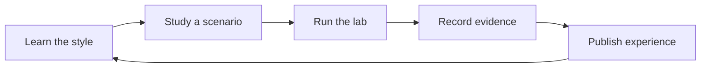

**Azure Solution Lab** is a lab-first knowledge base for Azure engineers who want architecture skills they can prove — not just describe.

## How this site is organized


  
  
  
  


## The learning loop

Each topic follows the same loop, modeled on how experienced engineers actually build credibility:

1. **Learn the style** — understand the architecture pattern, its trade-offs, and the Azure services that implement it.
2. **Study a scenario** — see the style applied to a realistic business workload.
3. **Run the lab** — deploy it yourself with the Azure CLI and Bicep in your own subscription.
4. **Record evidence** — capture resource diagrams, costs, and decisions you made.
5. **Publish experience** — convert the work into a concise, verifiable LinkedIn entry.


All labs are designed to run in a personal subscription at minimal cost, and every lab ends with a teardown step so you never leave billable resources behind.

