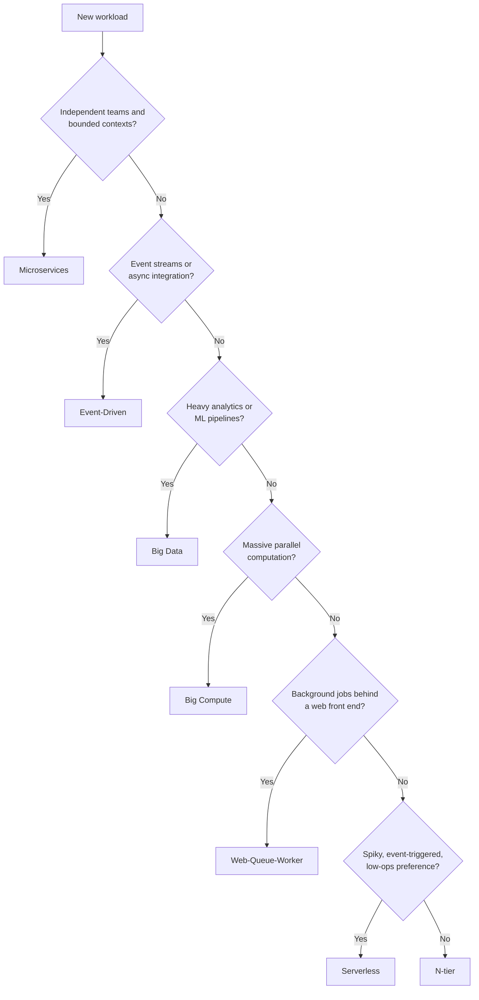

An **architecture style** is a named family of architectures that share constraints and characteristics. Choosing the right style is the highest-leverage decision in any Azure solution — it determines your scaling model, failure modes, cost profile, and team topology before a single service is picked.

## The core styles

| Style | Best for | Key Azure services |
|-------|----------|--------------------|
| [N-tier](n-tier) | Traditional business apps, lift-and-shift migrations | App Service, Azure SQL, Application Gateway |
| [Web-Queue-Worker](web-queue-worker) | Web apps with background processing | App Service, Storage Queues, Functions |
| [Microservices](microservices) | Large, evolving domains with independent teams | AKS, Container Apps, API Management |
| [Event-Driven](event-driven) | Real-time processing, decoupled producers/consumers | Event Grid, Event Hubs, Service Bus |
| [Big Data](big-data) | Batch and streaming analytics over large datasets | Microsoft Fabric, Databricks, Data Lake |
| [Big Compute](big-compute) | HPC, simulation, large-scale parallel workloads | Azure Batch, HPC VMs |
| [Serverless](serverless) | Spiky traffic, event-triggered logic, minimal ops | Functions, Logic Apps, Cosmos DB |

## How to choose


Styles are starting points, not prescriptions. Production systems routinely combine styles — a microservices core with an event-driven integration layer and a serverless edge is common.

