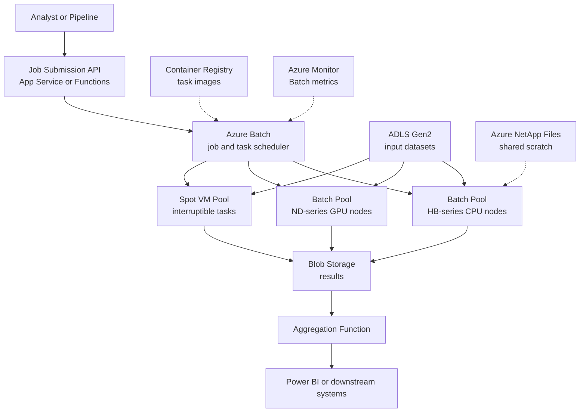

Big compute architecture addresses workloads that need hundreds or thousands of CPU or GPU cores working on a single computational problem — risk simulations, rendering, genomics, engineering analysis, and model training. The defining pattern is splitting a large job into many discrete tasks, scheduling them across a large pool of compute nodes, running them in parallel, and aggregating results. Workloads divide into embarrassingly parallel jobs, where tasks are independent and scale linearly, and tightly coupled HPC jobs, where tasks exchange data mid-run over low-latency interconnects like InfiniBand. On Azure, the workhorse is Azure Batch for task orchestration, HPC-optimized VM families for raw power, and Azure CycleCloud when you need a traditional scheduler like Slurm.

## When to use it

- The job is compute-bound and divisible: Monte Carlo risk runs, image or video rendering, parameter sweeps, backtesting, genomics alignment.
- On-premises grids or clusters are capacity-capped and jobs queue for hours while deadlines slip.
- Demand is episodic — month-end actuarial runs, quarterly stress tests, seasonal rendering crunches — so owning peak capacity is waste.
- The workload needs specialized hardware occasionally: GPU nodes for training, InfiniBand-connected nodes for MPI solvers.
- Engineering simulation packages such as CFD or FEA solvers need a burst-capable cluster with a familiar scheduler.
- You want to trade money for time linearly: 1,000 cores for one hour costs the same as 100 cores for ten.

## When to avoid it

- The problem is data-movement-bound rather than compute-bound — shipping 50 TB to the compute is the bottleneck; use a big data engine near the data instead.
- Work arrives as a continuous stream of small independent requests; that is a scaling web service or queue-worker problem, not a batch job.
- The application is licensed per node or per core in a way that makes elastic scale-out economically absurd — check ISV licensing first.
- Jobs are tightly coupled but the team picks general-purpose VMs without RDMA networking; MPI over ordinary Ethernet wastes most of the spend.
- Total monthly compute need is small and steady — a couple of always-on VMs or a Container Apps job is simpler.

## Reference architecture

## Azure service mapping

| Logical component | Azure service | Why |
|---|---|---|
| Task scheduler and pool manager | Azure Batch | Managed queueing, task-to-node scheduling, retries, and autoscaling formulas — no scheduler infrastructure to run |
| Traditional HPC cluster | Azure CycleCloud | Deploys and manages Slurm, PBS, or LSF clusters when scientists demand the schedulers they know |
| Turnkey MPI environment | Azure HPC-optimized VMs with InfiniBand | HB-series for memory-bandwidth-bound CFD, HX for large-memory FEA, ND-series for GPU training |
| Interruptible capacity | Azure Spot Virtual Machines | Up to 90 percent discount for checkpointable, retry-tolerant tasks |
| Input and result storage | Azure Data Lake Storage Gen2 and Blob Storage | Cheap, parallel-read object storage that thousands of nodes can hammer simultaneously |
| Shared POSIX scratch | Azure NetApp Files or Azure Managed Lustre | Low-latency shared file systems for solvers that expect a fast local file system |
| Task packaging | Azure Container Registry | Ship solver environments as containers so every node runs identical, reproducible software |
| Job submission surface | Azure Functions or App Service | Thin API that validates requests and submits Batch jobs |
| Orchestration of multi-stage runs | Durable Functions or Data Factory | Chains prepare, compute, and aggregate stages with retries |
| Observability | Azure Monitor | Pool utilization, task failure rates, and node health in one place |

## Benefits

- **Elastic scale**: spin up 10,000 cores for the month-end run and pay nothing the other 27 days.
- **Queue elimination**: researchers stop waiting days for on-premises cluster slots; the cloud pool is effectively always free when they arrive.
- **Time compression**: embarrassingly parallel jobs finish nearly N times faster on N nodes — deadlines become budget decisions.
- **Hardware access**: InfiniBand, latest GPUs, and huge-memory nodes on demand, without a three-year procurement cycle.
- **Reproducibility**: containerized task environments eliminate the works-on-the-old-cluster class of bugs.
- **Spot economics**: retry-tolerant workloads routinely run at a small fraction of on-demand cost.

## Challenges

- **Quota reality**: large core counts require quota increases negotiated in advance; discovering this the night before a deadline is a rite of passage nobody enjoys.
- **Data gravity**: staging terabytes in and out can dominate wall-clock time; input locality needs as much design as the compute.
- **Spot interruptions**: without checkpointing, an eviction at hour seven of an eight-hour task wastes seven hours.
- **License servers**: commercial solvers need reachable, sized license servers; a 1,000-node pool against a 50-seat license fails immediately.
- **Cost cliff misuse**: an autoscale formula bug or a forgotten pool can burn a quarter's budget over a weekend.
- **Debugging at scale**: a failure that appears once per 10,000 tasks is invisible in small tests and inevitable in production runs; per-task logging discipline is essential.

## Design checklist

Before you sign off on a big compute design, verify each of these:

- [ ] Regional core quotas for every VM family in the plan are approved and rechecked before each scheduled large run.
- [ ] Tasks are idempotent and checkpoint at intervals shorter than the acceptable rework window.
- [ ] Every pool has a hard maximum node count, an autoscale formula that reaches zero on empty queues, and an idle-pool alert.
- [ ] Spot eviction handling is tested: an evicted task resumes from checkpoint and the job still completes within SLA.
- [ ] Input staging strategy is explicit — node-local NVMe, Managed Lustre, or streamed from Blob — with measured throughput, not assumptions.
- [ ] Solver environments are containerized, versioned in ACR, and a result from last quarter can be reproduced bit-for-bit or within documented tolerance.
- [ ] License server capacity matches maximum pool size for every commercial solver, and license checkout failures fail fast with a clear error.
- [ ] Pools run without public IPs inside a VNet; storage access uses managed identities.
- [ ] Per-task metrics — duration, exit code, retry count — flow to Azure Monitor, and a job status dashboard exists for end users.
- [ ] A 10 percent scale rehearsal of the full pipeline — stage, compute, aggregate — passes before any full-scale run.
- [ ] Budget alerts are set at the subscription level, with an automated action that deallocates long-idle pools.
- [ ] MPI workloads are pinned to RDMA-capable VM families and placement groups; nobody is running tightly coupled solvers over ordinary Ethernet.
- [ ] Result aggregation and validation run automatically after the compute stage, so a bad run is detected before analysts consume it.
- [ ] Data egress costs for moving results out of Azure are estimated and accepted — they surprise finance more often than compute does.
- [ ] A cost-per-run figure is published after every campaign so the business can weigh accuracy, scale, and spend deliberately.
- [ ] VM family benchmarks are refreshed yearly; newer generations frequently deliver better price-performance for the same solver.

## Well-Architected considerations

### Reliability
Design tasks to be idempotent and checkpointable so retries and spot evictions lose minutes, not hours. Use Batch task retry policies plus poison-task detection — one malformed input should fail one task, not stall the job. Validate quota and capacity in your target region ahead of scheduled large runs, and have a secondary region plan for deadline-critical workloads.

### Security
Run pools with managed identities to reach storage — no keys baked into task command lines or images. Keep pools in a VNet with no public IPs and reach them via private endpoints. Scan solver container images, and isolate multi-tenant workloads into separate pools; Batch node reuse across trust boundaries is a subtle data-leak vector.

### Cost Optimization
Default to Spot VMs for anything checkpointable and keep a small on-demand core for the orchestrator and stragglers. Write autoscale formulas that scale to zero when queues empty — and alert if a pool has nodes but no running tasks for more than an hour. Benchmark VM families per workload: HB-series often finishes memory-bound jobs so much faster that it is cheaper despite a higher hourly rate.

### Operational Excellence
Treat job definitions, pool configs, and autoscale formulas as code in version control. Emit per-task metrics — duration, exit code, retries — to Azure Monitor and build a job dashboard; grid users always ask where their job is. Rehearse the full pipeline at 10 percent scale before the real run; most failures are staging and permissions, not math.

### Performance Efficiency
Match the interconnect to the coupling: embarrassingly parallel work runs fine on ordinary VMs, but MPI jobs need RDMA-enabled H-series and proper process pinning. Stage hot input data to node-local NVMe or Managed Lustre rather than pulling from Blob mid-task. Profile before scaling out — doubling nodes on a job that is 40 percent I/O wait doubles the bill, not the speed.


Field note: an actuarial team moved a 14-hour on-premises risk run to Azure Batch and got it to 40 minutes on 4,000 spot cores — then the first real month-end run failed at 2 a.m. on a regional core quota nobody had checked. The run itself was fine; the request for 4,000 cores was not pre-approved. Now their runbook files quota requests two weeks ahead of any scaled run and keeps a fallback region warm. Quota is part of the architecture.



Never let an autoscale formula be the only thing standing between you and a runaway bill. Set a hard maximum node count on every pool, a budget alert on the subscription, and an automation that deallocates pools idle for more than an hour. Big compute rewards discipline and punishes optimism, financially.


## Variations and related patterns

Big compute on Azure spans several distinct sub-styles:

- **Embarrassingly parallel on Batch**: independent tasks, no inter-node communication — rendering frames, scoring portfolios, sweeping parameters. Azure Batch alone covers this, and Spot VMs fit perfectly.
- **Tightly coupled MPI**: CFD, weather, crash simulation. Requires HB or HX-series with InfiniBand, single placement groups, and usually CycleCloud with Slurm so researchers keep their existing submission workflows.
- **GPU training and inference batch**: ND-series pools for model training runs; increasingly this shifts to Azure Machine Learning compute clusters, which layer experiment tracking on top of the same elastic-pool idea.
- **Grid burst hybrid**: an on-premises scheduler bursts overflow work to Azure pools during peaks — a pragmatic pattern for firms with sunk on-premises investment and hard month-end deadlines.
- **Container-native jobs**: for modest parallelism — tens of nodes, not thousands — Azure Container Apps jobs or AKS with Kueue can be simpler than Batch, especially if the team already lives in containers.
- **Serverless fan-out**: Durable Functions fan-out/fan-in handles small-grain parallelism of thousands of short tasks without any pool management, but hits limits quickly for long or resource-heavy tasks.

Related styles to compare before committing:

- If the bottleneck is transforming and querying large datasets rather than raw computation, use [Big Data](../big-data) engines instead.
- If tasks arrive continuously from users rather than as scheduled campaigns, [Web-Queue-Worker](../web-queue-worker) is the right shape.

## Go deeper

- Scenario: [Data Analytics Platform](../../scenarios/data-analytics) covers the adjacent large-scale data processing estate that often feeds and consumes big compute runs.
- There is no dedicated lab for this style yet — the official Azure Batch quickstart, which runs a parallel job on a managed pool in about 15 minutes, is the recommended hands-on starting point. Search for Azure Batch quickstart in Microsoft Learn.
- Adjacent style: for data-transformation workloads at scale, see [Big Data](../big-data).
