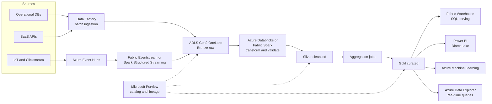

Big data architecture handles the ingestion, storage, processing, and serving of data volumes or velocities that overwhelm traditional databases — batch pipelines over terabytes of history, streaming pipelines over millions of events per second, or both combined. The style splits the flow into distinct stages: sources feed an ingestion layer, raw data lands in a lake, processing engines transform it through refinement layers, and curated results are served to analysts, applications, and ML models. On Azure, this increasingly consolidates around Microsoft Fabric with OneLake, alongside Azure Databricks, Event Hubs, and Azure Data Lake Storage Gen2 — with the medallion pattern of bronze, silver, and gold layers as the de facto organizing principle.

## When to use it

- Data volume, velocity, or variety exceeds what a single relational database handles gracefully — think terabytes daily, not gigabytes monthly.
- You need both historical batch analytics and near-real-time insights over the same business events.
- Multiple consumer types — BI dashboards, data scientists, downstream applications — need the same data in different shapes.
- Source systems are heterogeneous: operational databases, SaaS APIs, files, clickstreams, and IoT telemetry all feeding one analytical estate.
- Machine learning workloads need large, well-governed training datasets with reproducible lineage.
- Regulatory or business requirements demand long-horizon retention with the ability to reprocess history when logic changes.

## When to avoid it

- The actual data fits in Azure SQL Database or PostgreSQL with room to spare — a data lake for 50 GB is architecture cosplay.
- You need transactional consistency and row-level updates as the primary access pattern; lakes are analytical, not OLTP.
- There is no data engineering capability on the team; these platforms punish casual operation with silent cost and quality drift.
- Requirements are a single dashboard over one source system — a direct Power BI connection or a small warehouse is faster and cheaper.
- Latency requirements are single-digit milliseconds per lookup; serve those from an operational store, not a lakehouse.

## Reference architecture

## Azure service mapping

| Logical component | Azure service | Why |
|---|---|---|
| Unified analytics platform | Microsoft Fabric | SaaS bundle of lakehouse, warehouse, pipelines, real-time analytics, and Power BI over one copy of data in OneLake |
| Data lake storage | Azure Data Lake Storage Gen2 | Hierarchical namespace, POSIX ACLs, and cheap petabyte-scale object storage; the substrate under OneLake |
| Batch ingestion | Azure Data Factory or Fabric Data Pipelines | 100+ connectors, scheduling, and incremental copy patterns without custom code |
| Stream ingestion | Azure Event Hubs | Kafka-compatible, partitioned intake for millions of events per second |
| Heavy transformation | Azure Databricks | Best-in-class Spark with Delta Lake, Unity Catalog governance, and strong ML integration |
| Lightweight transformation | Fabric Spark and Dataflows Gen2 | Good enough for many pipelines without managing a separate Databricks estate |
| Real-time analytics | Azure Data Explorer or Fabric Real-Time Intelligence | Sub-second queries over fresh telemetry at scale |
| SQL serving layer | Fabric Warehouse | T-SQL endpoint over gold data for analysts and applications |
| BI | Power BI with Direct Lake | Reports read Delta tables in OneLake directly — no import refresh lag, no duplicate copies |
| ML platform | Azure Machine Learning | Training, registries, and endpoints consuming curated gold datasets |
| Governance | Microsoft Purview | Catalog, classification, and lineage across the whole estate |

## Benefits

- **Scale headroom**: storage and compute scale independently; a tenfold data growth is a bill change, not a re-architecture.
- **Schema-on-read flexibility**: land raw data now, decide its shape later; new questions do not require re-ingestion.
- **One copy, many engines**: with OneLake and Delta Lake, Spark, SQL, and Power BI read the same files — no more copy sprawl.
- **Reprocessability**: when business logic changes, replay bronze through the new logic and regenerate silver and gold.
- **ML readiness**: governed, versioned datasets shorten the path from question to model.

## Challenges

- **Data quality debt**: garbage lands in bronze effortlessly; without validation gates at silver, dashboards confidently show wrong numbers.
- **Cost opacity**: Spark clusters, capacity units, and cross-region egress make bills hard to attribute without deliberate tagging and monitoring.
- **Skill concentration**: Delta Lake optimization, partition strategy, and streaming semantics are specialist skills that hire slowly.
- **Latency layering**: each hop from bronze to gold adds minutes; teams routinely promise real-time and deliver hourly.
- **Governance sprawl**: hundreds of datasets without a catalog become a swamp — findable by nobody, trusted by nobody.

## Design checklist

Before you sign off on a big data design, verify each of these:

- [ ] Every dataset has a named owner, a defined refresh SLA, and a documented source of truth in Purview or the Fabric catalog.
- [ ] Bronze is immutable and append-only; corrections happen by reprocessing downstream, never by editing raw data.
- [ ] Silver-layer validation rules — schema checks, null thresholds, referential sanity — run in the pipeline and fail loudly.
- [ ] All pipelines are idempotent: re-running yesterday's load produces no duplicates, verified by test.
- [ ] Freshness and row-count anomaly monitors exist per critical table, alerting on statistical deviation as well as job failure.
- [ ] Streaming jobs checkpoint to durable storage and recovery from checkpoint has been rehearsed.
- [ ] Delta tables are partitioned or liquid-clustered around actual query predicates, and small-file compaction runs on a schedule.
- [ ] Storage and engines are reachable only via private endpoints; sensitive columns are classified and masked at the serving layer.
- [ ] Interactive clusters auto-terminate; job clusters use spot where tolerable; Fabric capacities pause outside business hours in non-production.
- [ ] Dev, test, and prod workspaces exist with pipeline promotion through CI/CD — no notebook edits directly in production.
- [ ] Cost is attributable per domain or team through tagging, workspace separation, or capacity assignment.
- [ ] Consumers read from silver and gold only; bronze access is restricted to the data engineering group.

## Well-Architected considerations

### Reliability
Make every pipeline idempotent and re-runnable — a failed job re-executed must not duplicate rows, which Delta Lake merge semantics make tractable. Checkpoint streaming jobs and test recovery from checkpoint loss. Keep bronze immutable so any downstream corruption can be repaired by replay rather than restoring backups.

### Security
Apply least privilege at the storage layer with ACLs and at the engine layer with Unity Catalog or Fabric workspace roles — not just one of them. Classify sensitive columns in Purview and enforce masking at the serving layer. Keep ingestion endpoints private with managed VNets and private endpoints; a data lake with a public endpoint is a headline waiting to happen.

### Cost Optimization
Use spot instances and autoscaling with aggressive auto-termination for Databricks job clusters — an interactive cluster left running over a weekend is the classic four-figure surprise. Tier aged bronze data to cool and archive storage. In Fabric, right-size capacity units against actual utilization and pause non-production capacities out of hours.

### Operational Excellence
Treat pipelines as code: version control, CI with data quality tests, and promotion through dev, test, and prod workspaces. Monitor freshness and row-count anomalies per table, not just job success — a job that succeeds while ingesting zero rows is a silent failure. Publish data contracts so upstream schema changes break loudly in test instead of quietly in production dashboards.

### Performance Efficiency
Partition and Z-order or liquid-cluster Delta tables around real query predicates, and compact small files on a schedule — the small-files problem quietly degrades every engine. Use Direct Lake for Power BI instead of scheduled imports. Push aggregation into gold tables so dashboards read pre-computed results rather than scanning silver.


Field note: a manufacturer's nightly pipeline had run green for months while a supplier's API silently started returning empty pages — the dashboards drifted 30 percent low before a finance analyst noticed. Job status monitoring saw nothing wrong because the jobs genuinely succeeded. The durable fix was row-count and freshness checks per table with alerts on statistical anomalies. Monitor the data, not just the jobs.



Resist the urge to give every team raw access to bronze. Bronze is unvalidated by design, and reports built on it will disagree with reports built on gold — then leadership stops trusting all of them. Serve consumers from silver and gold, and treat bronze as an engineering-only zone.


## Variations and related patterns

The medallion lakehouse is the mainstream shape, but several variants matter:

- **Fabric-native**: everything — ingestion, Spark, warehouse, BI — inside Microsoft Fabric on OneLake. Lowest integration effort and one billing meter; the trade-off is less engine choice and a younger platform than the Databricks stack.
- **Databricks-centric**: ADLS Gen2 plus Databricks with Unity Catalog, serving BI through Databricks SQL or into Power BI. The strongest option for heavy engineering and ML estates; Fabric can still mount the same Delta tables via shortcuts.
- **Lambda architecture**: parallel batch and speed layers reconciled at serving time. Largely superseded — Delta Lake plus Structured Streaming (a kappa-style single path) handles most cases with one codebase instead of two.
- **Real-time analytics estate**: Event Hubs into Azure Data Explorer or Fabric Real-Time Intelligence when the primary consumers are operational dashboards over the last hour, not historians over the last five years.
- **Data mesh**: domain teams own their products on shared platform rails — OneLake domains and Purview federated governance map to this well. An organizational pattern first; do not adopt it for technical reasons alone.
- **Hybrid warehouse coexistence**: keep an existing Azure SQL-based warehouse as a gold serving layer while the lake takes over ingestion and transformation — a common and reasonable multi-year transition state.

Related styles to compare before committing:

- If the events primarily drive application behavior rather than analytics, start from [Event-Driven Architecture](../event-driven).
- If the need is thousands of cores for simulation rather than data transformation, that is [Big Compute](../big-compute).

## Go deeper

- Scenario: [Data Analytics Platform](../../scenarios/data-analytics) designs a medallion lakehouse for a real business case.
- Hands-on: [Lab 6 — Data Pipeline](../../labs/lab-06-data-pipeline) builds the ingestion-to-Power-BI flow end to end.
