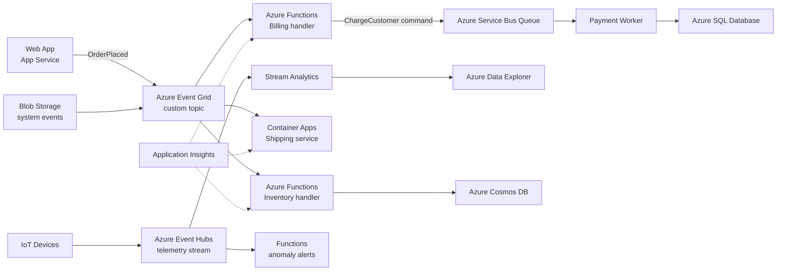

Event-driven architecture organizes a system around the production, detection, and consumption of events — immutable facts about something that has happened, such as OrderPlaced or PaymentCaptured. Producers publish events without knowing who consumes them; consumers subscribe and react independently, which decouples components in both time and topology. Azure gives you three distinct messaging backbones for this style — Event Grid for discrete reactive events, Service Bus for enterprise commands and transactional messaging, and Event Hubs for high-throughput telemetry streams — and choosing the right one for each flow is most of the architectural work.

## When to use it

- Multiple downstream systems must react to the same business fact — an order placement triggers inventory, billing, shipping, and analytics independently.
- Producers and consumers evolve at different speeds and should not deploy in lockstep.
- Workloads are naturally reactive: file uploaded, resource created, threshold crossed, IoT reading received.
- You need to absorb extreme bursts — events buffer in the broker while consumers drain at their own pace.
- You want an audit-friendly record of what happened; event streams double as a system of record for behavior.
- Integrating systems owned by different teams or vendors where point-to-point APIs would create a coupling web.

## When to avoid it

- The interaction is fundamentally request-response and the caller needs the answer now — wrapping a synchronous query in events adds latency and complexity.
- Strong ordering and immediate consistency across the whole workflow are hard requirements and the domain cannot tolerate eventual consistency.
- The team lacks experience with idempotency, duplicate handling, and out-of-order delivery — these are not optional skills in this style.
- The system is small and one team owns everything; direct calls inside a modular monolith are simpler and easier to debug.
- Workflows need central visibility and step-by-step compensation; a choreographed event web can hide the business process — consider an orchestrator like Durable Functions instead.

## Reference architecture

## Azure service mapping

| Logical component | Azure service | Why |
|---|---|---|
| Discrete event router | Azure Event Grid | Push-based pub/sub with filtering, massive fan-out, per-operation pricing, and native events from 20+ Azure services |
| Command and transactional messaging | Azure Service Bus | At-least-once queues and topics with sessions, dead-lettering, and transactions — for messages that must not be lost |
| High-throughput event streaming | Azure Event Hubs | Millions of events per second with partitioned consumers and replayable retention; Kafka-protocol compatible |
| Event handlers | Azure Functions | Native triggers for Event Grid, Service Bus, and Event Hubs; scale to zero between bursts |
| Long-running consumers | Azure Container Apps | KEDA-scaled containers for handlers that outgrow Functions limits |
| Stateful workflows | Durable Functions | Orchestration, fan-out/fan-in, and human-interaction timeouts when choreography gets tangled |
| Stream processing | Azure Stream Analytics | SQL-over-streams for windowed aggregations and real-time alerting |
| Hot analytics store | Azure Data Explorer | Fast ad hoc queries over billions of telemetry events |
| Event-sourced state | Azure Cosmos DB | Change feed turns the database itself into an event producer |
| Observability | Application Insights | Correlated traces across producers, brokers, and consumers |

## Benefits

- **Loose coupling**: producers know nothing about consumers; adding a fifth subscriber requires zero changes to the publisher.
- **Temporal decoupling**: consumers can be down for maintenance while producers keep publishing; the broker holds the difference.
- **Elastic burst handling**: brokers buffer spikes so consumers scale on backlog rather than dropping requests.
- **Independent evolution**: teams ship handlers on their own cadence against a stable event contract.
- **Natural audit trail**: the event stream records what happened and when — invaluable for debugging, compliance, and replay.
- **Extensibility**: new capabilities bolt on as new subscribers — analytics, fraud detection, notifications — without touching core flows.

## Challenges

- **Duplicate and out-of-order delivery**: every consumer must be idempotent; Event Grid and Service Bus both guarantee at-least-once, not exactly-once.
- **Choreography opacity**: the business process exists only as an emergent property of subscriptions — hard to see, harder to change safely.
- **Schema evolution**: an event published today will be read by consumers you have not written yet; versioning discipline is required from day one.
- **Debugging across hops**: without correlation IDs propagated through every event, tracing a lost order means archaeology.
- **Choosing the wrong broker**: Event Hubs for commands or Service Bus for telemetry firehoses are both painful, expensive mistakes.
- **Testing complexity**: meaningful integration tests need a broker in the loop; teams that mock everything discover delivery semantics in production.

## Design checklist

Before you sign off on an event-driven design, verify each of these:

- [ ] Each message flow is mapped to the right broker — Event Grid for discrete notifications, Service Bus for commands, Event Hubs for streams — with the reasoning written down.
- [ ] Every event has a stable schema with an explicit version field, registered somewhere consumers can discover it.
- [ ] Every consumer is idempotent, and duplicate-delivery handling is covered by an automated test, not an assumption.
- [ ] A shared event envelope carries event ID, correlation ID, source, timestamp, and schema version — enforced by a common library or build check.
- [ ] Dead-letter destinations are configured on every subscription and queue, with alerting and an owner for triage.
- [ ] Ordering requirements are explicit per flow; where ordering matters, Service Bus sessions or Event Hubs partition keys are used deliberately.
- [ ] Consumers can be replayed against historical events without side effects like duplicate emails or double charges.
- [ ] Event Hubs partition keys have been checked for skew under realistic data distributions.
- [ ] Producers and consumers authenticate with managed identities; shared access keys are absent or vaulted with rotation.
- [ ] End-to-end trace continuity is verified: one correlation ID can be followed from the original HTTP request through every downstream handler.
- [ ] Backlog and consumer-lag alerts exist for every subscription, thresholds tied to business SLAs.
- [ ] The team has documented which flows are choreographed and which are orchestrated by Durable Functions — and why.
- [ ] A schema-change process exists: additive changes flow freely, breaking changes require a new event version and a consumer migration window.
- [ ] Event retention windows on Event Hubs are sized against the worst-case consumer outage you intend to survive.
- [ ] Load tests include burst scenarios — 50x normal publish rate — confirming consumers scale and backlogs drain within SLA.
- [ ] A catalog page lists every event type, its producer, its consumers, and its owner, so impact analysis is a lookup rather than an investigation.

## Well-Architected considerations

### Reliability
Every handler must be idempotent and safe to retry — use event IDs for deduplication. Configure dead-lettering on Event Grid subscriptions and Service Bus queues, and alert on dead-letter arrival. For Event Hubs consumers, checkpoint deliberately: checkpoint too often and you pay in throughput, too rarely and you replay large windows after a crash.

### Security
Publish and subscribe with managed identities and Microsoft Entra RBAC instead of shared access keys wherever supported. Validate event payloads at every consumer — the broker authenticates the sender, not the shape or sanity of the data. Use private endpoints for brokers when the compliance posture requires traffic to stay off the public internet.

### Cost Optimization
Event Grid charges per operation and Functions consumption charges per execution, so a reactive system that is idle costs nearly nothing — this style is exceptionally cheap for bursty workloads. Watch Event Hubs throughput units and consider the Standard tier with auto-inflate before jumping to Premium. Batch where consumers allow it; per-event handling of a firehose multiplies execution costs.

### Operational Excellence
Treat event schemas as public APIs: version them, document them in a registry, and never remove fields without a deprecation window. Propagate a correlation ID in every event envelope and enforce it with a shared library. Build a replay capability early — the ability to re-run yesterday's events against a fixed handler turns disasters into chores.

### Performance Efficiency
Match the broker to the flow: Event Grid for discrete notifications, Service Bus for commands needing guarantees, Event Hubs for streams. Partition Event Hubs by a key that spreads load evenly — a hot partition caps your whole pipeline. Keep events lean: publish facts and IDs, and let consumers fetch heavy payloads from Blob Storage when needed.


Field note: an insurance client modeled claim events beautifully but let each of nine teams invent its own envelope format. Eighteen months in, a regulatory request to trace one claim end to end took three engineers a full week. The remediation — one shared envelope with event ID, correlation ID, source, and schema version, enforced by a build-time check — took two sprints. Standardize the envelope before the second consumer exists; it is the cheapest insurance in this style.



Do not use events as remote procedure calls. If the publisher waits for a specific consumer to finish before continuing, you have built a slow, unreliable synchronous call. Events state facts about the past; if you need to command a specific service and get a result, use a queue-backed command or a direct API and be honest about the coupling.


## Variations and related patterns

Event-driven systems on Azure take several recognizable shapes:

- **Simple pub/sub**: one Event Grid topic, several Functions subscribers. The entry-level form, and entirely sufficient for reactive automation and integration glue.
- **Event streaming**: Event Hubs plus Stream Analytics or Fabric Real-Time Intelligence for continuous analytics over telemetry — the events are the dataset, not just triggers.
- **Event sourcing**: the event log is the system of record and current state is a projection. Powerful for audit-heavy domains, but a significant commitment — reversing out of event sourcing is a rewrite.
- **CQRS with change feed**: writes go to Cosmos DB, and the change feed projects read-optimized views. A pragmatic middle ground that gets many event-sourcing benefits without the ceremony.
- **Saga choreography vs orchestration**: multi-service transactions either react to each other's events (choreography) or follow a Durable Functions orchestrator (orchestration). Rule of thumb: three or fewer steps, choreograph; more, or with compensation logic, orchestrate.
- **Hybrid with request-response**: most real systems are event-driven at the seams and synchronous inside a bounded context. That is healthy — purity is not the goal.

Related styles to compare before committing:

- One producer, one consumer, one job type is just [Web-Queue-Worker](../web-queue-worker) — do not overbuild it.
- If the events feed large-scale analytics rather than application behavior, you are heading into [Big Data](../big-data) territory.

## Go deeper

- Scenario: [Event-Driven Order Processing](../../scenarios/event-driven-orders) shows the full choreography for a retail order flow.
- Hands-on: [Lab 4 — Event-Driven Architecture](../../labs/lab-04-event-driven) wires Event Grid, Functions, and Service Bus into a working pipeline.
- Compute layer: the handlers in this style are usually built with the [Serverless](../serverless) stack.
