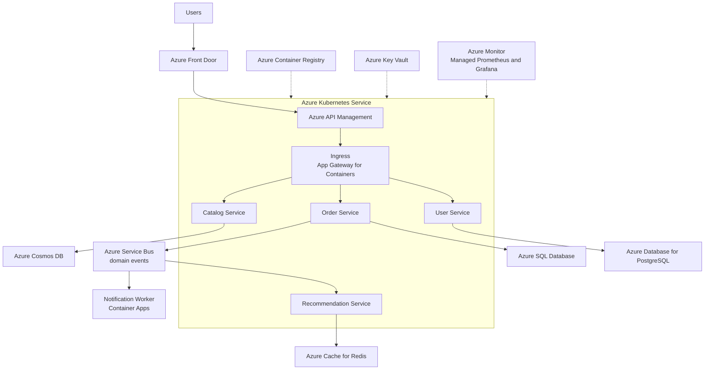

Microservices architecture decomposes an application into small, independently deployable services, each owning a single business capability and its own data. Services communicate over well-defined APIs or asynchronous messages, are built and released by autonomous teams, and can be scaled, versioned, and even rewritten without coordinating a big-bang release. On Azure, the style typically lands on Azure Kubernetes Service or Azure Container Apps, fronted by an API gateway, wired together with Service Bus or Event Grid, and observed through Azure Monitor and distributed tracing — because at this scale, observability stops being optional.

## When to use it

- Multiple teams need to ship independently and a shared release train has become the bottleneck.
- Different parts of the system have genuinely different scaling profiles — the catalog gets 100x the traffic of the returns service.
- Parts of the domain change at very different speeds, and slow-moving compliance code should not gate fast-moving product features.
- You need polyglot freedom: a Python ML service, a .NET order service, and a Node.js BFF, each with the right tool.
- The domain is complex enough that bounded contexts are clearly identifiable and worth enforcing with process boundaries.
- You need fault isolation so that a failure in recommendations degrades the page rather than taking down checkout.

## When to avoid it

- The team is small — fewer than roughly two teams' worth of engineers means you will spend more time on platform plumbing than product.
- The domain boundaries are still unclear; wrong service cuts are far more expensive to fix across networks than inside a monolith.
- You cannot yet invest in CI/CD, container platforms, distributed tracing, and on-call maturity — microservices without them is a distributed monolith with worse debugging.
- Strong transactional consistency across the whole dataset is a hard requirement; sagas and eventual consistency are a poor fit for some domains.
- The motivation is résumé-driven rather than a concrete scaling or team-velocity problem — a well-modularized monolith on App Service is a legitimate and often better answer.

## Reference architecture

## Azure service mapping

| Logical component | Azure service | Why |
|---|---|---|
| Container orchestration | Azure Kubernetes Service | Full Kubernetes control for large fleets: custom operators, node pools, service mesh options |
| Simpler container hosting | Azure Container Apps | Managed Dapr, KEDA scaling, and scale-to-zero without owning a cluster; the right default for smaller fleets |
| API gateway | Azure API Management | Auth, throttling, versioning, and a single facade so consumers never bind to internal topology |
| In-cluster ingress | Application Gateway for Containers | Layer 7 routing and WAF integration natively wired to AKS |
| Async messaging | Azure Service Bus | Reliable domain events with dead-lettering, sessions, and topics for pub/sub between services |
| Lightweight eventing | Azure Event Grid | Push-based fan-out for reactive integrations at low cost |
| Per-service data | Azure Cosmos DB, Azure SQL Database, Azure Database for PostgreSQL | Each service picks its own store — the database-per-service rule made real |
| Cache | Azure Cache for Redis | Shared-nothing caching per service; also backs rate limiting and distributed locks |
| Image registry | Azure Container Registry | Geo-replicated images with vulnerability scanning via Microsoft Defender for Cloud |
| Secrets and identity | Azure Key Vault and Microsoft Entra Workload ID | Pod-level identities so services authenticate without stored credentials |
| Observability | Azure Monitor, Managed Prometheus, Managed Grafana, Application Insights | Metrics, logs, and distributed traces across dozens of services in one place |

## Benefits

- **Independent deployability**: a team can ship its service ten times a day without a release train or coordination meetings.
- **Granular scaling**: scale only the hot service; the catalog runs 40 replicas while returns runs 2.
- **Fault isolation**: with timeouts, retries, and circuit breakers, one failing dependency degrades gracefully instead of cascading.
- **Technology fit**: each bounded context uses the runtime and datastore that suit it best.
- **Team ownership**: services align to teams, which aligns incentives — you build it, you run it, you get paged for it.

## Challenges

- **Operational complexity**: dozens of pipelines, dashboards, and on-call rotations; the platform itself becomes a product needing a team.
- **Distributed data**: no cross-service transactions — you trade ACID for sagas, outbox patterns, and eventual consistency bugs.
- **Network as a failure mode**: every in-process call that becomes an HTTP call inherits latency, partial failure, and retry storms.
- **Testing difficulty**: integration environments with 30 services are expensive; contract testing becomes essential, not optional.
- **Cost visibility**: shared clusters blur per-team spend; without labels and showback, nobody owns the bill.

## Design checklist

Before you sign off on a microservices design, verify each of these:

- [ ] Service boundaries follow business capabilities identified through domain analysis — not technical layers, not org-chart accidents.
- [ ] Every service owns its data store exclusively; no other service reads its tables or containers directly.
- [ ] All external traffic enters through API Management; internal service addresses are never exposed to clients.
- [ ] Every synchronous call has an explicit timeout, a bounded retry policy with jitter, and a circuit breaker.
- [ ] Cross-service writes use events with the outbox pattern — no distributed transactions, no dual writes.
- [ ] Each service has its own CI/CD pipeline and can deploy to production without any other team's involvement.
- [ ] OpenTelemetry tracing is wired through every service and correlation IDs survive both HTTP and Service Bus hops.
- [ ] Contract tests exist between each consumer-provider pair, running in CI before deployment.
- [ ] Workload identities are per-service with least-privilege RBAC; no shared cluster-wide secrets.
- [ ] Resource requests and limits are set per service from measured data, and cost per service is visible via labels and Azure Cost Management.
- [ ] A golden-path template exists so a new service gets pipeline, observability, and security defaults on day one.
- [ ] On-call ownership is mapped service by service, and every service has an SLO with an error budget someone reviews.
- [ ] API versioning policy is defined and enforced at APIM — breaking changes require a new version, with a deprecation window.
- [ ] Chaos or failure-injection testing has validated that circuit breakers and fallbacks actually engage under dependency failure.
- [ ] A documented decision record explains why each service exists as a separate deployable rather than a module.

## Well-Architected considerations

### Reliability
Assume every downstream call can fail: enforce timeouts, retries with jitter, and circuit breakers — via Dapr, a service mesh, or libraries like Polly. Spread AKS node pools across availability zones and set pod disruption budgets so upgrades never drop below serving capacity. Use the outbox pattern so database writes and event publishes cannot diverge.

### Security
Zero trust between services: mTLS in-cluster, Microsoft Entra Workload ID for pod identities, and Key Vault for anything secret. APIM validates tokens at the edge so internal services never trust raw internet traffic. Scan images in ACR and block deployments of critical-vulnerability images with Azure Policy for Kubernetes.

### Cost Optimization
Right-size requests and limits — Kubernetes overprovisioning is the silent budget killer, and Azure Advisor plus Vertical Pod Autoscaler recommendations expose it. Use spot node pools for stateless, interruption-tolerant services. For smaller estates, Container Apps consumption pricing frequently beats running a 24/7 AKS system node pool.

### Operational Excellence
Standardize the golden path: one templated pipeline, one Helm chart or Bicep module pattern, one logging schema, so the twentieth service costs a day and not a month. GitOps with Flux or Argo CD keeps cluster state auditable and reversible. Distributed tracing with OpenTelemetry is table stakes — without correlated traces, cross-service incidents take hours instead of minutes.

### Performance Efficiency
Prefer async messaging over synchronous chains — a five-hop synchronous call path multiplies latency and failure probability. Cache at the edge with APIM and Front Door, and inside with Redis. Load test individual services with realistic dependency latency injected, not just happy-path mocks.


Field note: a logistics company split their monolith into 23 services before establishing shared observability. The first production incident took 11 hours to diagnose because each team had its own logging format and there were no correlation IDs. After standardizing on OpenTelemetry and one Grafana workspace, a comparable incident took 20 minutes. Build the observability platform before service number five, not after service number twenty.



The most expensive microservices mistake is cutting service boundaries along technical layers — a data service, a validation service, an API service — instead of business capabilities. Layer-shaped services guarantee every feature touches every service. Cut along the domain: orders, catalog, payments.


## Variations and related patterns

Microservices on Azure come in several operational weights:

- **Container Apps first**: for estates under roughly 20 services, Azure Container Apps with built-in Dapr and KEDA delivers most microservices benefits without cluster ownership. Many teams should start here and graduate to AKS only when they hit a concrete limit.
- **AKS with a service mesh**: Istio-based add-on or open-source mesh when you need mTLS everywhere, fine-grained traffic policy, and canary routing at the platform layer rather than in application code.
- **Backend-for-frontend**: dedicated aggregation services per client type — web, mobile, partner API — so client-shaped concerns stay out of domain services.
- **Strangler fig migration**: route slices of a monolith's traffic through APIM to new services one capability at a time; the monolith shrinks gradually and reversibly instead of via big-bang rewrite.
- **Event-backbone-first**: services communicate predominantly through Service Bus topics rather than synchronous APIs. Higher latency tolerance required, but far better failure isolation — see [Event-Driven Architecture](../event-driven).
- **Modular monolith as the honest alternative**: enforced module boundaries inside one deployable. If you cannot articulate why this is insufficient, it probably is not.

Related styles to compare before committing:

- Async-heavy fleets shade into [Event-Driven Architecture](../event-driven).
- Small services with spiky load often belong on [Serverless](../serverless) compute instead of a always-on cluster.

## Go deeper

- Scenario: [Microservices on AKS](../../scenarios/microservices-aks) walks through a production-shaped decomposition.
- Hands-on: [Lab 5 — AKS Microservices](../../labs/lab-05-aks-microservices) deploys a multi-service fleet with ingress, messaging, and tracing.
- Foundation first: the messaging discipline this style depends on is covered in [Event-Driven Architecture](../event-driven).
