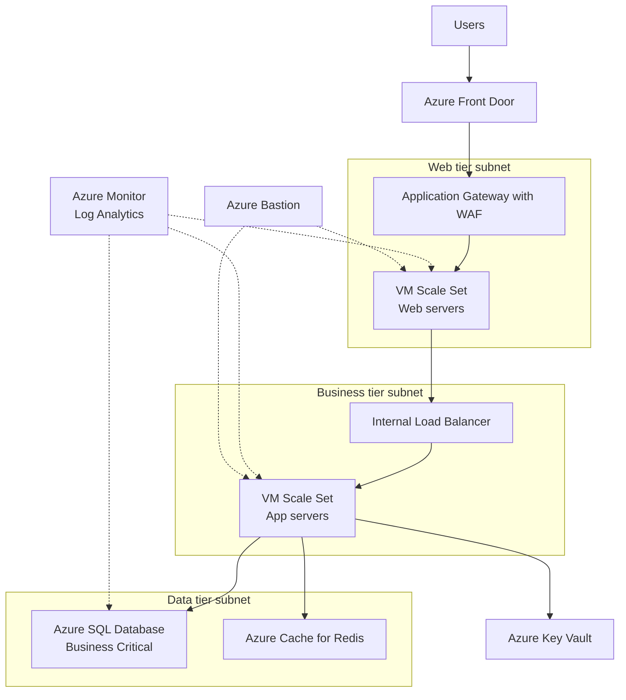

N-tier architecture divides an application into logical layers and physical tiers — typically presentation, business logic, and data — where each tier can only call into the tier directly below it. It is the most traditional architecture style in enterprise IT, and it remains the default choice for lift-and-shift migrations to Azure because on-premises applications are almost always already structured this way. On Azure, an n-tier design usually maps to load-balanced VMs or App Service instances for the web and business tiers, with a managed database service at the bottom, all segmented by virtual network subnets and network security groups.

## When to use it

- You are migrating an existing on-premises application to Azure with minimal code changes (lift-and-shift or lift-and-optimize).
- The application is a traditional web app with well-understood, relatively stable requirements.
- Your team is stronger in infrastructure operations than in distributed-systems development.
- You need clear network isolation boundaries between layers for compliance (for example, PCI DSS segmentation between web and data tiers).
- The workload depends on components that require Windows Server, IIS, or other VM-bound dependencies.
- You want a simple mental model that new team members and auditors can understand quickly.

## When to avoid it

- You need independent scaling and deployment of many small features — a monolithic middle tier becomes a bottleneck for team velocity.
- The workload is spiky and cost-sensitive; idle VMs in three tiers burn money compared to serverless or container-based alternatives.
- You are building a greenfield cloud-native product with no legacy constraints — PaaS-first styles usually deliver more value per engineering hour.
- Latency-critical paths cannot tolerate the extra network hops between tiers.
- Teams end up making changes across all three tiers for every feature — a sign the layering is ceremony, not architecture.

## Reference architecture

## Azure service mapping

| Logical component | Azure service | Why |
|---|---|---|
| Global entry point | Azure Front Door | TLS termination at the edge, global routing, caching, and DDoS absorption before traffic reaches your region |
| Web tier ingress | Application Gateway with WAF | Layer 7 load balancing plus OWASP rule sets inside your VNet |
| Web / presentation tier | Virtual Machine Scale Sets or App Service | VMSS for lift-and-shift parity; App Service when you can shed OS management |
| Business tier load balancing | Internal Load Balancer | Keeps tier-to-tier traffic private inside the VNet |
| Business tier | Virtual Machine Scale Sets | Autoscaling stateless app servers with rolling upgrade support |
| Data tier | Azure SQL Database | Managed HA, automated backups, and zone redundancy without DBA toil |
| Session and cache | Azure Cache for Redis | Externalizes session state so web tier instances stay stateless |
| Secrets | Azure Key Vault | Central store for connection strings and certificates with RBAC and rotation |
| Admin access | Azure Bastion | Browser-based RDP/SSH without exposing public management ports |
| Observability | Azure Monitor and Log Analytics | Single pane for VM metrics, SQL insights, and WAF logs |

## Benefits

- **Portability**: maps directly from on-premises topologies, so migration risk and retraining costs are low.
- **Predictable performance profile**: capacity planning is well understood, and each tier can be reasoned about with conventional sizing math.
- **Clear separation of concerns**: security teams can reason about subnet-to-subnet flows with NSGs and firewall rules.
- **Mature tooling**: decades of operational runbooks, monitoring patterns, and hiring pools exist for this style.
- **Incremental modernization path**: you can swap the data tier to Azure SQL first, then the web tier to App Service, without a rewrite.
- **Compliance friendliness**: physical tier boundaries make audit evidence straightforward.

## Challenges

- **Monolithic middle tier**: deployments are all-or-nothing; one bad release affects every feature.
- **Cost floor**: each tier needs a minimum instance count for HA, so the idle baseline is expensive.
- **Network hops**: every request pays latency crossing tiers even when the layering adds no value.
- **Scaling granularity**: you scale whole tiers, not hot features, which wastes capacity.
- **Configuration drift**: VM-based tiers accumulate snowflake state unless you enforce image pipelines or configuration management.

## Design checklist

Before you sign off on an n-tier design, verify each of these:

- [ ] Each tier is deployed across at least two availability zones, and the SLA math for the full chain has been calculated — chained SLAs multiply, they do not average.
- [ ] Web and business tiers are stateless; session state lives in Azure Cache for Redis, not in process memory.
- [ ] NSG rules enforce strictly one-directional flow between subnets, and there is a deny-all baseline rule at the bottom of every NSG.
- [ ] Azure SQL and Key Vault are reachable only through private endpoints; public network access is disabled.
- [ ] All service-to-service authentication uses managed identities; no SQL logins or connection-string passwords in app configuration.
- [ ] VM images are built by pipeline and versioned; no manual changes are made to running instances.
- [ ] Autoscale rules exist for both VMSS tiers with sensible floors, ceilings, and cooldowns — and they have been load-tested.
- [ ] Health probes at Application Gateway and the internal load balancer hit a real dependency-checking endpoint, not just a static page.
- [ ] Backup and restore for the data tier has been rehearsed, including a timed restore into a clean resource group.
- [ ] Azure Bastion is the only administrative path; no VM has a public IP or open port 3389/22.
- [ ] Diagnostic settings ship logs from every tier to a single Log Analytics workspace with a defined retention policy.
- [ ] The whole environment can be recreated from Bicep or Terraform in under an hour.
- [ ] Patch management is automated with Azure Update Manager and a defined maintenance window per tier.
- [ ] SQL connection pool limits in the business tier are aligned with the database tier's max concurrent connections.
- [ ] A capacity review is scheduled 30 days post-migration to right-size every tier against real telemetry.

## Well-Architected considerations

### Reliability
Deploy each tier across availability zones. Use zone-redundant Application Gateway v2 and zone-redundant Azure SQL. Keep the web and business tiers stateless (session in Redis) so any instance can die without user impact. Define health probes at every load balancer so unhealthy instances drain automatically.

### Security
Enforce a one-way traffic flow with NSGs: internet reaches only the web tier, the web tier reaches only the business tier, and only the business tier reaches the data tier. Use private endpoints for SQL and Key Vault, managed identities instead of connection-string credentials where possible, and Azure Bastion for all administrative access.

### Cost Optimization
Buy reserved instances or savings plans for the always-on baseline, and let VMSS autoscale handle the peak. Right-size with Azure Advisor after two weeks of real telemetry — teams routinely overprovision the business tier by 2x. Consider App Service for the web tier to cut OS-patching labor costs, which are real costs even if they never appear on the Azure bill.

### Operational Excellence
Build VM images with Azure Image Builder or Packer and treat them as immutable — never patch in place. Automate the whole topology with Bicep or Terraform. Wire deployment slots or rolling VMSS upgrades so releases never require downtime windows.

### Performance Efficiency
Cache aggressively in Redis to keep read traffic off SQL. Enable connection pooling in the business tier — SQL connection exhaustion is the classic n-tier scaling failure. Use Front Door caching for static assets so the web tier only serves dynamic content.


Field note: on a retail migration, the team sized all three tiers identically because that is what the on-premises cluster looked like. Two weeks of Azure Monitor data showed the business tier at 8 percent CPU while the web tier throttled. Right-sizing after real telemetry — not before — cut the monthly bill by 40 percent. Migrate first with generous sizing, then shrink with data; never guess in a spreadsheet.



Do not let the tiers become a distributed monolith with extra steps. If every feature change touches all three tiers and requires a coordinated release, you have the operational cost of distribution with none of the independence. Either collapse tiers or invest in real interface contracts between them.


## Variations and related patterns

The three-tier layout above is the canonical form, but real deployments vary:

- **Two-tier PaaS variant**: App Service hosting both presentation and business logic against Azure SQL. Fewer moving parts, lower cost, and often the right end state for lift-and-optimize migrations — the middle tier existed on-premises for hardware reasons that no longer apply.
- **Four-tier with API layer**: insert Azure API Management between web and business tiers when external partners or mobile clients also consume the business APIs. This decouples the public contract from internal implementation.
- **Hybrid tier placement**: keep the data tier on-premises during phased migration, connected via ExpressRoute or VPN Gateway. Watch the latency budget carefully — chatty ORM traffic across a 20 ms link destroys page performance.
- **Windows and Linux mixed estates**: nothing requires tiers to share an OS. A common pattern is Linux App Service for the web tier in front of a legacy Windows business tier on VMSS.
- **Multi-region active-passive**: replicate the full stack to a paired region with Azure SQL failover groups and Front Door priority routing. Test failover quarterly; an untested DR region is a diagram, not a capability.

Related styles to compare before committing:

- If the middle tier mostly dispatches background work, [Web-Queue-Worker](../web-queue-worker) is simpler and cheaper.
- If team scaling is the real problem, the tiers will not save you — read [Microservices](../microservices).

## Go deeper

- Scenario: [Scalable E-Commerce Platform](../../scenarios/ecommerce) applies this style to a real retail workload.
- Hands-on: [Lab 1 — N-Tier Web App](../../labs/lab-01-n-tier) builds the reference architecture above step by step.
- Next style: once the tiers are stable, [Web-Queue-Worker](../web-queue-worker) is the natural first step toward asynchronous processing.
