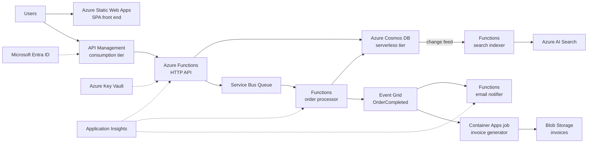

Serverless architecture builds applications from managed services where the platform handles all server provisioning, scaling, and patching, and you pay only for actual execution — compute measured in invocations and milliseconds rather than reserved instances. Code runs as event-triggered functions or scale-to-zero containers, state lives in managed databases and storage, and glue like API gateways, queues, and identity are consumed as services. On Azure, the core is Azure Functions and Azure Container Apps for compute, backed by Cosmos DB, Service Bus, Event Grid, and Azure Static Web Apps — a stack where a production API can exist with zero virtual machines and a near-zero idle bill.

## When to use it

- Traffic is spiky, unpredictable, or low-volume — paying per execution beats paying for idle capacity around the clock.
- You are building event-driven glue: react to uploads, messages, timers, webhooks, or database changes.
- Time to market dominates: a small team can ship a production API in days because the platform owns the undifferentiated plumbing.
- The workload decomposes into short, stateless operations — API endpoints, transformations, notifications.
- You are prototyping or launching a product whose scale is unknown; serverless scales from 10 users to 10 million without re-platforming.
- Operational headcount is scarce and nobody wants to own OS patching, capacity planning, or cluster upgrades.

## When to avoid it

- Sustained, high, steady throughput — at constant heavy load, provisioned App Service, AKS, or dedicated plans usually cost less than per-execution billing.
- Hard latency floors where cold starts are unacceptable and you are unwilling to pay for pre-warmed capacity via Flex Consumption or Premium plans.
- Long-running, stateful, or specialized processes — multi-hour jobs, GPU workloads, or software needing OS-level control.
- Heavy dependence on execution-environment specifics creates deep platform coupling; if portability is a contractual requirement, weigh containers on neutral ground.
- Extremely chatty architectures where hundreds of function-to-function hops per request multiply latency and cost — consolidation beats decomposition there.

## Reference architecture

## Azure service mapping

| Logical component | Azure service | Why |
|---|---|---|
| Function compute | Azure Functions | Rich trigger bindings, scale to zero, and per-execution billing; Flex Consumption adds VNet support and faster cold starts |
| Container compute | Azure Container Apps | Scale-to-zero containers with KEDA and Dapr for anything that outgrows the Functions programming model |
| Stateful workflows | Durable Functions | Orchestrations, timers, and human-approval patterns without owning a workflow engine |
| Low-code integration | Azure Logic Apps | Connector-driven workflows for SaaS integration where code adds no value |
| Front end hosting | Azure Static Web Apps | Global static hosting with integrated Functions API, auth, and preview environments per pull request |
| API gateway | Azure API Management consumption tier | Per-call priced gateway with auth, quotas, and versioning to keep function URLs out of clients |
| Serverless database | Azure Cosmos DB serverless | Per-request-unit billing that matches the pay-per-use model of the compute in front of it |
| SQL option | Azure SQL Database serverless | Auto-pause and per-second compute billing for relational needs with idle periods |
| Messaging | Azure Service Bus and Azure Event Grid | Reliable commands and reactive fan-out, both consumed as managed services |
| Object storage | Azure Blob Storage | Durable, event-emitting storage for files and artifacts |
| Identity | Microsoft Entra ID | Token issuance and validation handled by the platform, not your code |
| Observability | Application Insights | Per-invocation traces, dependency maps, and live metrics across all functions |

## Benefits

- **True pay-per-use**: an API that gets no traffic overnight costs pennies overnight; cost scales with revenue-generating activity.
- **Zero infrastructure operations**: no patching, no capacity planning, no cluster upgrades — the platform team is Microsoft.
- **Instant elasticity**: from zero to thousands of concurrent executions without pre-provisioning or scale planning meetings.
- **Small-team leverage**: two engineers can own a production system end to end, from front end to database.
- **Built-in event integration**: triggers and bindings replace hundreds of lines of polling and connection-management code.

## Challenges

- **Cold starts**: idle functions add latency on first invocation; mitigations — Flex Consumption always-ready instances or Premium plans — cost money and dilute the pay-per-use purity.
- **Execution limits**: timeouts, memory ceilings, and payload caps force workarounds for anything long-running or large.
- **Distributed debugging**: a request touching six functions and three queues is only debuggable with disciplined correlation and tracing.
- **Cost surprises at scale**: per-execution pricing that was free at 10,000 calls can exceed dedicated hosting at 500 million — model the crossover.
- **Platform coupling**: bindings, triggers, and service semantics are Azure-shaped; migration later is a rewrite of the edges, not a lift.

## Design checklist

Before you sign off on a serverless design, verify each of these:

- [ ] Every function is stateless and idempotent; any required state lives in Cosmos DB, Blob Storage, or a Durable Functions orchestration.
- [ ] Clients and connections are initialized outside the handler and reused across invocations.
- [ ] All HTTP functions sit behind API Management or Static Web Apps auth; no anonymous function keys are shared with clients.
- [ ] Each function app has its own managed identity scoped to exactly the resources it needs.
- [ ] Retry policies and dead-lettering are explicitly configured on every trigger — the defaults have been read, not assumed.
- [ ] Cold-start impact is measured for user-facing paths, and always-ready instances are budgeted where the latency floor demands it.
- [ ] Cosmos DB queries are covered by indexes and RU consumption per operation is known for the top ten calls.
- [ ] Budget alerts exist, and a runaway-loop scenario — a function triggering itself via its own output — has been checked for by design review.
- [ ] The cost crossover point versus dedicated hosting is modeled at 10x and 100x current traffic.
- [ ] Everything deploys from Bicep or Terraform through CI/CD with staged rollout; the portal is read-only in production.
- [ ] Distributed traces connect the front end, APIM, every function, and every queue hop under one correlation ID.
- [ ] Function timeout, memory, and payload limits are documented per workload, with a plan for jobs that approach them.
- [ ] Concurrency limits are configured on triggers that call rate-limited downstreams, so a scale-out burst cannot exhaust a partner API quota.
- [ ] Local development and testing story is settled — Functions Core Tools, testcontainers, or a dev environment — so the platform is not the only place code runs.

## Well-Architected considerations

### Reliability
Design every function to be idempotent and stateless — the platform will retry, scale, and recycle instances at will. Use Durable Functions for anything multi-step so state survives crashes and restarts. Configure dead-lettering on every queue and Event Grid subscription, and set explicit retry policies rather than accepting defaults you have never read.

### Security
Assign each function app its own managed identity with least-privilege RBAC to exactly the resources it touches. Put API Management or Static Web Apps auth in front of HTTP functions — never expose anonymous function URLs for anything stateful. Use Flex Consumption or Premium for VNet integration when data services must stay behind private endpoints.

### Cost Optimization
Serverless is cheapest when idle and can be expensive when busy: track cost per million executions and model the crossover to dedicated plans as traffic grows. Watch Cosmos DB request-unit consumption — a poorly indexed query costs real money on every call. Set budget alerts early; per-use billing means a bug that loops is a bug that bills, and an infinite retry storm shows up on the invoice.

### Operational Excellence
Deploy everything — function apps, APIM policies, Cosmos containers — from Bicep or Terraform with slot-based or blue-green releases. Application Insights with sampled distributed tracing is non-negotiable from day one. Keep functions small in count as well as size: fifty micro-functions with duplicated boilerplate operate worse than twelve well-factored ones.

### Performance Efficiency
Reuse connections and clients across invocations by initializing them outside the handler — per-invocation connection creation exhausts downstream limits fast. Mind the cold-start tax on latency-sensitive paths and pre-warm them explicitly. Batch queue and Event Hubs triggers where the workload tolerates it; per-message invocation of a firehose is the slowest and most expensive option.


Field note: a startup ran their entire booking API on Functions and Cosmos DB serverless for 14 months at under 80 dollars a month — then a marketing campaign multiplied traffic 60x in a week and the bill hit four figures while dedicated capacity would have been cheaper. They moved the two hottest endpoints to a Container Apps dedicated profile and kept the long tail serverless. The lesson: serverless-first is right for new products, but revisit the pricing model at every traffic milestone; the best architectures end up hybrid.



Never let a function call another function over HTTP when a queue or an in-process call would do. Synchronous function chains compound cold starts, double-bill you for the caller waiting on the callee, and turn one timeout into a cascade. If two functions always change together and call each other, they are one function.


## Variations and related patterns

Serverless on Azure covers a spectrum, not a single stack:

- **Jamstack plus API**: Static Web Apps hosting the front end with its managed Functions backend — the fastest route from repository to production URL, complete with per-pull-request preview environments.
- **Durable workflow core**: Durable Functions orchestrating multi-step business processes — approvals, sagas, scheduled follow-ups — where the platform persists state between steps for you.
- **Serverless containers**: Container Apps with scale-to-zero for teams that want per-use economics but need custom runtimes, longer executions, or gradual migration from existing container images.
- **Low-code integration layer**: Logic Apps for SaaS-to-SaaS flows — connector-driven work where writing code adds maintenance burden without adding value.
- **Hybrid hot-path split**: latency-critical or high-volume endpoints on dedicated Container Apps profiles or Premium Functions, with the long tail of rarely called endpoints on consumption billing. Most mature serverless estates converge here.
- **Event-sourced serverless**: Cosmos DB change feed driving Functions projections — a natural, low-plumbing implementation of CQRS-style read models.

Related styles to compare before committing:

- Serverless compute is the natural execution layer for [Event-Driven Architecture](../event-driven); the two styles usually ship together.
- A growing fleet of function apps with team-ownership boundaries is quietly becoming [Microservices](../microservices) — adopt its discipline before its pain.

## Go deeper

- Scenario: [Serverless API](../../scenarios/serverless-api) designs a production-grade pay-per-use API end to end.
- Hands-on: [Lab 3 — Serverless API](../../labs/lab-03-serverless-api) builds the Functions, Cosmos DB, and API Management stack above.
- Companion style: the eventing backbone these functions react to is detailed in [Event-Driven Architecture](../event-driven).
