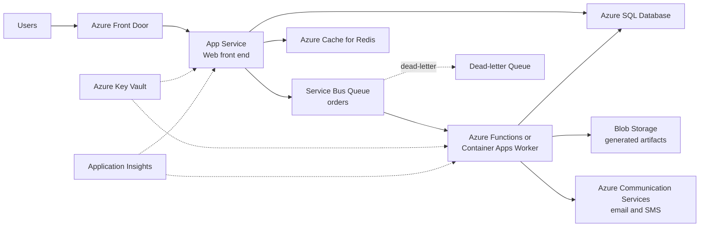

Web-Queue-Worker is a two-component style: a web front end that handles synchronous HTTP requests, and a worker process that handles long-running or resource-intensive jobs, with a message queue decoupling the two. The web tier accepts a request, drops a message on the queue, and returns immediately; the worker picks it up whenever it can. This is the simplest architecture that gives you asynchronous processing, load leveling, and independent scaling — and on Azure it composes almost entirely from managed PaaS parts, making it a favorite first step beyond a plain monolith.

## When to use it

- Requests trigger work that takes longer than users will wait — image processing, report generation, order fulfillment, email or notification sending.
- Traffic is bursty and you want the queue to absorb spikes instead of scaling the whole app to peak.
- You want to keep the application simple — a monolithic front end plus one worker is far easier to operate than full microservices.
- You are decomposing a monolith and want a low-risk first cut: move the slowest endpoint behind a queue.
- Background jobs fail occasionally and you need retries and dead-lettering without writing that plumbing yourself.
- The core domain is straightforward enough that it does not need to be split into many services.

## When to avoid it

- All operations are fast, synchronous request-response — a queue adds latency and moving parts for nothing.
- The workflow needs many steps with complex branching and compensation; look at Durable Functions or an orchestrator instead of chaining queues by hand.
- Users need the result of the background work immediately in the same interaction — async plus polling or push notifications adds real UX complexity.
- The web and worker components have grown large and cross-cutting teams keep stepping on each other; that is the signal to graduate toward microservices.
- You need strict global ordering across all messages at high throughput — queues make this harder, not easier.

## Reference architecture

## Azure service mapping

| Logical component | Azure service | Why |
|---|---|---|
| Global entry | Azure Front Door | Edge TLS, WAF, and caching in front of the web app |
| Web front end | Azure App Service | Managed HTTP hosting with deployment slots and autoscale; the fastest path for a web monolith |
| Message queue | Azure Service Bus Queue | At-least-once delivery, sessions, dead-lettering, and scheduled messages; richer semantics than Storage Queues |
| Simple queue alternative | Azure Storage Queues | Cheaper and simpler when you only need basic enqueue/dequeue at scale |
| Worker | Azure Functions or Azure Container Apps | Functions with a Service Bus trigger scale to zero; Container Apps with KEDA when you need custom containers or longer runs |
| Primary data | Azure SQL Database | Shared transactional store for web and worker |
| Cache | Azure Cache for Redis | Offloads hot reads and stores session state |
| Artifact storage | Azure Blob Storage | Cheap durable home for generated files like PDFs and images |
| Notifications | Azure Communication Services | Managed email and SMS from the worker |
| Secrets | Azure Key Vault | One place for connection strings, accessed via managed identity |
| Observability | Application Insights | Distributed traces that follow a request from web through queue to worker |

## Benefits

- **Load leveling**: the queue absorbs traffic spikes so the worker can drain at its own pace; you size for average, not peak.
- **Deploy independence**: web and worker release on separate cadences; a worker fix never requires touching the customer-facing app.
- **Retry for free**: the broker's delivery semantics give you durable retries without hand-rolled retry loops in application code.
- **Responsiveness**: users get an immediate acknowledgment instead of watching a spinner for 30 seconds.
- **Independent scaling**: scale the web tier on HTTP load and the worker on queue depth — two different signals, two different bills.
- **Failure isolation**: a worker crash or a poison message does not take down the website; dead-lettering quarantines bad messages.
- **Low conceptual overhead**: two deployables and a queue is something a small team can genuinely own.

## Challenges

- **Eventual consistency**: the UI must handle the gap between accepted and completed — status pages, polling, or push updates.
- **Idempotency is mandatory**: Service Bus is at-least-once; workers will occasionally see the same message twice and must tolerate it.
- **Poison messages**: without a dead-letter strategy and alerting, one malformed message can silently retry forever.
- **Hidden coupling through the database**: web and worker sharing one schema can become the real monolith; watch for lockstep deployments.
- **Queue depth blindness**: teams monitor CPU but not queue age, then discover a four-hour backlog from an angry customer.
- **Local development friction**: reproducing the web-queue-worker loop on a laptop needs emulators or dev namespaces; teams that skip this test only in the cloud.

## Design checklist

Before you sign off on a web-queue-worker design, verify each of these:

- [ ] Every worker operation is idempotent — reprocessing the same message twice produces the same end state, verified by a test.
- [ ] Max delivery count is set on every queue and dead-lettered messages raise an alert that a human actually receives.
- [ ] There is a documented, preferably automated, procedure for inspecting, fixing, and resubmitting dead-letter messages.
- [ ] Queue age — not just queue length — has a monitor with a threshold tied to the business SLA for that job type.
- [ ] Worker scaling is driven by queue depth (KEDA or Functions scale controller), and the maximum scale-out has been load-tested against downstream limits like SQL connections.
- [ ] Messages carry an ID and a correlation ID; payloads are small, with large data passed as blob references.
- [ ] The web tier degrades gracefully when the queue is unreachable — a clear error or fallback, not a hung request.
- [ ] All queue and database access uses managed identities; no shared access signatures in configuration.
- [ ] The message schema is versioned, and the worker tolerates at least one prior version during rolling deployments.
- [ ] Users can see the status of their async work — a status endpoint, notification, or UI state, decided deliberately rather than left as a surprise.
- [ ] A backlog-drain runbook exists: if the worker is down for N hours, you know how long recovery takes and how to scale it.
- [ ] End-to-end traces in Application Insights connect the HTTP request, the enqueue, and the worker execution.
- [ ] Duplicate-processing consequences are documented per job type — harmless for a report, catastrophic for a charge — and mitigations match the stakes.
- [ ] Worker deployment uses rolling or blue-green strategy so in-flight messages complete on the old version before it drains.
- [ ] Peak-load behavior is load-tested: enqueue at 10x normal rate and confirm the drain time and downstream stability.
- [ ] Message time-to-live values are set deliberately so stale work expires rather than executing days later.

## Well-Architected considerations

### Reliability
Use Service Bus with zone redundancy and configure max delivery count so poison messages land in the dead-letter queue instead of looping. Make every worker operation idempotent — check a processed-message table or use natural idempotency keys like order IDs. Test the backlog-drain scenario: if the worker is down for an hour, how long until the queue is empty?

### Security
Use managed identities for all queue and database access — no connection strings in app settings. Lock Service Bus behind a private endpoint if the VNet posture requires it. Validate and size-limit message payloads; the queue is an input surface just like HTTP.

### Cost Optimization
Functions on the Consumption or Flex Consumption plan cost nothing when the queue is empty — ideal for spiky jobs. If worker load is steady, a Container Apps instance or an App Service plan you already own may be cheaper than per-execution billing. Storage Queues cost a fraction of Service Bus when you do not need its features.

### Operational Excellence
Alert on queue age, not just queue length — 100 messages that are 2 seconds old is fine; 5 messages that are 30 minutes old is an incident. Trace end to end with Application Insights correlation IDs flowing through message properties. Automate dead-letter inspection; a DLQ nobody reads is a black hole for customer orders.

### Performance Efficiency
Scale workers on queue depth with KEDA or the Functions scale controller rather than CPU. Batch message receipt where the workload allows it — prefetch and batch processing can cut per-message overhead dramatically. Keep messages small: pass a blob URL or an entity ID, not a 2 MB payload.


Field note: a ticketing client launched a flash sale and the site stayed up beautifully — but confirmation emails arrived six hours late because the worker was pinned to two instances while the queue grew past 200,000 messages. Nobody had an alert on message age. The fix took one afternoon: KEDA scaling on queue depth plus an alert when the oldest message exceeded five minutes. Monitor the queue like it is a customer-facing SLA, because it is.



Never assume exactly-once delivery. Design every worker as if each message will arrive twice, out of order, after a delay. If duplicate processing would double-charge a customer, build the idempotency check before you build anything else.


## Variations and related patterns

The core shape stays constant, but the components swap freely:

- **All-Functions variant**: an HTTP-triggered function as the web tier and a queue-triggered function as the worker. The cheapest possible version of this style, and a common shape for internal tools and APIs.
- **Container Apps end to end**: web and worker as two Container Apps in one environment, worker scaled by a KEDA Service Bus scaler. Good when you want containers and Dapr without Kubernetes.
- **Priority queues**: split into high- and low-priority queues with separately scaled workers so bulk imports never starve customer-facing jobs.
- **Scheduled work**: add timer-triggered enqueuing for recurring jobs — the queue remains the single entry point to the worker, keeping one code path for everything.
- **Competing consumers at scale**: multiple worker instances naturally compete on one queue; use Service Bus sessions when a subset of messages, such as all events for one order, must process in sequence.
- **Claim-check pattern**: for large payloads, store the body in Blob Storage and enqueue only a reference — keeps queues fast and cheap.

Related styles to compare before committing:

- If many independent consumers need the same event, that is fan-out — see [Event-Driven Architecture](../event-driven).
- If the worker keeps absorbing unrelated responsibilities, you are growing a second monolith — see [Microservices](../microservices) for when to split.

## Go deeper

- Scenario: [Scalable E-Commerce Platform](../../scenarios/ecommerce) uses this style for order processing and notifications.
- Hands-on: [Lab 2 — Web-Queue-Worker](../../labs/lab-02-web-queue-worker) builds the queue-decoupled pipeline above.
- Next style: when multiple consumers need to react to the same events, graduate to [Event-Driven Architecture](../event-driven).
