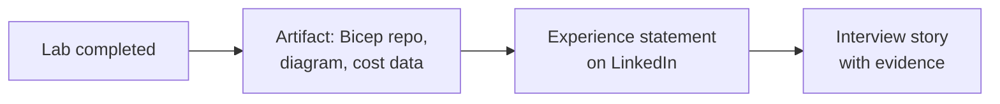

Labs only pay off if they become **legible career experience**. This section turns the architecture styles you learned and the labs you completed into LinkedIn entries, resume bullets, and interview answers that hiring managers and recruiters actually respond to.

## What's here


  
  
  


## The principle: claims backed by artifacts

A statement like *"Designed event-driven order processing on Azure Service Bus with idempotent consumers"* is credible when you can link a repository, sketch the diagram from memory, and explain the trade-off you rejected. Every lab on this site is structured to leave you with exactly those three artifacts.
