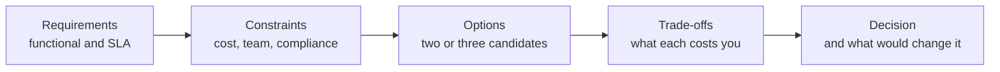

Design-review interviews test one thing: can you reason from requirements to a defensible decision under time pressure. The questions below are the ones Azure engineers and architects actually get, each with what the interviewer is probing, a strong answer outline grounded in this site's [scenario playbooks](../../scenarios), and the weak answer that gets candidates rejected.

## The answer framework

Never jump to services. Walk every design question through the same five stages — interviewers score the structure as much as the content:

The last box matters most. Ending with *and I would revisit this if X changed* is the sentence that separates senior candidates from service-name reciters.


For every question below, your strongest asset is a lab you actually ran. Saying I deployed this, here is the repo, and here is the number I measured beats any memorized reference architecture.


## Question 1 — Design a multi-region web app with RTO under 5 minutes

**Probing:** whether you design from the SLA backwards, and whether you know what actually breaks during regional failover — usually the data tier, not the compute.

**Strong outline** — grounded in [Multi-Region High Availability](../../scenarios/multi-region-ha):

- Clarify RPO first; RTO under 5 minutes with RPO zero is a very different design from RPO of minutes.
- Global entry: Azure Front Door with health probes and automated failover — DNS-based Traffic Manager is too slow for a 5-minute RTO because of TTL caching.
- Compute: active-passive with the secondary warm, or active-active if the budget allows; state must live outside the compute tier either way.
- Data: this is the hard part. Azure SQL failover groups or Cosmos DB multi-region writes; be explicit that geo-replication is asynchronous, so a forced failover can lose seconds of data — that is an RPO conversation with the business.
- Verify: an RTO you have not drilled is a guess. Describe the failover test from [Lab 8](../../labs/lab-08-multi-region-ha) and the measured number.

**Weak answer to avoid:** deploy to two regions and put Traffic Manager in front. It ignores the data tier entirely, picks the wrong routing layer for the RTO, and offers no evidence the 5-minute target is met.

## Question 2 — Event Grid vs Service Bus vs Event Hubs: when each?

**Probing:** whether you select messaging services from workload characteristics or just name whichever one you used last.

**Strong outline** — grounded in [Event-Driven Order Processing](../../scenarios/event-driven-orders) and [IoT Telemetry Pipeline](../../scenarios/iot-telemetry):

- **Event Grid** — discrete lightweight events, push-based reactive routing, massive fan-out; the fact that something happened. Blob created, resource changed.
- **Service Bus** — commands and business messages that must not be lost: ordering via sessions, transactions, duplicate detection, dead-lettering. Orders, payments.
- **Event Hubs** — high-throughput streams of telemetry read by partition with consumer offsets; millions of events per second, replayable.
- Close with the composite pattern: Event Hubs ingests the stream, Stream Analytics detects a condition, Event Grid routes the alert, Service Bus carries the resulting command. Real systems combine them.

**Weak answer to avoid:** they are all messaging services, I would just use Service Bus everywhere. It signals you have never hit Service Bus throughput limits or paid the cost of using it as a telemetry pipe.

## Question 3 — How would you migrate an on-prem 3-tier app to Azure?

**Probing:** whether you know migration is a sequence of risk decisions, not a single lift-and-shift command.

**Strong outline** — grounded in [Scalable E-Commerce Platform](../../scenarios/ecommerce) and [Hybrid Networking with Hub-Spoke](../../scenarios/hybrid-networking):

- Assess first: dependencies, data gravity, licensing, and what actually holds the SLA today.
- Choose a track per tier — rehost the app tier to App Service or VMs, replatform the database to Azure SQL Managed Instance to keep compatibility, modernize the web tier last.
- Land it in a proper network foundation: hub-spoke with hybrid connectivity, so the app can talk to what stays on-prem during the transition — see [Lab 7](../../labs/lab-07-hub-spoke).
- Cut over with a rollback plan: database migration via replication with a short freeze window, not a big-bang export.
- Name the post-migration debt explicitly: session state, hardcoded IPs, and chatty tier-to-tier calls that now cross a network boundary.

**Weak answer to avoid:** use Azure Migrate to move the VMs. Tooling is not a strategy; the interviewer wants the sequencing, the data cutover, and the rollback story.

## Question 4 — A checkout endpoint times out under load. Walk me through fixing it.

**Probing:** whether you reach for the Web-Queue-Worker pattern or just scale up the web tier and hope.

**Strong outline** — grounded in [Scalable E-Commerce Platform](../../scenarios/ecommerce):

- Diagnose before designing: is the bottleneck the web tier, a downstream dependency, or a synchronous call that should never have been synchronous?
- If checkout does slow work inline — payment, inventory, email — decouple it: accept the order, validate, enqueue, return 202 with an order ID, and let workers process from the queue as in [Lab 2](../../labs/lab-02-web-queue-worker).
- Address the consequences honestly: the client now needs a status endpoint or a notification; the worker needs idempotency because the queue delivers at-least-once.
- Only then talk scaling: autoscale workers on queue depth, not CPU.

**Weak answer to avoid:** increase the App Service plan size and add more instances. Vertical scaling a synchronous bottleneck buys time, not a fix, and the interviewer knows it.

## Question 5 — When would you choose AKS over Container Apps or App Service?

**Probing:** whether you can resist the resume-driven pull of Kubernetes and match platform to team.

**Strong outline** — grounded in [Microservices on AKS](../../scenarios/microservices-aks):

- Default order: App Service for a handful of web workloads, Container Apps for microservices without a platform team, AKS when you need what only Kubernetes gives you — custom operators, sidecars and service mesh, GPU scheduling, strict pod-level network policy, or portability mandates.
- The real cost of AKS is operational: upgrades, node management, RBAC, and someone on call for the cluster. Quote your own experience from [Lab 5](../../labs/lab-05-aks-microservices).
- State the reversal condition: start on Container Apps and move to AKS when a concrete requirement appears, not before.

**Weak answer to avoid:** AKS because Kubernetes is the industry standard. Choosing the heaviest tool by default tells the interviewer you have never paid its operating bill.

## Question 6 — Design the network foundation for a company moving 20 workloads to Azure

**Probing:** landing-zone thinking — segmentation, centralized control, and growth planning rather than one big VNet.

**Strong outline** — grounded in [Hybrid Networking with Hub-Spoke](../../scenarios/hybrid-networking):

- Hub-spoke: shared services in the hub — firewall, DNS, hybrid gateways, Bastion — one spoke per workload or environment, non-overlapping address space planned for years of growth.
- Centralized egress through Azure Firewall with UDRs; deny-by-default NSGs in spokes; private endpoints for PaaS data planes.
- Hybrid: VPN Gateway to start, ExpressRoute when bandwidth and SLA demand it — give the criteria, not just the names.
- Governance: Azure Policy to keep new spokes compliant, IaC so the topology is reproducible — reference the Bicep from [Lab 7](../../labs/lab-07-hub-spoke).

**Weak answer to avoid:** put everything in one VNet with subnets per app. It works for five workloads and becomes an unsegmentable blast radius at twenty.

## Question 7 — How do you guarantee an order is processed exactly once?

**Probing:** whether you know exactly-once delivery is a myth and idempotency is the real answer.

**Strong outline** — grounded in [Event-Driven Order Processing](../../scenarios/event-driven-orders):

- State the truth up front: the infrastructure gives you at-least-once; exactly-once is an end-to-end property you build.
- Idempotent consumers: a natural idempotency key such as the order ID, with processed-state checked before side effects.
- Layer the platform helpers: Service Bus duplicate detection for a time window, sessions where ordering matters, dead-lettering for poison messages.
- Mention the outbox pattern for the produce side — writing state and publishing an event atomically — as in [Lab 4](../../labs/lab-04-event-driven).

**Weak answer to avoid:** Service Bus supports exactly-once delivery so I would enable that. It does not, and claiming so ends the credibility of everything said before it.

## Question 8 — Serverless API: how do you handle cold starts and downstream throttling?

**Probing:** operational maturity with serverless — the failure modes, not the marketing.

**Strong outline** — grounded in [Serverless API Backend](../../scenarios/serverless-api):

- Quantify cold start before fixing it: measure per runtime and payload, as in [Lab 3](../../labs/lab-03-serverless-api). Fix with Premium plan pre-warmed instances only for the latency-critical paths — Consumption everywhere else.
- Downstream pressure: Functions scale out faster than most databases can absorb; cap concurrency, use Cosmos DB autoscale, and put a queue between the API and heavy writes.
- Front with API Management for throttling, quotas, and retry-friendly error responses.
- Note the anti-pattern: a serverless function calling a fixed-capacity SQL database is the classic self-inflicted denial of service.

**Weak answer to avoid:** serverless scales automatically so throttling is not a concern. That is precisely the failure the question is about.

## Question 9 — Design an analytics platform for both batch and streaming data

**Probing:** whether you know the lakehouse pattern and hot-path vs cold-path separation.

**Strong outline** — grounded in [Modern Data Analytics Platform](../../scenarios/data-analytics) and [IoT Telemetry Pipeline](../../scenarios/iot-telemetry):

- Two paths, one storage truth: streaming through Event Hubs and Stream Analytics for the hot path; batch through Data Factory into the lake for the cold path.
- Medallion layers on ADLS Gen2 — bronze raw, silver cleaned, gold curated — with Parquet or Delta and deliberate partitioning; quote the scan-size difference you measured in [Lab 6](../../labs/lab-06-data-pipeline).
- Consumption: serverless SQL or Fabric for BI; keep compute and storage decoupled so each scales and bills independently.
- Governance early: schema evolution, lineage, and lifecycle policies are retrofits nobody enjoys.

**Weak answer to avoid:** put everything in a data warehouse. It collapses the streaming requirement, couples storage to compute cost, and ignores semi-structured data.

## Question 10 — Your architecture was rejected in review for being too expensive. What now?

**Probing:** whether you treat cost as a first-class requirement and can degrade a design gracefully instead of defensively.

**Strong outline:**

- Reframe: cost is a constraint like RTO; the review surfaced a requirement that was missing. Ask for the actual envelope.
- Decompose the bill: usually two or three line items dominate — in lab experience, firewalls, AKS control-plane hours, and over-provisioned SKUs. Every lab on this site tracks per-run cost for exactly this reason.
- Offer tiered options: the same architecture at three price points with explicit SLA differences — for example active-active dropped to active-passive with a longer RTO, as analyzed in [Multi-Region High Availability](../../scenarios/multi-region-ha).
- Close with the principle: the cheapest architecture that meets the stated requirements wins; gold-plating past requirements is a design defect, not a virtue.

**Weak answer to avoid:** defend the original design and explain why the budget should increase. Sometimes true, but as a first move it signals you cannot engineer within constraints.

## How to practice

1. Pick two questions per session and answer out loud, walking the framework diagram above — requirements to decision in under six minutes.
2. After each answer, check it against the linked playbook and note what you missed.
3. Rerun the matching lab if the miss was hands-on knowledge rather than framing; the [skill matrix](../skill-matrix) tells you which lab that is.
4. Record the strongest version of each answer as a story — situation, decision, evidence — and keep it consistent with your [LinkedIn statements](../linkedin-experience).


Do not memorize these outlines verbatim. Interviewers probe one level deeper than any script, and the labs exist precisely so that the next level down is something you have actually touched.

