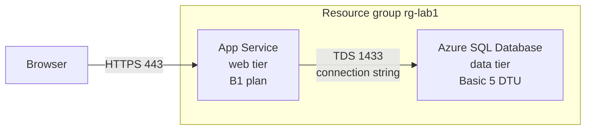

In this lab you deploy the smallest honest version of a classic three-tier application on Azure: an App Service web app as the web tier, an Azure SQL Database as the data tier, and an App Service plan providing the compute. The middle tier is collapsed into the web app, which is exactly how most small N-tier systems start in practice. Everything runs on the cheapest viable SKUs — a B1 App Service plan and a Basic SQL database — so the lab costs well under a dollar if you tear it down the same day. This lab proves the [N-Tier Architecture](../../architecture-styles/n-tier) style: separate tiers, separate scaling, and a network boundary between compute and data.

## What you will build



## Prerequisites

- Azure CLI 2.60 or later — check with `az version`
- Logged in to a subscription you can create resources in — `az login` then `az account show`
- Bicep CLI available — `az bicep version` installs it on first use
- A bash shell — macOS, Linux, WSL, or Azure Cloud Shell

## Walkthrough

{}

### Set variables

A random suffix keeps globally unique names, such as the web app hostname and the SQL server name, from colliding with anyone else's.

```bash
SUFFIX=$RANDOM
LOCATION=eastus
RG=rg-lab1-ntier-$SUFFIX
PLAN=plan-ntier-$SUFFIX
APP=app-ntier-$SUFFIX
SQL_SERVER=sql-ntier-$SUFFIX
SQL_DB=appdb
SQL_ADMIN=labadmin
SQL_PASSWORD="P@ssw0rd$RANDOM$RANDOM"

echo "App URL will be: https://$APP.azurewebsites.net"
echo "SQL password is: $SQL_PASSWORD"
```


Keep this terminal open for the whole lab. The variables live only in the current shell session, and you will need the generated password later.


### Create the resource group

```bash
az group create --name $RG --location $LOCATION
```

Expected output ends with `"provisioningState": "Succeeded"`.

### Deploy the web tier

Create the App Service plan on the B1 SKU and a Linux web app on it. B1 is the cheapest tier that supports always-on custom apps and manual scale-out, which makes it a fair stand-in for a production web tier.

```bash
az appservice plan create \
  --name $PLAN \
  --resource-group $RG \
  --sku B1 \
  --is-linux

az webapp create \
  --name $APP \
  --resource-group $RG \
  --plan $PLAN \
  --runtime "NODE:20-lts"
```

### Deploy the data tier with Bicep

The SQL server, database, and firewall rule form one logical unit, so they are cleaner as a single Bicep file than as three CLI calls. Save this as `main.bicep`:

```bicep
param location string = resourceGroup().location
param sqlServerName string
param sqlDbName string = 'appdb'
param administratorLogin string

@secure()
param administratorLoginPassword string

resource sqlServer 'Microsoft.Sql/servers@2021-11-01' = {
  name: sqlServerName
  location: location
  properties: {
    administratorLogin: administratorLogin
    administratorLoginPassword: administratorLoginPassword
    minimalTlsVersion: '1.2'
  }
}

resource sqlDb 'Microsoft.Sql/servers/databases@2021-11-01' = {
  parent: sqlServer
  name: sqlDbName
  location: location
  sku: {
    name: 'Basic'
    tier: 'Basic'
    capacity: 5
  }
  properties: {
    maxSizeBytes: 2147483648
  }
}

resource allowAzureServices 'Microsoft.Sql/servers/firewallRules@2021-11-01' = {
  parent: sqlServer
  name: 'AllowAzureServices'
  properties: {
    startIpAddress: '0.0.0.0'
    endIpAddress: '0.0.0.0'
  }
}

output sqlServerFqdn string = sqlServer.properties.fullyQualifiedDomainName
```

The `0.0.0.0` firewall rule is the special value that means "allow Azure services", which lets the web app reach the database over the Azure backbone. Deploy it:

```bash
az deployment group create \
  --resource-group $RG \
  --template-file main.bicep \
  --parameters \
      sqlServerName=$SQL_SERVER \
      administratorLogin=$SQL_ADMIN \
      administratorLoginPassword=$SQL_PASSWORD
```

The deployment takes two to four minutes. Look for `"provisioningState": "Succeeded"` in the output.

### Wire the tiers together

Give the web tier its connection string as an App Service connection string setting, which is injected as an environment variable at runtime and never lives in code:

```bash
az webapp config connection-string set \
  --name $APP \
  --resource-group $RG \
  --connection-string-type SQLAzure \
  --settings DefaultConnection="Server=tcp:$SQL_SERVER.database.windows.net,1433;Database=$SQL_DB;User ID=$SQL_ADMIN;Password=$SQL_PASSWORD;Encrypt=true;Connection Timeout=30;"
```

### Verify it works

Confirm the web tier responds and the data tier is online:

```bash
curl -sI https://$APP.azurewebsites.net | head -n 1
```

Expected output:

```text
HTTP/1.1 200 OK
```

```bash
az sql db show \
  --resource-group $RG \
  --server $SQL_SERVER \
  --name $SQL_DB \
  --query status --output tsv
```

Expected output:

```text
Online
```

You now have two independent tiers with a secret-free code path between them: the app reads `DefaultConnection` from its environment.

### Capture evidence

```bash
az resource list --resource-group $RG --output table
```

You should see four resources: the App Service plan, the web app, the SQL server, and the SQL database. Take a screenshot or save the output — this is your deployment artifact. At B1 plus Basic pricing this stack costs roughly 18 to 20 USD per month, or a few cents for the hour the lab runs.

{}

## Private connectivity — what production changes

This lab uses the "allow Azure services" firewall rule, which is fine for learning but too broad for production: any Azure-hosted tenant could attempt a connection if it had valid credentials. The production-grade pattern is a **Private Endpoint** on the SQL server plus **VNet integration** on the web app, so database traffic never touches a public IP at all. That upgrade adds a virtual network, a private DNS zone for `privatelink.database.windows.net`, and roughly 7 to 10 USD per month per endpoint — a good example of paying money to shrink the attack surface. Being able to explain why you did not do this in a lab, and exactly what you would change for production, is worth more in an interview than pretending the firewall rule is fine.

## Teardown

One command removes every resource in the lab:

```bash
az group delete --name $RG --yes --no-wait
```


Deletion is asynchronous and irreversible. The B1 plan and the SQL database bill by the hour whether or not you use them, so run the teardown as soon as you finish. Verify later with az group show, which should return ResourceGroupNotFound.


## What to record for your portfolio

- **The claim** — you can deploy a two-tier web application on Azure with the compute and data tiers provisioned separately, wired by injected configuration, and defined partly in Bicep infrastructure-as-code.
- **The artifact** — the `main.bicep` file plus the `az resource list` output showing the four resources, ideally in a repo with a README describing the topology.
- **The trade-off** — public firewall rule versus Private Endpoint: you can explain the cost, DNS, and security implications of each and when the cheaper option is acceptable.

## Next

Continue to [Lab 2 — Web-Queue-Worker](../lab-02-web-queue-worker), which breaks the synchronous chain of this lab by putting a queue between the web tier and the background work.
