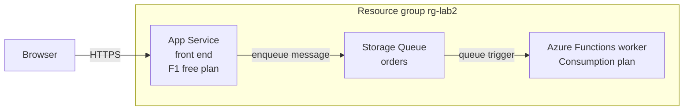

In this lab you build the simplest asynchronous system on Azure: an App Service front end, an Azure Storage Queue as the buffer, and an Azure Functions worker on the Consumption plan that drains the queue. The point is to prove that the front end and the worker are decoupled — the web tier can accept work instantly and stay responsive even if processing is slow, and the worker scales to zero when there is nothing to do. This lab demonstrates the [Web-Queue-Worker Architecture](../../architecture-styles/web-queue-worker) style end to end for pennies.

## What you will build



## Prerequisites

- Azure CLI 2.60 or later — check with `az version`
- Logged in to a subscription you can create resources in — `az login` then `az account show`
- Bicep CLI available — `az bicep version` installs it on first use
- A bash shell with `zip` installed — macOS, Linux, WSL, or Azure Cloud Shell

## Walkthrough

{}

### Set variables

Storage account and function app names must be globally unique, so generate a random suffix once and reuse it everywhere:

```bash
SUFFIX=$RANDOM
LOCATION=eastus
RG=rg-lab2-wqw-$SUFFIX
PLAN=plan-wqw-$SUFFIX
WEB=web-wqw-$SUFFIX
STORAGE=stwqw$SUFFIX
FUNC=func-wqw-$SUFFIX
QUEUE=orders

echo "Web app:      $WEB"
echo "Function app: $FUNC"
echo "Storage:      $STORAGE"
```


Storage account names allow only lowercase letters and digits, 3 to 24 characters, which is why the storage variable has no hyphens.


### Create the resource group

```bash
az group create --name $RG --location $LOCATION
```

### Create the storage account and queue

One storage account serves double duty here: it hosts the `orders` queue and acts as the required backing store for the function app. In production you would often split these, but for a lab one account keeps costs and moving parts minimal.

```bash
az storage account create \
  --name $STORAGE \
  --resource-group $RG \
  --location $LOCATION \
  --sku Standard_LRS

CONN=$(az storage account show-connection-string \
  --name $STORAGE --resource-group $RG \
  --output tsv)

az storage queue create --name $QUEUE --connection-string "$CONN"
```

### Create the front end

The web tier only needs to accept requests and enqueue messages, so the free F1 plan is enough for this lab:

```bash
az appservice plan create \
  --name $PLAN \
  --resource-group $RG \
  --sku F1 \
  --is-linux

az webapp create \
  --name $WEB \
  --resource-group $RG \
  --plan $PLAN \
  --runtime "NODE:20-lts"
```

In a real system this app would use the Azure Storage SDK to enqueue a message per user action, reading the connection string from configuration. To keep the lab focused on the pattern rather than app code, you will enqueue from the CLI in the verify step — the CLI call and the SDK call hit exactly the same queue endpoint.

### Create the worker on the Consumption plan

```bash
az functionapp create \
  --name $FUNC \
  --resource-group $RG \
  --consumption-plan-location $LOCATION \
  --runtime node \
  --runtime-version 20 \
  --functions-version 4 \
  --os-type Linux \
  --storage-account $STORAGE
```

The Consumption plan bills per execution and per gigabyte-second, with a generous monthly free grant — an idle worker costs nothing.

### Write and deploy the worker function

Create a minimal queue-triggered function. The `connection` property names an app setting; `AzureWebJobsStorage` already points at the storage account you created, so the trigger needs zero extra configuration.

```bash
mkdir -p worker/ProcessOrder

cat > worker/host.json <<'EOF'
{
  "version": "2.0",
  "extensionBundle": {
    "id": "Microsoft.Azure.Functions.ExtensionBundle",
    "version": "[4.*, 5.0.0)"
  }
}
EOF

cat > worker/ProcessOrder/function.json <<'EOF'
{
  "bindings": [
    {
      "name": "orderItem",
      "type": "queueTrigger",
      "direction": "in",
      "queueName": "orders",
      "connection": "AzureWebJobsStorage"
    }
  ]
}
EOF

cat > worker/ProcessOrder/index.js <<'EOF'
module.exports = async function (context, orderItem) {
  context.log('Worker processed order:', JSON.stringify(orderItem));
};
EOF
```

Zip the folder contents and deploy:

```bash
cd worker && zip -r ../worker.zip . && cd ..

az functionapp deployment source config-zip \
  --name $FUNC \
  --resource-group $RG \
  --src worker.zip
```

Wait for `"provisioningState": "Succeeded"` in the output, then give the app about a minute to warm up.

### Verify it works

Drop a message on the queue exactly as the web tier would. Queue-triggered functions expect base64-encoded message bodies by default:

```bash
az storage message put \
  --queue-name $QUEUE \
  --content "$(echo -n '{"orderId": 42, "item": "widget"}' | base64)" \
  --connection-string "$CONN"
```

Wait roughly 30 seconds for the trigger to fire, then peek at the queue:

```bash
sleep 30
az storage message peek \
  --queue-name $QUEUE \
  --connection-string "$CONN" \
  --output table
```

Expected output: an empty result. The worker consumed the message. If the message is still there after a minute, check the function deployment with `az functionapp function list --name $FUNC --resource-group $RG --output table`, which should list `ProcessOrder`. You can also open the function's Monitor blade in the portal to see the invocation log line containing `orderId: 42`.

Also confirm the front end is alive:

```bash
curl -sI https://$WEB.azurewebsites.net | head -n 1
```

Expected output:

```text
HTTP/1.1 200 OK
```

### Capture evidence

```bash
az resource list --resource-group $RG --output table
```

You should see the App Service plan, the web app, the storage account, the Consumption function app, and an Application Insights component created alongside it. Cost note: F1 is free, Standard_LRS storage is fractions of a cent for this volume, and the Consumption plan stays inside the free grant — this entire lab rounds to zero if torn down promptly.

{}

## Why the queue matters

Delete the queue from the picture mentally and you have Lab 1: a synchronous chain where a slow downstream step makes the user wait and a crashed worker loses the request. With the queue, the front end's job ends at enqueue, the message survives worker crashes, and a traffic spike becomes queue depth instead of dropped requests. Queue depth is also the natural autoscale signal — the Functions runtime already scales worker instances based on it, which you got without writing a line of scaling logic.

## Teardown

```bash
az group delete --name $RG --yes --no-wait
```


Deletion is asynchronous and irreversible. This lab is nearly free while idle, but the storage account will bill for stored data indefinitely if you forget it. Confirm later that az group show returns ResourceGroupNotFound.


## What to record for your portfolio

- **The claim** — you can decouple a web front end from background processing using a queue and a scale-to-zero worker, and explain why enqueue-and-return beats a synchronous call for slow or bursty work.
- **The artifact** — the `worker/` function source plus a screenshot of the empty queue peek after the message was consumed, showing the trigger fired.
- **The trade-off** — Storage Queues versus Service Bus: you accepted at-least-once delivery with no ordering or dead-letter topics because the price and simplicity fit; you can articulate when Service Bus features justify the upgrade.

## Next

Continue to [Lab 3 — Serverless API](../lab-03-serverless-api), where the front end itself becomes serverless: an HTTP-triggered Functions API backed by Cosmos DB.
