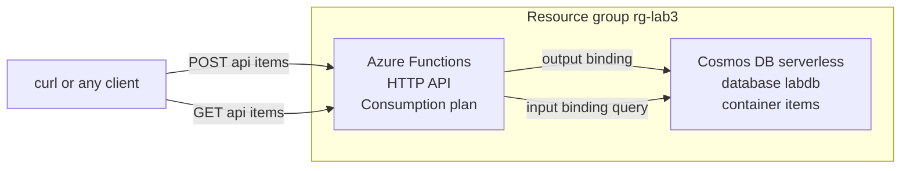

In this lab you build an HTTP API where every layer bills by usage and idles at zero: an Azure Functions app on the Consumption plan serves the endpoints, and a Cosmos DB account in serverless mode stores the data. There is no server, no plan with a monthly fee, and no provisioned throughput — you pay per invocation and per request unit. You will create two endpoints, `POST /api/items` and `GET /api/items`, wired to Cosmos DB entirely through declarative bindings, with zero database SDK code. This lab proves the [Serverless Architecture](../../architecture-styles/serverless) style in its purest form.

## What you will build



## Prerequisites

- Azure CLI 2.60 or later — check with `az version`
- Logged in to a subscription you can create resources in — `az login` then `az account show`
- Bicep CLI available — `az bicep version` installs it on first use
- A bash shell with `zip` installed — macOS, Linux, WSL, or Azure Cloud Shell

## Walkthrough

{}

### Set variables

```bash
SUFFIX=$RANDOM
LOCATION=eastus
RG=rg-lab3-api-$SUFFIX
STORAGE=stapi$SUFFIX
FUNC=func-api-$SUFFIX
COSMOS=cosmos-api-$SUFFIX

echo "API base URL will be: https://$FUNC.azurewebsites.net/api"
```

### Create the resource group

```bash
az group create --name $RG --location $LOCATION
```

### Create the Cosmos DB serverless account

The `EnableServerless` capability switches the account from provisioned throughput to pure pay-per-request-unit billing, which is the right mode for spiky or low-volume APIs:

```bash
az cosmosdb create \
  --name $COSMOS \
  --resource-group $RG \
  --locations regionName=$LOCATION \
  --capabilities EnableServerless
```


Cosmos DB account creation is the slow step of this lab — expect five to ten minutes. Let it finish before moving on.


Create the database and container. Serverless accounts take no throughput parameter — that is the entire point:

```bash
az cosmosdb sql database create \
  --account-name $COSMOS \
  --resource-group $RG \
  --name labdb

az cosmosdb sql container create \
  --account-name $COSMOS \
  --resource-group $RG \
  --database-name labdb \
  --name items \
  --partition-key-path /id
```

### Create the function app

```bash
az storage account create \
  --name $STORAGE \
  --resource-group $RG \
  --location $LOCATION \
  --sku Standard_LRS

az functionapp create \
  --name $FUNC \
  --resource-group $RG \
  --consumption-plan-location $LOCATION \
  --runtime node \
  --runtime-version 20 \
  --functions-version 4 \
  --os-type Linux \
  --storage-account $STORAGE
```

Hand the app its Cosmos DB connection string as an app setting named `CosmosDbConnection` — the bindings below reference it by that name:

```bash
COSMOS_CONN=$(az cosmosdb keys list \
  --name $COSMOS \
  --resource-group $RG \
  --type connection-strings \
  --query "connectionStrings[0].connectionString" \
  --output tsv)

az functionapp config appsettings set \
  --name $FUNC \
  --resource-group $RG \
  --settings CosmosDbConnection="$COSMOS_CONN"
```

### Write the API

Two functions, both bound to Cosmos DB declaratively. `CreateItem` uses an output binding to write a document; `GetItems` uses an input binding that runs a query before your code executes.

```bash
mkdir -p api/CreateItem api/GetItems

cat > api/host.json <<'EOF'
{
  "version": "2.0",
  "extensionBundle": {
    "id": "Microsoft.Azure.Functions.ExtensionBundle",
    "version": "[4.*, 5.0.0)"
  }
}
EOF

cat > api/CreateItem/function.json <<'EOF'
{
  "bindings": [
    {
      "name": "req",
      "type": "httpTrigger",
      "direction": "in",
      "authLevel": "anonymous",
      "methods": ["post"],
      "route": "items"
    },
    {
      "name": "outputDocument",
      "type": "cosmosDB",
      "direction": "out",
      "databaseName": "labdb",
      "containerName": "items",
      "connection": "CosmosDbConnection"
    },
    { "name": "res", "type": "http", "direction": "out" }
  ]
}
EOF

cat > api/CreateItem/index.js <<'EOF'
module.exports = async function (context, req) {
  const item = {
    id: Date.now().toString(),
    name: (req.body && req.body.name) || 'unnamed',
    createdUtc: new Date().toISOString()
  };
  context.bindings.outputDocument = item;
  context.res = { status: 201, body: item };
};
EOF

cat > api/GetItems/function.json <<'EOF'
{
  "bindings": [
    {
      "name": "req",
      "type": "httpTrigger",
      "direction": "in",
      "authLevel": "anonymous",
      "methods": ["get"],
      "route": "items"
    },
    {
      "name": "items",
      "type": "cosmosDB",
      "direction": "in",
      "databaseName": "labdb",
      "containerName": "items",
      "connection": "CosmosDbConnection",
      "sqlQuery": "SELECT * FROM c"
    },
    { "name": "res", "type": "http", "direction": "out" }
  ]
}
EOF

cat > api/GetItems/index.js <<'EOF'
module.exports = async function (context, req) {
  context.res = { status: 200, body: context.bindings.items };
};
EOF
```

Deploy:

```bash
cd api && zip -r ../api.zip . && cd ..

az functionapp deployment source config-zip \
  --name $FUNC \
  --resource-group $RG \
  --src api.zip
```

### Verify it works

Create an item, then read it back:

```bash
curl -s -X POST "https://$FUNC.azurewebsites.net/api/items" \
  -H "Content-Type: application/json" \
  -d '{"name": "first serverless item"}'
```

Expected output, with your own generated id:

```json
{"id":"1751900000000","name":"first serverless item","createdUtc":"2026-07-07T09:00:00.000Z"}
```

```bash
curl -s "https://$FUNC.azurewebsites.net/api/items"
```

Expected output: a JSON array containing the item you just created, this time with Cosmos DB system properties such as `_rid`, `_ts`, and `_etag` attached — proof the round trip went through the database and not an in-memory cache. Note the first request after deployment may take several seconds; that pause is the cold start, the signature trade-off of scale-to-zero compute.

### Capture evidence

```bash
az resource list --resource-group $RG --output table
```

You should see the Cosmos DB account, the storage account, the Consumption function app, and an Application Insights component. Cost note: the Functions free grant covers 1 million executions per month, and Cosmos DB serverless bills about 0.25 USD per million request units — this lab's traffic costs effectively nothing, though the storage account holds a few cents of data until teardown.

{}

## Adding API Management — when and why

The API you just built is naked: `authLevel` is anonymous, there is no rate limiting, no subscription keys, and no versioning surface. The standard front door for that is **Azure API Management**, and its Consumption tier fits this architecture perfectly — it is itself serverless, bills about 4.20 USD per million calls after a free grant of one million, and adds policies such as quotas, JWT validation, response caching, and request rewriting without touching function code. You would create it with `az apim create --sku-name Consumption --sku-capacity 0` and import the function app as an API. It is left out of the walkthrough because activation can take a while and the lab's learning goal is the Functions-plus-Cosmos core, but in any interview discussion of this architecture, APIM is the answer to "how do you protect and version this?".

## Teardown

```bash
az group delete --name $RG --yes --no-wait
```


Deletion is asynchronous and irreversible. Serverless resources cost little while idle but not zero — the storage account and any stored Cosmos DB data keep billing until the group is gone. Confirm later that az group show returns ResourceGroupNotFound.


## What to record for your portfolio

- **The claim** — you can ship a fully serverless CRUD API on Azure where compute and database both scale to zero, using declarative bindings instead of SDK plumbing.
- **The artifact** — the `api/` source folder plus the two curl transcripts showing a 201 create and the item echoed back from Cosmos DB with `_ts` and `_etag` system properties.
- **The trade-off** — cold starts and per-request pricing versus provisioned capacity: you can explain at what traffic profile serverless stops being the cheap option and a provisioned plan or autoscale throughput wins.

## Next

Continue to [Lab 4 — Event-Driven Messaging](../lab-04-event-driven), where one message fans out to multiple independent consumers through a Service Bus topic.
