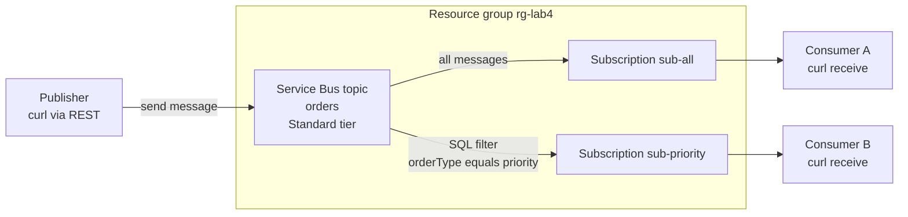

In this lab you build the core plumbing of an event-driven system: a Service Bus topic that fans one published message out to two independent subscriptions, one of which filters so it only receives priority messages. You will publish and receive messages straight from the shell using Service Bus's REST endpoints, so you can watch pub/sub, filtering, and competing-consumer semantics happen with nothing but `curl` — no application code at all. This lab proves the [Event-Driven Architecture](../../architecture-styles/event-driven) style: producers that know nothing about consumers, and consumers you can add without touching the producer.

## What you will build



## Prerequisites

- Azure CLI 2.60 or later — check with `az version`
- Logged in to a subscription you can create resources in — `az login` then `az account show`
- Bicep CLI available — `az bicep version` installs it on first use
- A bash shell with `openssl` and `python3` for SAS token generation — standard on macOS, Linux, WSL, and Azure Cloud Shell

## Walkthrough

{}

### Set variables

```bash
SUFFIX=$RANDOM
LOCATION=eastus
RG=rg-lab4-events-$SUFFIX
SB_NAMESPACE=sb-events-$SUFFIX
TOPIC=orders

echo "Namespace: $SB_NAMESPACE"
```

### Create the resource group

```bash
az group create --name $RG --location $LOCATION
```

### Create the Service Bus namespace and topic

Topics and subscriptions require the Standard tier — the Basic tier only supports queues. Standard has a flat base charge of roughly 10 USD per month prorated hourly, so an afternoon of lab time costs a few cents.

```bash
az servicebus namespace create \
  --name $SB_NAMESPACE \
  --resource-group $RG \
  --location $LOCATION \
  --sku Standard

az servicebus topic create \
  --name $TOPIC \
  --namespace-name $SB_NAMESPACE \
  --resource-group $RG
```

### Create two subscriptions with different filters

`sub-all` keeps its default true filter and receives every message. `sub-priority` gets a SQL filter on a custom message property, and its auto-created default rule is deleted so the filter actually restricts delivery — with both rules present, matching either one would deliver the message.

```bash
az servicebus topic subscription create \
  --name sub-all \
  --topic-name $TOPIC \
  --namespace-name $SB_NAMESPACE \
  --resource-group $RG

az servicebus topic subscription create \
  --name sub-priority \
  --topic-name $TOPIC \
  --namespace-name $SB_NAMESPACE \
  --resource-group $RG

az servicebus topic subscription rule create \
  --name PriorityOnly \
  --subscription-name sub-priority \
  --topic-name $TOPIC \
  --namespace-name $SB_NAMESPACE \
  --resource-group $RG \
  --filter-sql-expression "orderType = 'priority'"

az servicebus topic subscription rule delete \
  --name '$Default' \
  --subscription-name sub-priority \
  --topic-name $TOPIC \
  --namespace-name $SB_NAMESPACE \
  --resource-group $RG
```

### Build a SAS token for the data plane

The `az servicebus` commands manage resources but do not send or receive messages, so the sender and receiver use the Service Bus REST API with a shared access signature. Fetch the root key and sign a one-hour token scoped to the topic — SAS scope is a prefix, so the same token also authorizes receives from the subscriptions beneath it:

```bash
SB_KEY=$(az servicebus namespace authorization-rule keys list \
  --namespace-name $SB_NAMESPACE \
  --resource-group $RG \
  --name RootManageSharedAccessKey \
  --query primaryKey --output tsv)

TOPIC_URI="https://$SB_NAMESPACE.servicebus.windows.net/$TOPIC"
ENCODED_URI=$(python3 -c "import urllib.parse,sys; print(urllib.parse.quote_plus(sys.argv[1]))" "$TOPIC_URI")
EXPIRY=$(( $(date +%s) + 3600 ))
SIG=$(printf '%s\n%s' "$ENCODED_URI" "$EXPIRY" \
  | openssl dgst -sha256 -hmac "$SB_KEY" -binary | base64)
ENCODED_SIG=$(python3 -c "import urllib.parse,sys; print(urllib.parse.quote_plus(sys.argv[1]))" "$SIG")

SAS="SharedAccessSignature sr=$ENCODED_URI&sig=$ENCODED_SIG&se=$EXPIRY&skn=RootManageSharedAccessKey"
```

### Send messages — one standard, one priority

Custom HTTP headers on a REST send become custom message properties, which is exactly what the SQL filter evaluates:

```bash
curl -s -o /dev/null -w "standard send: %{http_code}\n" \
  -X POST "$TOPIC_URI/messages" \
  -H "Authorization: $SAS" \
  -H "Content-Type: application/json" \
  -H "orderType: standard" \
  -d '{"orderId": 101, "amount": 20}'

curl -s -o /dev/null -w "priority send: %{http_code}\n" \
  -X POST "$TOPIC_URI/messages" \
  -H "Authorization: $SAS" \
  -H "Content-Type: application/json" \
  -H "orderType: priority" \
  -d '{"orderId": 102, "amount": 950}'
```

Expected output:

```text
standard send: 201
priority send: 201
```

The publisher's job is done. It never named a consumer, and adding a third subscription tomorrow would require no change to these two commands.

### Receive from each subscription

A destructive read pops the next message from a subscription. Drain `sub-all` twice — it should hold both messages:

```bash
curl -s -X DELETE "$TOPIC_URI/subscriptions/sub-all/messages/head?timeout=15" \
  -H "Authorization: $SAS"
echo
curl -s -X DELETE "$TOPIC_URI/subscriptions/sub-all/messages/head?timeout=15" \
  -H "Authorization: $SAS"
echo
```

Expected output: the bodies `{"orderId": 101, "amount": 20}` and `{"orderId": 102, "amount": 950}`, one per call. Now read `sub-priority` twice:

```bash
curl -s -w "\nstatus: %{http_code}\n" \
  -X DELETE "$TOPIC_URI/subscriptions/sub-priority/messages/head?timeout=15" \
  -H "Authorization: $SAS"

curl -s -w "\nstatus: %{http_code}\n" \
  -X DELETE "$TOPIC_URI/subscriptions/sub-priority/messages/head?timeout=15" \
  -H "Authorization: $SAS"
```

Expected output: the first call returns `{"orderId": 102, "amount": 950}` with status 200 — only the priority order passed the filter. The second call waits out the timeout and returns status 204 with an empty body, because order 101 was never delivered to this subscription. That asymmetry is the whole demonstration: one publish, two deliveries, routing decided by the broker.

### Capture evidence

```bash
az resource list --resource-group $RG --output table

az servicebus topic subscription show \
  --name sub-priority \
  --topic-name $TOPIC \
  --namespace-name $SB_NAMESPACE \
  --resource-group $RG \
  --query messageCount --output tsv
```

The message count should be `0` — everything delivered was consumed. Save the send and receive transcripts; they are the artifact. Cost note: the Standard namespace base charge is about 0.014 USD per hour, so tear down promptly.

{}

## Service Bus or Event Grid?

Both are event-driven building blocks, and interviews love the distinction. **Service Bus** is a message broker for commands and jobs: messages are pulled by consumers, buffered durably until processed, and support ordering, sessions, transactions, and dead-lettering — use it when losing or double-firing a message costs money. **Event Grid** is a reactive event router for facts: it pushes lightweight notifications such as blob-created or resource-changed to HTTP endpoints and Functions at massive scale for about 0.60 USD per million operations, with retry but no long-term buffering or pull-based consumption. A common production pattern uses both — Event Grid announces that something happened, and the handler drops a work item onto Service Bus for reliable processing. This lab used Service Bus because filtered fan-out of business messages is squarely its territory.

## Teardown

```bash
az group delete --name $RG --yes --no-wait
```


Deletion is asynchronous and irreversible. Unlike the earlier labs, the Standard namespace bills a flat hourly base charge even when completely idle, so leaving it overnight costs real money. Confirm later that az group show returns ResourceGroupNotFound.


## What to record for your portfolio

- **The claim** — you can implement broker-side pub/sub with content-based routing on Azure Service Bus, and demonstrate producer-consumer decoupling with nothing but the REST data plane.
- **The artifact** — the terminal transcript showing two 201 sends, both messages received on `sub-all`, and only the priority message received on `sub-priority` with a 204 for the other.
- **The trade-off** — Service Bus versus Event Grid: you can explain pull versus push delivery, durable buffering versus reactive routing, and why the flat Standard-tier fee is the price of broker features like filters and dead-letter queues.

## Next

You have now built all four foundational styles hands-on. Head back to the [Labs overview](../) to review them side by side, or revisit the [Event-Driven Architecture](../../architecture-styles/event-driven) style page to map what you just ran onto the reference architecture.
