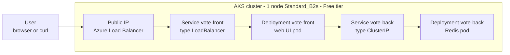

In this lab you deploy a two-service application to a deliberately tiny Azure Kubernetes Service cluster: a Redis-backed voting API and a Python web frontend, wired together only through Kubernetes Services. This is the smallest honest demonstration of the [Microservices](../../architecture-styles/microservices) architecture style — independent deployables, service discovery by DNS name, and a platform (Kubernetes) that owns scheduling, health, and networking instead of your application code. Everything runs on a single burstable node so the hourly cost stays close to the price of one small VM.

## What you will build



Two microservices, two Deployments, two Services. The frontend finds the backend by its Service name `vote-back` — no IP addresses in config, which is the microservices contract in miniature.

## Prerequisites

- Azure CLI 2.60 or later (`az version`)
- A logged-in subscription (`az login`, `az account show`)
- Bicep CLI available via `az bicep version` (installed automatically on first use)
- `kubectl` — install with `az aks install-cli` if you do not have it

{}

### Set variables

Use a random suffix so names never collide with a previous run.

```bash
SUFFIX=$RANDOM
RG=rg-lab5-aks-$SUFFIX
LOC=eastus
AKS=aks-lab5-$SUFFIX

echo "Resource group: $RG"
```

### Create the resource group

```bash
az group create --name $RG --location $LOC
```

### Create the AKS cluster

One node, a burstable `Standard_B2s` VM, and the Free management tier — the control plane costs nothing, you pay only for the node while it exists.

```bash
az aks create \
  --resource-group $RG \
  --name $AKS \
  --node-count 1 \
  --node-vm-size Standard_B2s \
  --tier free \
  --enable-managed-identity \
  --generate-ssh-keys
```

Cluster creation takes 4–8 minutes. When it returns, confirm the node pool.

```bash
az aks show --resource-group $RG --name $AKS \
  --query "{name:name, tier:sku.tier, nodes:agentPoolProfiles[0].count, size:agentPoolProfiles[0].vmSize}" -o table
```

Expected output:

```text
Name             Tier    Nodes    Size
---------------  ------  -------  ------------
aks-lab5-12345   Free    1        Standard_B2s
```

### Connect kubectl to the cluster

```bash
az aks get-credentials --resource-group $RG --name $AKS

kubectl get nodes
```

Expected output:

```text
NAME                                STATUS   ROLES    AGE   VERSION
aks-nodepool1-xxxxxxxx-vmss000000   Ready    <none>   2m    v1.30.x
```

### Deploy the backend microservice

The backend is Redis, published by Microsoft for the classic azure-vote sample. Save this as `vote-back.yaml`.

```yaml
apiVersion: apps/v1
kind: Deployment
metadata:
  name: vote-back
spec:
  replicas: 1
  selector:
    matchLabels:
      app: vote-back
  template:
    metadata:
      labels:
        app: vote-back
    spec:
      containers:
        - name: vote-back
          image: mcr.microsoft.com/oss/bitnami/redis:6.0.8
          env:
            - name: ALLOW_EMPTY_PASSWORD
              value: "yes"
          resources:
            requests:
              cpu: 100m
              memory: 128Mi
            limits:
              cpu: 250m
              memory: 256Mi
          ports:
            - containerPort: 6379
              name: redis
---
apiVersion: v1
kind: Service
metadata:
  name: vote-back
spec:
  type: ClusterIP
  ports:
    - port: 6379
  selector:
    app: vote-back
```

Apply it.

```bash
kubectl apply -f vote-back.yaml
```

### Deploy the frontend microservice

The frontend only knows the backend's Service name, passed as the `REDIS` environment variable. Save this as `vote-front.yaml`.

```yaml
apiVersion: apps/v1
kind: Deployment
metadata:
  name: vote-front
spec:
  replicas: 1
  selector:
    matchLabels:
      app: vote-front
  template:
    metadata:
      labels:
        app: vote-front
    spec:
      containers:
        - name: vote-front
          image: mcr.microsoft.com/azuredocs/azure-vote-front:v1
          env:
            - name: REDIS
              value: "vote-back"
          resources:
            requests:
              cpu: 100m
              memory: 128Mi
            limits:
              cpu: 250m
              memory: 256Mi
          ports:
            - containerPort: 80
---
apiVersion: v1
kind: Service
metadata:
  name: vote-front
spec:
  type: LoadBalancer
  ports:
    - port: 80
  selector:
    app: vote-front
```

```bash
kubectl apply -f vote-front.yaml
```

The `type: LoadBalancer` Service tells AKS to provision an Azure Load Balancer and a public IP in the cluster's managed resource group.

### Verify

Watch until the external IP moves from `<pending>` to a real address (usually under two minutes).

```bash
kubectl get service vote-front --watch
```

Expected output:

```text
NAME         TYPE           CLUSTER-IP    EXTERNAL-IP     PORT(S)        AGE
vote-front   LoadBalancer   10.0.113.42   20.242.xxx.xx   80:31245/TCP   90s
```

Press Ctrl+C, then hit the app.

```bash
IP=$(kubectl get service vote-front -o jsonpath='{.status.loadBalancer.ingress[0].ip}')
curl -s http://$IP | grep -o "<title>.*</title>"
```

Expected output:

```text
<title>Azure Voting App</title>
```

Confirm both microservices are healthy and discover each other by name.

```bash
kubectl get pods -o wide
kubectl logs deploy/vote-front --tail=5
```

### Capture evidence

```bash
kubectl get deploy,svc,pods -o wide > lab5-k8s-state.txt
az aks show --resource-group $RG --name $AKS -o json > lab5-aks.json
```

Take a browser screenshot of the voting page at `http://$IP` and save the two files with it.

{}

## Going further: ingress and managed identity

A LoadBalancer Service is fine for one app, but it burns one public IP and one load-balancer rule per service. Real microservices estates put an ingress controller in front: one public IP, host- and path-based routing to many backend Services, TLS termination in one place. On AKS the low-friction option is the managed NGINX-based application routing add-on — `az aks approuting enable --resource-group $RG --name $AKS` — after which you declare `Ingress` resources instead of LoadBalancer Services.

The cluster you built also runs with a **managed identity** because of the `--enable-managed-identity` flag (the default for new clusters). That identity is what the cluster uses to create the load balancer and public IP on your behalf — no service principal secrets to rotate. The same pattern extends to workloads: with workload identity federation, individual pods can exchange a Kubernetes service account token for Microsoft Entra tokens and call Key Vault or Storage without any secret in the cluster. That is the answer to give when asked how microservices on AKS authenticate to Azure services.

## Teardown

The node VM, load balancer, and public IP bill hourly whether or not you use them. Delete everything now.

```bash
az group delete --name $RG --yes --no-wait
```

AKS puts the node and networking resources in a second, auto-created group named like `MC_rg-lab5-aks-..._eastus`; deleting the cluster's resource group deletes that one too.


An idle AKS node is still a running VM billed by the hour, and the load balancer public IP bills alongside it. Verify deletion finished with az group list before you walk away.


## What to record for your portfolio

- **Claim** — deployed a two-service microservices application to AKS with service discovery by DNS, resource limits, and an Azure Load Balancer front end, on a single Free-tier node.
- **Artifact** — the two YAML manifests, `lab5-k8s-state.txt`, and the screenshot of the running voting app.
- **Trade-off** — a LoadBalancer Service per app is simple but does not scale in cost or IPs; an ingress controller consolidates entry but adds a routing layer you must operate and secure.

## Next

Continue to [Lab 6 — Data Analytics Pipeline](../lab-06-data-pipeline).
