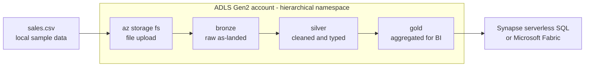

In this lab you build the storage backbone of a modern analytics platform: an Azure Data Lake Storage Gen2 account organized into medallion layers (bronze, silver, gold), loaded with a sample CSV and ready to be queried in place by a serverless SQL engine. This is the [Big Data](../../architecture-styles/big-data) architecture style stripped to its essence — cheap immutable storage as the source of truth, schema applied at read time, and compute that you rent only for the seconds a query runs. The runnable part of the lab costs pennies: it is a standard LRS storage account plus a few `az storage` commands.

## What you will build



The medallion layers are just folders — but folders with real semantics thanks to the hierarchical namespace, which gives you atomic directory renames and POSIX-style ACLs that flat blob storage cannot offer.

## Prerequisites

- Azure CLI 2.60 or later (`az version`)
- A logged-in subscription (`az login`, `az account show`)
- Bicep CLI available via `az bicep version` (not used directly here, but the labs assume it)
- Permission to assign RBAC roles on the resource group (Owner or User Access Administrator)

{}

### Set variables

```bash
SUFFIX=$RANDOM
RG=rg-lab6-lake-$SUFFIX
LOC=eastus
SA=lakelab6$SUFFIX
FS=lake

echo "Storage account: $SA"
```

Storage account names must be 3–24 lowercase alphanumeric characters, which is why this one skips hyphens.

### Create the resource group

```bash
az group create --name $RG --location $LOC
```

### Create the Data Lake Gen2 storage account

The single flag that turns a blob account into a data lake is `--hns true` — the hierarchical namespace.

```bash
az storage account create \
  --name $SA \
  --resource-group $RG \
  --location $LOC \
  --sku Standard_LRS \
  --kind StorageV2 \
  --hns true \
  --min-tls-version TLS1_2 \
  --allow-blob-public-access false
```

Grant yourself data-plane access — the control-plane Owner role does not include reading or writing blobs.

```bash
az role assignment create \
  --assignee $(az ad signed-in-user show --query id -o tsv) \
  --role "Storage Blob Data Contributor" \
  --scope $(az storage account show --name $SA --resource-group $RG --query id -o tsv)
```

Role assignments can take a minute or two to propagate; if the next step returns an authorization error, wait and retry.

### Create the filesystem and medallion folders

```bash
az storage fs create --name $FS --account-name $SA --auth-mode login

az storage fs directory create --file-system $FS --name bronze/sales --account-name $SA --auth-mode login
az storage fs directory create --file-system $FS --name silver/sales --account-name $SA --auth-mode login
az storage fs directory create --file-system $FS --name gold/sales   --account-name $SA --auth-mode login
```

### Create and upload the sample CSV

```bash
cat > sales.csv <<'EOF'
order_id,order_date,region,product,quantity,unit_price
1001,2026-06-01,east,widget,3,19.99
1002,2026-06-01,west,gadget,1,49.50
1003,2026-06-02,east,widget,5,19.99
1004,2026-06-03,north,sprocket,2,7.25
1005,2026-06-03,west,widget,4,19.99
1006,2026-06-04,east,gadget,2,49.50
1007,2026-06-05,north,widget,1,19.99
1008,2026-06-05,west,sprocket,6,7.25
EOF

az storage fs file upload \
  --file-system $FS \
  --source sales.csv \
  --path bronze/sales/2026-06/sales.csv \
  --account-name $SA \
  --auth-mode login
```

Landing raw files under a date-partitioned path in bronze is the habit that matters: bronze is append-only and never edited, so any downstream layer can always be rebuilt from it.

### Verify

```bash
az storage fs file list \
  --file-system $FS \
  --path bronze \
  --recursive true \
  --account-name $SA \
  --auth-mode login \
  --query "[].{name:name, bytes:contentLength}" -o table
```

Expected output:

```text
Name                              Bytes
--------------------------------  -------
bronze/sales                      0
bronze/sales/2026-06              0
bronze/sales/2026-06/sales.csv    353
```

Read the file back to prove round-trip integrity.

```bash
az storage fs file download \
  --file-system $FS \
  --path bronze/sales/2026-06/sales.csv \
  --destination ./sales-check.csv \
  --account-name $SA \
  --auth-mode login

head -3 sales-check.csv
```

Expected output:

```text
order_id,order_date,region,product,quantity,unit_price
1001,2026-06-01,east,widget,3,19.99
1002,2026-06-01,west,gadget,1,49.50
```

### Query it with Synapse serverless SQL

Serverless SQL bills per terabyte scanned (roughly five dollars per TB, with no charge for an idle pool), so querying this file costs effectively nothing — but creating a Synapse workspace adds setup you may not want for a quick lab, so treat this step as optional. If you create a workspace (`az synapse workspace create` with a data lake it can reach, plus a Storage Blob Data Contributor grant to its managed identity), the built-in serverless pool can query the CSV in place:

```sql
SELECT region,
       SUM(quantity * unit_price) AS revenue
FROM OPENROWSET(
    BULK 'https://lakelab6XXXXX.dfs.core.windows.net/lake/bronze/sales/2026-06/sales.csv',
    FORMAT = 'CSV',
    PARSER_VERSION = '2.0',
    HEADER_ROW = TRUE
) AS rows
GROUP BY region
ORDER BY revenue DESC;
```

The point to internalize: no data was moved, no cluster was provisioned, and schema was applied at read time. The alternative in 2026 is **Microsoft Fabric** — its OneLake is itself ADLS Gen2 under the hood, so you can create a shortcut to this exact storage account and query the same file from a Fabric lakehouse SQL endpoint or a KQL queryset. Fabric trades the pay-per-query model for capacity-based pricing (F2 and up), which is simpler to govern but never scales to zero; Synapse serverless is the cheaper choice for sporadic exploration, Fabric the better one for an organization standardizing its whole analytics estate.

### Capture evidence

```bash
az storage account show --name $SA --resource-group $RG \
  --query "{name:name, hns:isHnsEnabled, sku:sku.name}" -o table > lab6-account.txt

az storage fs file list --file-system $FS --recursive true \
  --account-name $SA --auth-mode login -o table > lab6-lake-tree.txt
```

If you ran the Synapse query, screenshot the result grid showing revenue by region.

{}

## Teardown

```bash
az group delete --name $RG --yes --no-wait
```


The storage account itself costs almost nothing, but if you created a Synapse workspace or a Fabric capacity for the query step, those bill by the hour even when idle. Delete the workspace resource group and pause or delete any Fabric capacity before leaving the lab.


## What to record for your portfolio

- **Claim** — built an ADLS Gen2 data lake with medallion-layer structure, RBAC-based data-plane access, and demonstrated schema-on-read querying with serverless SQL.
- **Artifact** — `lab6-lake-tree.txt` showing the bronze/silver/gold hierarchy, the OPENROWSET query text, and the query result screenshot.
- **Trade-off** — Synapse serverless scales to zero and suits sporadic ad-hoc queries, while Microsoft Fabric offers a unified platform at an always-on capacity price; the lake layout you built is identical either way, which is exactly why the folder discipline matters.

## Next

Continue to [Lab 7 — Hub-Spoke Network](../lab-07-hub-spoke).
