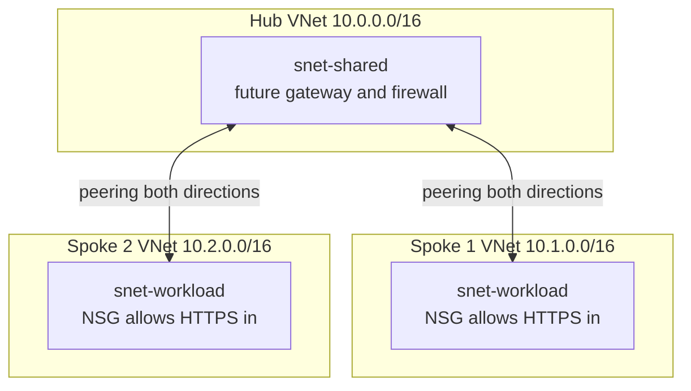

In this lab you deploy the canonical hub-spoke network topology from a single Bicep file: one hub virtual network for shared services and two spoke virtual networks connected to it by bidirectional peering, each spoke guarded by its own network security group. This is the networking foundation underneath almost every enterprise Azure estate — it is how you place the tiers of an [N-Tier Architecture](../../architecture-styles/n-tier) into isolated address spaces, and it is the starting point for the [Hybrid Networking with Hub-Spoke](../../scenarios/hybrid-networking) scenario, where a VPN gateway or ExpressRoute circuit lands in the hub and every spoke inherits on-premises connectivity. The topology itself is nearly free: virtual networks, subnets, peerings, and NSGs have no hourly charge — you pay only a tiny per-GB fee on traffic that actually crosses a peering.

## What you will build



Note what is deliberately absent: the spokes are not peered to each other. Peering is non-transitive, so spoke-to-spoke traffic requires a routing device in the hub — that isolation-by-default is a feature, not a gap.

## Prerequisites

- Azure CLI 2.60 or later (`az version`)
- A logged-in subscription (`az login`, `az account show`)
- Bicep CLI — confirm with `az bicep version` (the CLI installs it automatically on first `az deployment` use)

{}

### Set variables

```bash
SUFFIX=$RANDOM
RG=rg-lab7-hubspoke-$SUFFIX
LOC=eastus

echo "Resource group: $RG"
```

### Create the resource group

```bash
az group create --name $RG --location $LOC
```

### Author the Bicep file

Save the following as `hub-spoke.bicep`. It declares the three VNets, one NSG shared by both spoke subnets, and all four peering resources — each direction of a peering is its own child resource on the source VNet.

```bicep
param location string = resourceGroup().location

var hubName = 'vnet-hub'
var spoke1Name = 'vnet-spoke1'
var spoke2Name = 'vnet-spoke2'

resource spokeNsg 'Microsoft.Network/networkSecurityGroups@2023-11-01' = {
  name: 'nsg-spoke-workload'
  location: location
  properties: {
    securityRules: [
      {
        name: 'Allow-HTTPS-Inbound'
        properties: {
          priority: 100
          direction: 'Inbound'
          access: 'Allow'
          protocol: 'Tcp'
          sourceAddressPrefix: 'VirtualNetwork'
          sourcePortRange: '*'
          destinationAddressPrefix: '*'
          destinationPortRange: '443'
        }
      }
      {
        name: 'Deny-Spoke-To-Spoke'
        properties: {
          priority: 200
          direction: 'Inbound'
          access: 'Deny'
          protocol: '*'
          sourceAddressPrefixes: [
            '10.1.0.0/16'
            '10.2.0.0/16'
          ]
          sourcePortRange: '*'
          destinationAddressPrefix: '*'
          destinationPortRange: '*'
        }
      }
    ]
  }
}

resource hubVnet 'Microsoft.Network/virtualNetworks@2023-11-01' = {
  name: hubName
  location: location
  properties: {
    addressSpace: {
      addressPrefixes: [
        '10.0.0.0/16'
      ]
    }
    subnets: [
      {
        name: 'snet-shared'
        properties: {
          addressPrefix: '10.0.1.0/24'
        }
      }
    ]
  }
}

resource spoke1Vnet 'Microsoft.Network/virtualNetworks@2023-11-01' = {
  name: spoke1Name
  location: location
  properties: {
    addressSpace: {
      addressPrefixes: [
        '10.1.0.0/16'
      ]
    }
    subnets: [
      {
        name: 'snet-workload'
        properties: {
          addressPrefix: '10.1.1.0/24'
          networkSecurityGroup: {
            id: spokeNsg.id
          }
        }
      }
    ]
  }
}

resource spoke2Vnet 'Microsoft.Network/virtualNetworks@2023-11-01' = {
  name: spoke2Name
  location: location
  properties: {
    addressSpace: {
      addressPrefixes: [
        '10.2.0.0/16'
      ]
    }
    subnets: [
      {
        name: 'snet-workload'
        properties: {
          addressPrefix: '10.2.1.0/24'
          networkSecurityGroup: {
            id: spokeNsg.id
          }
        }
      }
    ]
  }
}

resource hubToSpoke1 'Microsoft.Network/virtualNetworks/virtualNetworkPeerings@2023-11-01' = {
  parent: hubVnet
  name: 'peer-hub-to-spoke1'
  properties: {
    remoteVirtualNetwork: {
      id: spoke1Vnet.id
    }
    allowVirtualNetworkAccess: true
    allowForwardedTraffic: true
    allowGatewayTransit: false
    useRemoteGateways: false
  }
}

resource spoke1ToHub 'Microsoft.Network/virtualNetworks/virtualNetworkPeerings@2023-11-01' = {
  parent: spoke1Vnet
  name: 'peer-spoke1-to-hub'
  properties: {
    remoteVirtualNetwork: {
      id: hubVnet.id
    }
    allowVirtualNetworkAccess: true
    allowForwardedTraffic: true
    allowGatewayTransit: false
    useRemoteGateways: false
  }
}

resource hubToSpoke2 'Microsoft.Network/virtualNetworks/virtualNetworkPeerings@2023-11-01' = {
  parent: hubVnet
  name: 'peer-hub-to-spoke2'
  properties: {
    remoteVirtualNetwork: {
      id: spoke2Vnet.id
    }
    allowVirtualNetworkAccess: true
    allowForwardedTraffic: true
    allowGatewayTransit: false
    useRemoteGateways: false
  }
}

resource spoke2ToHub 'Microsoft.Network/virtualNetworks/virtualNetworkPeerings@2023-11-01' = {
  parent: spoke2Vnet
  name: 'peer-spoke2-to-hub'
  properties: {
    remoteVirtualNetwork: {
      id: hubVnet.id
    }
    allowVirtualNetworkAccess: true
    allowForwardedTraffic: true
    allowGatewayTransit: false
    useRemoteGateways: false
  }
}

output hubVnetId string = hubVnet.id
output spoke1VnetId string = spoke1Vnet.id
output spoke2VnetId string = spoke2Vnet.id
```

In production the hub-side peerings would set `allowGatewayTransit: true` and the spoke sides `useRemoteGateways: true` once a VPN or ExpressRoute gateway exists in the hub — that pair of flags is what makes the hub a shared on-ramp for every spoke.

### Deploy with a single command

```bash
az deployment group create \
  --resource-group $RG \
  --name hubspoke \
  --template-file hub-spoke.bicep
```

The deployment finishes in under two minutes because everything here is control-plane configuration — no compute is provisioned.

### Verify

List the VNets and confirm all four peerings are connected.

```bash
az network vnet list --resource-group $RG \
  --query "[].{name:name, prefix:addressSpace.addressPrefixes[0]}" -o table
```

Expected output:

```text
Name         Prefix
-----------  -----------
vnet-hub     10.0.0.0/16
vnet-spoke1  10.1.0.0/16
vnet-spoke2  10.2.0.0/16
```

```bash
for VNET in vnet-hub vnet-spoke1 vnet-spoke2; do
  az network vnet peering list --resource-group $RG --vnet-name $VNET \
    --query "[].{peering:name, state:peeringState}" -o table
done
```

Expected output — every row must show `Connected`:

```text
Peering             State
------------------  ---------
peer-hub-to-spoke1  Connected
peer-hub-to-spoke2  Connected

Peering             State
------------------  ---------
peer-spoke1-to-hub  Connected

Peering             State
------------------  ---------
peer-spoke2-to-hub  Connected
```

If you had built the peerings imperatively instead of in Bicep, the equivalent command per direction is `az network vnet peering create --allow-vnet-access --allow-forwarded-traffic ...` — worth knowing for troubleshooting, since a peering stuck in `Initiated` almost always means the reverse direction was never created.

### Optional: prove connectivity with a test VM

Peering state says the wire exists; only a packet proves it works. If you want live proof, drop a small VM into each spoke (`az vm create --size Standard_B1s --image Ubuntu2204 ...`) and ping across the hub. Be aware this adds two hourly-billed VMs plus public IPs to an otherwise nearly free lab — create them, capture the ping output, and delete them the same session. The pure-topology verification above is enough for the portfolio if you want to keep the cost at zero.

### Capture evidence

```bash
az deployment group show --resource-group $RG --name hubspoke \
  --query properties.outputs > lab7-outputs.json

for VNET in vnet-hub vnet-spoke1 vnet-spoke2; do
  az network vnet peering list --resource-group $RG --vnet-name $VNET -o table
done > lab7-peerings.txt
```

Keep `hub-spoke.bicep` itself with the evidence — the template is the artifact.

{}

## Teardown

```bash
az group delete --name $RG --yes --no-wait
```


The VNets, peerings, and NSGs cost nothing while idle, but if you created the optional test VMs they bill hourly along with their public IPs and disks. Confirm the resource group is gone with az group list rather than assuming.


## What to record for your portfolio

- **Claim** — deployed a hub-spoke topology as a single idempotent Bicep template: three VNets, four explicit peering directions, and NSG-enforced spoke isolation, with gateway-transit flags identified for hybrid extension.
- **Artifact** — `hub-spoke.bicep`, `lab7-peerings.txt` showing every peering in Connected state, and the deployment outputs JSON.
- **Trade-off** — hub-spoke centralizes shared services and keeps spokes isolated by default, but spoke-to-spoke traffic needs a hub NVA or Azure Firewall (hourly cost and a throughput ceiling); full mesh peering avoids the hop but explodes in peering count and loses the central inspection point.

## Next

Continue to [Lab 8 — Multi-Region HA](../lab-08-multi-region-ha).
