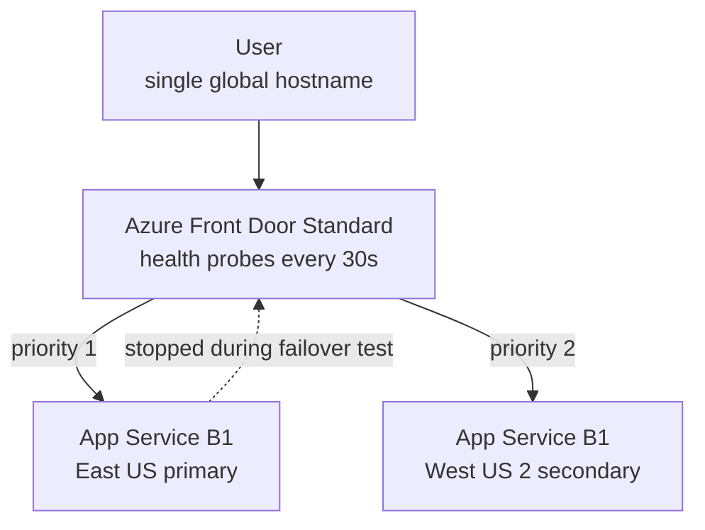

In this lab you run the same web app in two Azure regions and put Azure Front Door Standard in front of both, with health probes deciding in near real time which origin receives traffic. Then you break it on purpose: stop the primary app and watch Front Door fail over to the secondary without you touching DNS. This is the smallest complete rehearsal of the [Multi-Region High Availability](../../scenarios/multi-region-ha) scenario — priority-based routing, health-probe-driven failover, and a global entry point that survives the loss of an entire region. Two B1 App Service plans plus Front Door Standard bill by the hour, so plan to finish and tear down in one sitting.

## What you will build



## Prerequisites

- Azure CLI 2.60 or later (`az version`)
- A logged-in subscription (`az login`, `az account show`)
- Bicep CLI available via `az bicep version` (not required for this lab's commands, but assumed by the series)
- `zip` on your PATH for the tiny app deployment

{}

### Set variables

```bash
SUFFIX=$RANDOM
RG=rg-lab8-mrha-$SUFFIX
LOC1=eastus
LOC2=westus2
APP1=app-lab8-primary-$SUFFIX
APP2=app-lab8-secondary-$SUFFIX
AFD=afd-lab8-$SUFFIX
EP=ep-lab8-$SUFFIX

echo "Front Door endpoint name: $EP"
```

### Create the resource group

Front Door is a global resource; the group's location only anchors metadata.

```bash
az group create --name $RG --location $LOC1
```

### Create an App Service app in each region

Two independent plans — one per region — because a plan is a regional scale unit and shares nothing across regions.

```bash
az appservice plan create --name plan-lab8-$LOC1 --resource-group $RG \
  --location $LOC1 --sku B1 --is-linux

az appservice plan create --name plan-lab8-$LOC2 --resource-group $RG \
  --location $LOC2 --sku B1 --is-linux

az webapp create --name $APP1 --resource-group $RG \
  --plan plan-lab8-$LOC1 --runtime "PHP:8.2"

az webapp create --name $APP2 --resource-group $RG \
  --plan plan-lab8-$LOC2 --runtime "PHP:8.2"
```

Capture each app's real hostname — newer subscriptions generate regionalized default hostnames, so never assume the `appname.azurewebsites.net` pattern.

```bash
HOST1=$(az webapp show --name $APP1 --resource-group $RG --query defaultHostName -o tsv)
HOST2=$(az webapp show --name $APP2 --resource-group $RG --query defaultHostName -o tsv)
echo "Primary:   $HOST1"
echo "Secondary: $HOST2"
```

### Deploy a page that identifies its region

A one-line HTML file per app is enough to make failover visible.

```bash
mkdir -p site && cd site

echo '<h1>PRIMARY - East US</h1>' > index.html
zip -q primary.zip index.html
az webapp deploy --name $APP1 --resource-group $RG --src-path primary.zip --type zip

echo '<h1>SECONDARY - West US 2</h1>' > index.html
zip -q secondary.zip index.html
az webapp deploy --name $APP2 --resource-group $RG --src-path secondary.zip --type zip

cd ..
```

Verify both origins directly before involving Front Door — never debug two layers at once.

```bash
curl -s https://$HOST1
curl -s https://$HOST2
```

Expected output:

```text
<h1>PRIMARY - East US</h1>
<h1>SECONDARY - West US 2</h1>
```

### Create the Front Door profile and endpoint

```bash
az afd profile create --profile-name $AFD --resource-group $RG \
  --sku Standard_AzureFrontDoor

az afd endpoint create --endpoint-name $EP --profile-name $AFD \
  --resource-group $RG --enabled-state Enabled
```

### Create the origin group with health probes

The probe settings below mean: probe `/` over HTTPS every 30 seconds, and judge health on the last 4 samples requiring 3 successes — so a dead origin is detected in roughly one to two minutes.

```bash
az afd origin-group create --origin-group-name og-webapps \
  --profile-name $AFD --resource-group $RG \
  --probe-request-type GET \
  --probe-protocol Https \
  --probe-path / \
  --probe-interval-in-seconds 30 \
  --sample-size 4 \
  --successful-samples-required 3 \
  --additional-latency-in-milliseconds 50
```

### Add both origins with priorities

Priority 1 gets all traffic while healthy; priority 2 is pure standby. Equal priorities with different weights would give you active-active instead — one flag is the whole difference between the two patterns.

```bash
az afd origin create --origin-name origin-primary \
  --origin-group-name og-webapps --profile-name $AFD --resource-group $RG \
  --host-name $HOST1 --origin-host-header $HOST1 \
  --priority 1 --weight 1000 \
  --http-port 80 --https-port 443 --enabled-state Enabled

az afd origin create --origin-name origin-secondary \
  --origin-group-name og-webapps --profile-name $AFD --resource-group $RG \
  --host-name $HOST2 --origin-host-header $HOST2 \
  --priority 2 --weight 1000 \
  --http-port 80 --https-port 443 --enabled-state Enabled
```

### Create the route

```bash
az afd route create --route-name route-default \
  --profile-name $AFD --resource-group $RG \
  --endpoint-name $EP --origin-group og-webapps \
  --supported-protocols Http Https \
  --forwarding-protocol HttpsOnly \
  --https-redirect Enabled \
  --link-to-default-domain Enabled
```

### Verify steady state

```bash
FDHOST=$(az afd endpoint show --endpoint-name $EP --profile-name $AFD \
  --resource-group $RG --query hostName -o tsv)
echo "Front Door: https://$FDHOST"

curl -s https://$FDHOST
```

Propagation to the global edge can take a few minutes after route creation; retry until you see the primary respond.

Expected output:

```text
<h1>PRIMARY - East US</h1>
```

### Failover test — stop the primary

```bash
az webapp stop --name $APP1 --resource-group $RG

for i in $(seq 1 30); do
  echo "$(date +%T)  $(curl -s https://$FDHOST | head -c 60)"
  sleep 15
done
```

For the first minute or so you will see the primary's cached responses or an error page, then the probes mark the origin unhealthy and traffic shifts.

Expected output — the transition line is the evidence:

```text
14:02:11  <h1>PRIMARY - East US</h1>
14:02:26  <h1>PRIMARY - East US</h1>
14:03:42  <h1>SECONDARY - West US 2</h1>
14:03:57  <h1>SECONDARY - West US 2</h1>
```

Now heal the primary and confirm failback.

```bash
az webapp start --name $APP1 --resource-group $RG
sleep 180
curl -s https://$FDHOST
```

Expected output:

```text
<h1>PRIMARY - East US</h1>
```

Note the failover window you observed — with a 30-second probe interval and 4-sample window, one to two minutes of impact is normal. Tightening the interval shortens the window at the cost of more probe traffic; that number is exactly the kind of measured RTO figure interviewers ask for.

### Capture evidence

```bash
az afd origin list --origin-group-name og-webapps --profile-name $AFD \
  --resource-group $RG \
  --query "[].{origin:name, host:hostName, priority:priority}" -o table > lab8-origins.txt

az afd origin-group show --origin-group-name og-webapps --profile-name $AFD \
  --resource-group $RG --query healthProbeSettings > lab8-probes.json
```

Save the terminal transcript of the failover loop — the timestamped flip from PRIMARY to SECONDARY is the artifact that matters most.

{}

## Teardown

```bash
az group delete --name $RG --yes --no-wait
```


This lab has three hourly meters running: two B1 App Service plans and the Front Door Standard profile with its fixed base fee. None of them stop billing when idle, so delete the resource group as soon as you have your evidence and verify with az group list.


## What to record for your portfolio

- **Claim** — built an active-passive multi-region deployment behind Azure Front Door with priority routing and health probes, and measured an end-to-end failover of under two minutes by stopping the primary region's app.
- **Artifact** — the timestamped curl transcript showing the PRIMARY-to-SECONDARY flip, `lab8-origins.txt`, and `lab8-probes.json`.
- **Trade-off** — active-passive keeps the secondary cheap and the data story simple, but the standby capacity is idle spend and failover takes the probe-detection window; active-active removes the window and uses all capacity, at the price of solving cross-region data consistency for anything stateful.

## Next

You have completed the lab series. Turn the evidence into interview-ready stories in [Career Portfolio](../../career).
