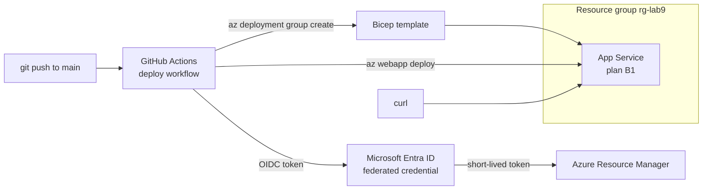

In this lab you build a real deployment pipeline: a GitHub Actions workflow that authenticates to Azure with **workload identity federation** — no stored secret anywhere — deploys infrastructure with Bicep, and ships a web app to App Service on every push to main. The credential you create can only be used by workflows from your repository's main branch; nothing else on earth can redeem it. This lab proves the [Enterprise CI/CD on Azure](../../scenarios/cicd) scenario end to end.

## What you will build



## Prerequisites

- Azure CLI 2.60 or later — check with `az version`
- Logged in to a subscription you can create resources and Entra app registrations in — `az login`
- GitHub CLI logged in — `gh auth status`
- A bash shell — macOS, Linux, WSL, or Azure Cloud Shell

## Walkthrough

{}

### Set variables

```bash
SUFFIX=$RANDOM
LOCATION=eastus
RG=rg-lab9-cicd-$SUFFIX
APPNAME=web-lab9-$SUFFIX
REPO=lab9-cicd-$SUFFIX
GHUSER=$(gh api user --jq .login)
SUB_ID=$(az account show --query id -o tsv)
TENANT_ID=$(az account show --query tenantId -o tsv)

echo "App URL will be: https://$APPNAME.azurewebsites.net"
```

### Create the resource group

The pipeline identity will be scoped to exactly this group — least privilege from the start:

```bash
az group create --name $RG --location $LOCATION
```

### Create the pipeline identity with a federated credential

Create an Entra application, its service principal, and grant it Contributor on the resource group only:

```bash
APP_ID=$(az ad app create --display-name gha-lab9-$SUFFIX --query appId -o tsv)
az ad sp create --id $APP_ID
az role assignment create \
  --assignee $APP_ID \
  --role Contributor \
  --scope /subscriptions/$SUB_ID/resourceGroups/$RG
```

Now the heart of the lab — the federated credential. The `subject` claim pins this trust to workflows running on the main branch of your repository, and only those:

```bash
az ad app federated-credential create --id $APP_ID --parameters '{
  "name": "gha-main-branch",
  "issuer": "https://token.actions.githubusercontent.com",
  "subject": "repo:'$GHUSER'/'$REPO':ref:refs/heads/main",
  "audiences": ["api://AzureADTokenExchange"]
}'
```


There is no secret in this lab. When the workflow runs, GitHub signs an OIDC token describing the repo and branch, Entra ID checks it against this credential, and issues a token that lives for minutes. Nothing to store, leak, or rotate.


### Create the application repository

```bash
mkdir /tmp/$REPO && cd /tmp/$REPO && git init -b main
```

Add a minimal app — a static page served by App Service:

```bash
mkdir -p src
cat > src/index.html <<'EOF'
<!DOCTYPE html>
<html><body>
<h1>Deployed by GitHub Actions via OIDC</h1>
<p>No secrets were stored in the making of this deployment.</p>
</body></html>
EOF
```

Add the infrastructure as a Bicep file:

```bash
mkdir -p infra
cat > infra/main.bicep <<'EOF'
param location string = resourceGroup().location
param appName string

resource plan 'Microsoft.Web/serverfarms@2023-12-01' = {
  name: 'plan-${appName}'
  location: location
  sku: {
    name: 'B1'
    tier: 'Basic'
  }
  properties: {
    reserved: true
  }
}

resource app 'Microsoft.Web/sites@2023-12-01' = {
  name: appName
  location: location
  properties: {
    serverFarmId: plan.id
    httpsOnly: true
    siteConfig: {
      linuxFxVersion: 'PHP|8.2'
      minTlsVersion: '1.2'
    }
  }
}

output appUrl string = 'https://${app.properties.defaultHostName}'
EOF
```

### Add the deploy workflow

The workflow needs `id-token: write` permission — that is what lets it request the OIDC token:

```bash
mkdir -p .github/workflows
cat > .github/workflows/deploy.yml <<'EOF'
name: Deploy to Azure

on:
  push:
    branches: ["main"]
  workflow_dispatch:

permissions:
  id-token: write
  contents: read

concurrency:
  group: deploy
  cancel-in-progress: false

jobs:
  deploy:
    runs-on: ubuntu-latest
    steps:
      - uses: actions/checkout@v4

      - name: Azure login via OIDC
        uses: azure/login@v2
        with:
          client-id: ${{ secrets.AZURE_CLIENT_ID }}
          tenant-id: ${{ secrets.AZURE_TENANT_ID }}
          subscription-id: ${{ secrets.AZURE_SUBSCRIPTION_ID }}

      - name: Deploy infrastructure
        run: |
          az deployment group create \
            --resource-group ${{ vars.AZURE_RG }} \
            --template-file infra/main.bicep \
            --parameters appName=${{ vars.APP_NAME }}

      - name: Deploy application
        run: |
          cd src && zip -r ../app.zip . && cd ..
          az webapp deploy \
            --resource-group ${{ vars.AZURE_RG }} \
            --name ${{ vars.APP_NAME }} \
            --src-path app.zip --type zip

      - name: Smoke test
        run: |
          sleep 20
          curl -sf https://${{ vars.APP_NAME }}.azurewebsites.net | grep "OIDC"
EOF
```

### Create the repo and set the pipeline configuration

The three "secrets" here are identifiers, not credentials — but secrets storage keeps them out of the workflow file:

```bash
gh repo create $REPO --private --source . --push

gh secret set AZURE_CLIENT_ID --body "$APP_ID" --repo $GHUSER/$REPO
gh secret set AZURE_TENANT_ID --body "$TENANT_ID" --repo $GHUSER/$REPO
gh secret set AZURE_SUBSCRIPTION_ID --body "$SUB_ID" --repo $GHUSER/$REPO
gh variable set AZURE_RG --body "$RG" --repo $GHUSER/$REPO
gh variable set APP_NAME --body "$APPNAME" --repo $GHUSER/$REPO
```

The `--push` above already triggered the first run. Watch it:

```bash
gh run watch --repo $GHUSER/$REPO --exit-status
```

Expected: the run goes green through login, infrastructure, application, and smoke test.

### Verify the deployment

```bash
curl -s https://$APPNAME.azurewebsites.net | grep -o "<h1>.*</h1>"
```

Expected output:

```
<h1>Deployed by GitHub Actions via OIDC</h1>
```

Now prove the pipeline is the deployment path — change the page and push:

```bash
sed -i.bak 's/via OIDC/via OIDC, redeployed/' src/index.html
git add -A && git commit -m "Redeploy through the pipeline" && git push
gh run watch --repo $GHUSER/$REPO --exit-status
curl -s https://$APPNAME.azurewebsites.net | grep -o "<h1>.*</h1>"
```

### Capture evidence

```bash
az resource list --resource-group $RG --output table
az role assignment list --assignee $APP_ID --output table
gh run list --repo $GHUSER/$REPO --limit 3
```

Save the run URL and the federated credential subject — together they prove a secretless, branch-scoped production deployment path.

{}

## Teardown

Delete the Azure resources, the pipeline identity, and optionally the repository:

```bash
az group delete --name $RG --yes --no-wait
az ad app delete --id $APP_ID
gh repo delete $GHUSER/$REPO --yes   # optional — keep it as a portfolio artifact
```


The B1 App Service plan bills hourly whether or not it serves traffic, and the Entra app registration lingers invisibly if you skip the second command. Run all three lines — or keep the repo and delete only the Azure side.


## What to record for your portfolio

- **The claim**: "Implemented secretless CI/CD to Azure using GitHub Actions with Entra ID workload identity federation, Bicep infrastructure deployment, and branch-scoped least-privilege access."
- **The artifact**: the repository itself — workflow file, Bicep template, and green run history are a self-documenting portfolio piece. This is the one lab where keeping the repo is the evidence.
- **The trade-off you can discuss**: OIDC federation vs stored service principal secrets — why subject-claim scoping bounds the blast radius, and what the break-glass path looks like when the pipeline is down.

## Next

Turn your lab evidence into career assets in the [Career Portfolio](../../career) section.
