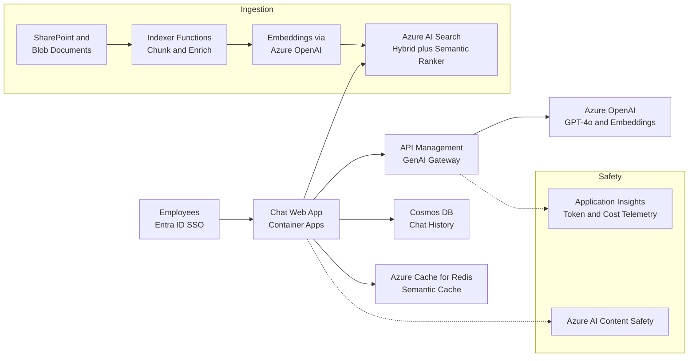

A design-review playbook for a retrieval-augmented generation application: grounding an LLM on private enterprise documents with Azure OpenAI Service and Azure AI Search.

## Business context

A professional-services firm wants an internal assistant that answers questions over 200,000 documents — contracts, policy manuals, project reports — that are confidential, permission-scoped, and updated daily. Users are ~3,000 employees with bursty daytime usage (peak ~50 concurrent chats). The firm's counsel requires that answers cite sources, that users never see documents they lack permission to read, and that no document content trains any model. Latency expectations are chat-grade: first token within a couple of seconds. A team of 5 engineers owns it, with no ML-ops background — managed AI services only, and cost per conversation must be understood before rollout.

## Requirements

| Requirement | Target |
|---|---|
| Availability | 99.9% business hours |
| Time to first token | p95 < 2.5 s |
| Full answer p95 | < 15 s |
| Groundedness | Every claim cites a retrieved source; refuse when retrieval is empty |
| Document freshness | Indexed within 15 min of update |
| Security | Per-user document-level trimming, private endpoints, no training on tenant data |
| Concurrency | 50 concurrent chats, 5x headroom |
| Cost transparency | Cost per conversation tracked from day one |

## Reference architecture

## Service choices and rationale

| Component | Chosen service | Alternatives considered | Why |
|---|---|---|---|
| LLM | Azure OpenAI Service — GPT-4o main, GPT-4o mini for cheap steps | OpenAI direct, open models on AML | Data-residency and no-training guarantees inside the tenant boundary, private endpoints, Entra auth; per-step model tiering cuts cost |
| Retrieval | Azure AI Search — hybrid vector + BM25 + semantic ranker | Cosmos DB vector search, PostgreSQL pgvector | Hybrid retrieval measurably beats pure-vector on enterprise docs full of exact terms — clause numbers, project codes; built-in security trimming via filters |
| Embeddings | text-embedding-3-large via Azure OpenAI | Open-source embedding models | Same governance envelope as the LLM; strong multilingual retrieval quality |
| App host | Azure Container Apps | App Service, Functions | Streaming responses over SSE, scale-to-near-zero overnight, per-revision canary for prompt changes |
| LLM gateway | API Management with GenAI policies | Direct SDK calls | Token-based rate limiting per user, PTU-with-paygo-spillover load balancing across deployments, and per-request token metering for chargeback |
| Chat history | Cosmos DB | Azure SQL, Table Storage | Conversation documents with per-user partition keys; TTL for retention policy |
| Semantic cache | Azure Cache for Redis (vector similarity) | No cache | Repeated policy questions are a large traffic share; caching near-duplicate answers cuts token spend |
| Guardrails | Azure AI Content Safety + prompt shields | Prompt-only defenses | Managed jailbreak and harmful-content screens independent of prompt quality |

## Key design decisions

1. **Hybrid retrieval with semantic ranking, not pure vector search.** Pure vector similarity misses exact identifiers (clause 14.2, project ATLAS) that dominate professional queries, and pure keyword misses paraphrases. Hybrid runs both and fuses with reciprocal rank fusion; the semantic ranker reorders the top set. Trade-off: semantic ranker adds per-query cost and ~100–300 ms — paid because retrieval quality is the ceiling on answer quality; no prompt fixes bad retrieval.
2. **Security trimming in the retrieval layer, enforced by filters, not by the prompt.** Every document chunk is indexed with its permitted-group ACL; every query carries a mandatory filter built from the user's Entra group claims. Asking the model to withhold restricted content is not a security control — anything in the context window must already be authorized. Trade-off: ACL changes must propagate to the index (the 15-min freshness pipeline re-indexes ACL deltas), and group-explosion on complex permissions needs flattening in the ingestion pipeline.
3. **Chunking is a product decision, not a preprocessing detail.** Contracts answer best with clause-aligned chunks (~400 tokens, heading-anchored, 15% overlap); reports tolerate larger prose chunks. The pipeline chunks per document type and stores title, section path, and source URL with each chunk so citations resolve to a human-navigable location. Trade-off: per-type chunking logic is maintenance surface, and re-chunking strategy changes force full re-index — budget index rebuild as a routine operation, with a blue-green index-alias swap to avoid downtime.
4. **Provisioned throughput for the baseline, pay-as-you-go for spillover.** Pure pay-as-you-go token pricing exposes peak-hour latency variance and 429s; pure PTU overprovisions for a bursty daytime curve. APIM's gateway policy routes to the PTU deployment first and spills to a standard deployment on saturation. Trade-off: PTU is a significant fixed commitment — it is sized from measured token telemetry after a paygo pilot phase, never guessed up front.
5. **Refuse-and-cite over always-answer.** When retrieval returns nothing above a relevance floor, the app says so and routes to search suggestions instead of letting the model improvise — hallucinated confident answers about contracts are a legal risk, not a UX blemish. Groundedness is evaluated continuously: a nightly evaluation set (real anonymized queries with graded answers) scores retrieval hit-rate and citation faithfulness, and prompt or chunking changes ship only when evals hold. Trade-off: a visible refusal rate that product owners must accept as a feature.

## Scaling and failure behavior

**Scale out.** Container Apps scales on concurrent SSE connections. Azure OpenAI capacity is the real constraint: PTU handles the provisioned floor; spillover absorbs bursts at paygo latency; APIM spreads across two regional deployments for headroom beyond that. AI Search scales with replicas (query throughput) and partitions (index size) — replicas also carry the availability SLA (three replicas for 99.9% read-write). The semantic cache flattens the peak materially because intranet question distributions are heavy-tailed.

**What fails and how it degrades:**

- **Azure OpenAI throttling** (429s) — gateway retries against the spillover deployment, then the second region. Users see slower first tokens, not errors. Sustained saturation triggers the PTU-resize conversation with data in hand.
- **Azure OpenAI regional outage** — APIM fails over to the second-region deployment; embeddings for ingestion queue and drain later. Chat continues with slightly higher latency.
- **AI Search down** — the hard dependency: no retrieval means no grounded answers. The app degrades explicitly — assistant unavailable, fall back to classic document search — rather than serving ungrounded model output. This failure honesty is a deliberate policy.
- **Ingestion pipeline failure** — the index serves stale-but-correct content; freshness SLO alarms fire. Because indexing is idempotent (chunk IDs deterministic from doc ID + position), recovery is re-run.
- **Semantic cache failure** — invisible except in cost and latency dashboards; requests pass through to the LLM.
- **Prompt regression** — a prompt tweak degrades citation quality. Canary revisions on Container Apps plus the nightly eval gate catch it; rollback is a revision flip.
- **Prompt injection via documents** — a poisoned document instructs the model to exfiltrate or mislead. Defenses layered: Content Safety prompt shields, ingestion-time screening, and strict output citation-checking; the residual risk is documented, not hand-waved.


Rough monthly cost drivers: Azure OpenAI dominates and scales with usage — at ~2,000 conversations/day averaging 8k input + 1k output tokens on GPT-4o, expect ~ $1,500–3,000/month paygo, which is what motivates the PTU-baseline decision and the mini-model tiering for query rewriting and summarization steps. AI Search: S1 with 3 replicas + semantic ranker ~ $750–1,100. Container Apps ~ $100–200. Cosmos DB + Redis ~ $300–500. Embeddings for the initial 200k-document index are a one-time ~ $100–300, trivial versus chat tokens. All-in ~ $3k–5k/month, roughly $0.05–0.10 per conversation — instrument this per-request at the gateway from day one, because token telemetry is what turns every scaling and PTU decision from a guess into arithmetic.


## Run it yourself

- [Lab 3 — Serverless API](../../labs/lab-03-serverless-api) — build the API backbone, then adapt it: swap the business endpoints for a retrieval step against Azure AI Search and a completion call to Azure OpenAI Service, and stream the response.
