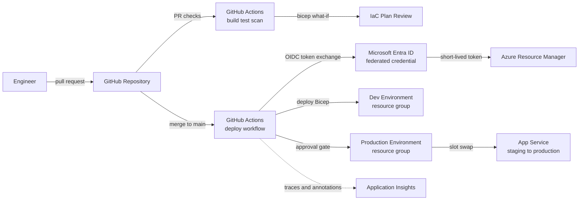

A design-review playbook for the delivery pipeline itself: how code and infrastructure changes get from a pull request to production on Azure — safely, auditable, and without long-lived credentials.

## Business context

A product team of ten engineers ships a web application and its infrastructure to Azure several times a day. Today deployments are manual: an engineer with Owner rights runs scripts from a laptop using a shared service principal secret that never rotates. The business wants faster, safer releases; security wants the shared secret gone and every production change traceable to a reviewed pull request; the team wants zero-downtime deploys and a one-click rollback. The pipeline must cover both application code and infrastructure as code, with a promotion path through dev and production environments.

## Requirements

| Requirement | Target |
|---|---|
| Lead time, merge to production | < 30 minutes |
| Deployment downtime | Zero for routine releases |
| Rollback time | < 5 minutes |
| Credentials in the pipeline | No long-lived secrets — OIDC only |
| Production change control | PR review + environment approval gate |
| Infrastructure changes | Same pipeline discipline as code, via IaC |
| Audit | Every production change traceable to commit, actor, and approval |
| Build reproducibility | Pinned tool versions, cached dependencies |

## Reference architecture

## Service choices and rationale

| Component | Chosen service | Alternatives considered | Why |
|---|---|---|---|
| Pipeline engine | GitHub Actions | Azure DevOps Pipelines, GitLab CI, Jenkins | Code, reviews, and pipeline in one place; OIDC federation with Entra ID is first-class; largest marketplace of maintained actions |
| Pipeline identity | Entra ID workload identity federation | Service principal with client secret, publish profiles | No stored secret to leak or rotate — GitHub exchanges a signed OIDC token for a short-lived Azure token scoped per repo, branch, and environment |
| IaC language | Bicep | Terraform, ARM JSON, Pulumi | Native ARM semantics, `what-if` preview for plan review, no state file to host and lock; Terraform wins for multi-cloud shops |
| App hosting | App Service with deployment slots | AKS, Container Apps, VMs | Slot swap gives zero-downtime deploy and instant rollback with no orchestrator to run; the pattern transfers to AKS with rolling updates later |
| Artifact registry | GitHub Packages / Azure Container Registry | Docker Hub | ACR when images ship to Azure compute; geo-replication and vulnerability scanning integrate with Defender for Cloud |
| Environment gates | GitHub Environments with required reviewers | Manual runbook, ServiceNow gate | Approval, audit trail, and environment-scoped OIDC subject claims in one feature |
| Observability | Application Insights release annotations | None | Correlates deploy events with latency and error changes — the first question in any incident is "what shipped?" |

## Key design decisions

1. **OIDC federation instead of service principal secrets.** A federated credential binds trust to a specific repository, branch, or environment claim — `repo:org/app:environment:production` can deploy to production and nothing else can. There is no secret to store, leak, or rotate. Trade-off: initial setup is less obvious than pasting a secret, and each environment needs its own federated credential entry.
2. **One workflow, two environments, approval between them.** Dev deploys on every merge to main; production requires a named reviewer through a GitHub Environment gate. This keeps a single pipeline definition while enforcing separation of duties. Trade-off: approvals add human latency — keep the gate on production only, or teams start rubber-stamping.
3. **Infrastructure and application in the same pipeline, with `what-if` as the plan step.** Bicep deploys are idempotent, so every run converges infrastructure before deploying code. The PR check posts `az deployment group what-if` output for review, giving Terraform-plan-style visibility without a state backend. Trade-off: a full converge on every deploy is slower than code-only pushes; split the jobs when infra churn drops.
4. **Slot swap as the release mechanism, not in-place deploy.** Code deploys to a staging slot, smoke tests run against it, then the swap promotes it with warm instances — and rollback is swapping back. Trade-off: slots require Standard tier or above, roughly doubling the compute cost of the environment; that is the price of zero-downtime and instant rollback on PaaS.
5. **Scoped least privilege for the pipeline identity.** The federated identity gets Contributor on the workload's resource groups — never subscription Owner. Role assignments and policy stay with humans through privileged identity management. Trade-off: occasionally a pipeline step fails on a missing permission and needs a deliberate scope increase, which is exactly the review you want to force.

## Scaling and failure behavior

**Scale out.** The pipeline scales with the team: GitHub-hosted runners parallelize per job, and matrix builds fan out tests. When builds need VNet access to private resources, add self-hosted runners on Container Apps jobs — scale-to-zero keeps idle cost near nothing.

**What fails and how it degrades:**

- **Failed smoke test on the staging slot** — the swap never happens; production traffic is untouched. The deploy marks failed, the team fixes forward or abandons the slot.
- **Bad release discovered after swap** — swap back; the previous version is still warm in the other slot. Rollback is minutes, and no rebuild is required.
- **GitHub Actions outage** — no deploys during the outage, production keeps running. The documented break-glass path is a human with PIM-elevated rights running the same Bicep from a laptop — the same artifacts, audited after the fact.
- **Drifted infrastructure** — someone changed a resource in the portal; the next `what-if` surfaces the drift and the converge reverts it. Treat portal write access in production as the anomaly to remove.
- **Leaked pipeline credential** — there is none. The OIDC token lives minutes and only mints for workflows matching the subject claim; the blast radius of a compromised fork or branch is bounded by the claim match.

**Backpressure.** Concurrency groups serialize deploys per environment so two merges cannot interleave a swap; queued runs supersede each other with `cancel-in-progress` on non-production.


Rough monthly cost drivers: GitHub Actions minutes — free tier covers small teams, then ~ $0.008 per Linux minute; the staging slot requirement pushes App Service to Standard S1 (~ $70/month per environment); ACR Basic ~ $5/month; Application Insights ingestion. The pipeline itself is usually under $50/month — an order of magnitude below the cost of one botched manual production deploy.


## Run it yourself

Deploy this pipeline end to end — OIDC federation, Bicep infrastructure, and a working GitHub Actions deploy — in [Lab 9 — CI/CD with GitHub Actions OIDC](../../labs/lab-09-cicd-pipeline).
