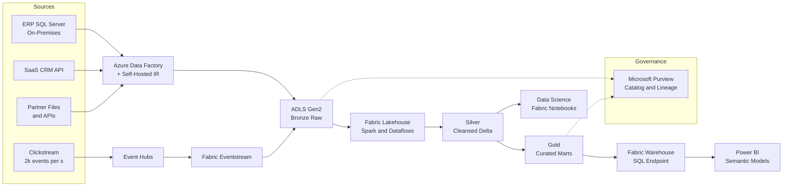

A design-review playbook for a company-wide analytics platform: batch and streaming ingestion into a governed lakehouse, serving BI, self-service SQL, and data science.

## Business context

A 2,000-person retail company has analytics scattered across nightly SQL dumps, departmental spreadsheets, and one overloaded reporting database that doubles as the ERP replica. Leadership wants a single governed platform: finance needs trustworthy daily numbers, marketing wants near-real-time campaign metrics from clickstream data, and a new data science team needs ML-ready history. Sources include an ERP (SQL Server on-prem), a SaaS CRM, e-commerce clickstream (~2,000 events/s), and 30+ smaller files-and-APIs feeds. The data team is 6 engineers and 4 analysts — strong SQL, limited Spark experience — so managed, low-ops tooling wins over maximal flexibility.

## Requirements

| Requirement | Target |
|---|---|
| Daily batch SLA | Curated finance marts ready by 07:00 local |
| Streaming freshness (clickstream) | < 5 min to dashboard |
| BI query performance | p95 < 5 s on curated marts |
| Platform availability | 99.9% business hours |
| RPO / RTO | 24 h for batch layers / next business day |
| Governance | Central catalog, lineage, row-level security for finance |
| Data volume | ~2 TB/day ingest, 200 TB total in 3 years |
| Team fit | SQL-first tooling, minimal cluster management |

## Reference architecture

## Service choices and rationale

| Component | Chosen service | Alternatives considered | Why |
|---|---|---|---|
| Analytics platform | Microsoft Fabric | Azure Databricks + Synapse, self-assembled stack | One SaaS surface for lakehouse, warehouse, streaming, and Power BI; capacity-based pricing; fits a SQL-first team better than Databricks' Spark-centric model |
| Batch ingestion | Azure Data Factory (self-hosted IR for on-prem) | Fabric Data Factory, Fivetran | Mature connector set and self-hosted integration runtime for the on-prem ERP behind the firewall; pipelines can migrate to Fabric Data Factory incrementally |
| Streaming ingestion | Event Hubs + Fabric Eventstream | IoT Hub, Kafka | Clickstream is one-way, high-volume; Event Hubs is the standard buffer, Eventstream lands it in Delta without custom Spark |
| Storage | ADLS Gen2 with Delta Lake (OneLake-attached) | Blob without hierarchical namespace | ACID tables, time travel, schema enforcement; hierarchical namespace for medallion-layout management |
| Transformation | Fabric Spark notebooks + dataflows | dbt on Databricks, stored procedures | Medallion transforms in PySpark/SQL where analysts can contribute; dbt remains an option on top of the warehouse endpoint |
| Serving / BI | Fabric Warehouse + Power BI Direct Lake | Import-mode Power BI, Azure Analysis Services | Direct Lake reads Delta without scheduled refresh copies, keeping one physical copy of gold data |
| Governance | Microsoft Purview | Unity Catalog, Collibra | Cross-estate catalog, scan-based lineage, sensitivity labels shared with the M365 estate |

## Key design decisions

1. **Fabric over a Databricks-plus-Synapse assembly.** Databricks is the stronger pure engineering platform (deeper Spark, better CI/CD maturity, Unity Catalog). Fabric won on team shape and TCO: 6 engineers who live in SQL and Power BI get warehouse endpoints, Direct Lake, and a single capacity bill instead of stitching workspaces, DBU pricing, and a separate BI layer. Trade-off: less control over compute tuning, a younger platform with rougher edges, and capacity throttling as a shared-resource failure mode to manage.
2. **Medallion layers with bronze as immutable truth.** Raw data lands in bronze exactly as received and is never edited; silver applies cleansing, deduplication, and conformance; gold holds business-modeled marts. This costs storage (three copies-ish) and pipeline hops, but buys the ability to rebuild any downstream layer after logic bugs — which is the recovery story for most data incidents, far more common than infrastructure loss.
3. **Batch-first, streaming only where freshness pays.** Only clickstream justifies streaming; everything else is scheduled batch. Streaming everything is fashionable and doubles operational surface for data nobody reads intraday. Trade-off: marketing dashboards mix 5-minute-fresh clickstream with day-old ERP dimensions — the semantic model must label freshness per table to avoid misleading joins.
4. **Direct Lake for BI instead of import-mode copies.** Import mode is battle-tested but creates refresh schedules, memory-bound model copies, and a second data estate inside Power BI. Direct Lake queries the gold Delta files directly. Trade-off: it constrains model design (no calculated columns on large tables, fallback to DirectQuery on complex cases), so gold tables must be shaped BI-ready — pushing modeling discipline upstream, which is where it belongs anyway.
5. **Idempotent, re-runnable pipelines as a hard standard.** Every ADF/Fabric pipeline is written to be safely re-run for any date window: watermark-based incremental loads, MERGE-based upserts into silver, partition-overwrite into gold. This is the difference between a 07:00 SLA miss being a re-run command versus a manual data-surgery morning. Trade-off: more careful pipeline design up front and watermark state to manage.

## Scaling and failure behavior

**Scale out.** Fabric capacity (F SKUs) is the single scaling dial: Spark, warehouse queries, and Power BI draw from shared capacity units, with smoothing absorbing bursts. Scale up the SKU or split workloads across capacities (e.g., isolate data science from the BI-serving capacity) when interactive queries slow during heavy transforms. Event Hubs scales via throughput units; ADF scales copy parallelism per pipeline. Storage is effectively unbounded.

**What fails and how it degrades:**

- **Nightly batch failure** — the most routine incident. Pipelines alert on failure and on missed 07:00 readiness (deadline alert, not just error alert). Because loads are idempotent, recovery is re-run; finance sees yesterday's marts clearly stamped with data-as-of timestamps rather than silently stale numbers.
- **Source system slow or down** (ERP maintenance window overruns) — the pipeline retries then skips with a data-late flag; downstream gold builds proceed with prior-day dimensions where joins allow, or hold the affected marts.
- **Capacity throttling** — a runaway notebook consumes the capacity; interactive BI slows or queues for everyone. This is Fabric's version of the noisy-neighbor problem: mitigate with workload isolation across capacities, surge protection settings, and notebook resource limits.
- **Streaming lag** — Eventstream or Spark structured-streaming backlog delays clickstream freshness; dashboards show data lagging its freshness label. Event Hubs retention (7 days) is the catch-up budget; no data is lost.
- **Bad transform logic ships** — wrong numbers in gold. Recovery: fix, rebuild gold from silver (or silver from bronze) for affected partitions; Delta time travel supports diffing before/after. This rebuildability is the medallion payoff.
- **Region loss** — ADLS is GRS; Fabric items and pipeline definitions live in Git (deployment pipelines), so DR is redeploy-and-rehydrate in the paired region within next-business-day RTO. Bronze completeness bounds true data loss to in-flight ingestion.


Rough monthly cost drivers: Fabric capacity dominates — F16 ~ $2,600 (pay-as-you-go) covering Spark, warehouse, and Power BI; reservations cut ~40%. ADLS Gen2 at 200 TB with tiering ~ $2,000–3,500 as it accrues over years (start ~ $100–300). ADF self-hosted IR runs on a small on-prem VM plus per-activity charges ~ $100–300. Event Hubs Standard 2–4 TUs ~ $50–100. Purview consumption ~ $100–400 depending on scan cadence. Expect $3k–4k/month in year one, drifting up with storage. The review-meeting levers: Fabric SKU size and reservation, hot vs cool lake tiering, and whether data science needs its own capacity.


## Run it yourself

- [Lab 6 — Data Analytics Pipeline](../../labs/lab-06-data-pipeline) — build the ingest-to-curated pipeline pattern from this design.
