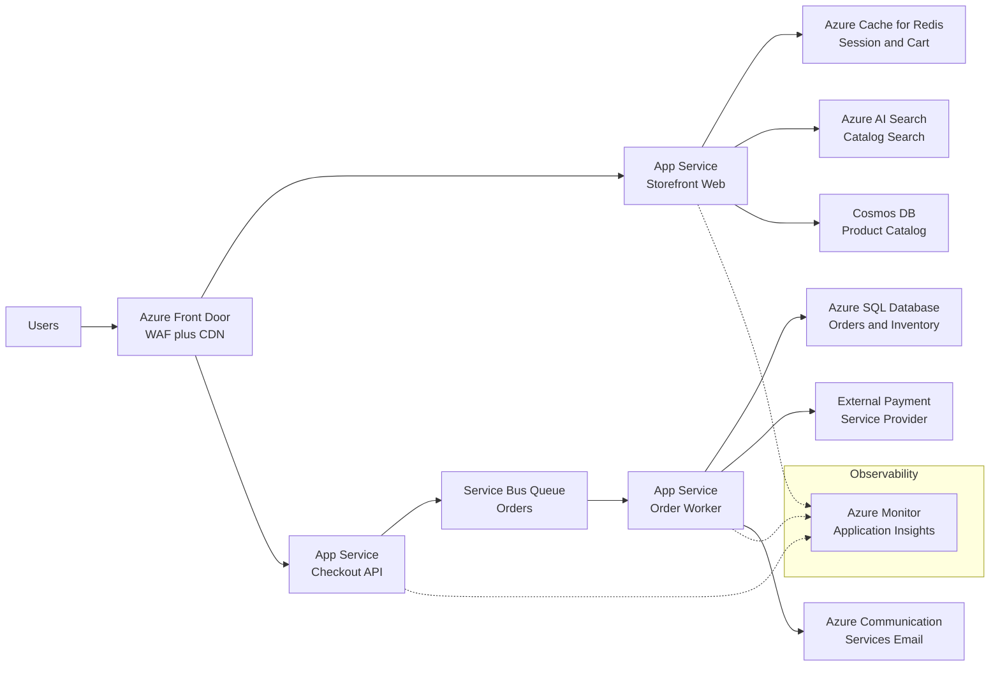

A design-review playbook for a consumer-facing e-commerce platform on Azure: storefront, catalog, cart, checkout, and order fulfillment.

## Business context

A mid-size retailer runs a storefront serving roughly 50,000 daily active users, with traffic spiking 10–20x during flash sales and holiday campaigns. Checkout must never lose an order, product pages must feel instant worldwide, and the catalog team pushes content updates several times a day. The engineering team is about 15 people, comfortable with managed PaaS services but without a dedicated platform/SRE group, so operational simplicity matters as much as raw scalability. Revenue is directly tied to availability: a one-hour outage during a sale is a five-figure loss.

## Requirements

| Requirement | Target |
|---|---|
| Availability (storefront) | 99.95% monthly |
| Availability (checkout path) | 99.99% monthly |
| p95 page latency (catalog reads) | < 300 ms globally |
| p95 checkout API latency | < 800 ms |
| Peak throughput | 20x baseline within 10 minutes |
| Order durability | Zero accepted orders lost |
| RPO (order data) | ~0 (synchronous within region) |
| RTO (regional incident) | < 1 hour |
| PCI scope | Payment handled by external PSP, no card data at rest |

## Reference architecture

## Service choices and rationale

| Component | Chosen service | Alternatives considered | Why |
|---|---|---|---|
| Global entry, CDN, WAF | Azure Front Door (Premium) | Traffic Manager + Azure CDN, Application Gateway | Single service for anycast routing, caching, WAF, and origin failover; Traffic Manager is DNS-only and slower to fail over |
| Web tier | Azure App Service | AKS, Container Apps, VMs | Team of 15 with no platform group; deployment slots and autoscale cover the need without cluster ops |
| Cart and session store | Azure Cache for Redis | Cosmos DB, in-process session | Sub-millisecond reads, TTL-native cart expiry, and externalized state so web instances stay stateless |
| Product catalog | Cosmos DB (session consistency) | Azure SQL, MySQL | Read-heavy, globally distributable, flexible schema for merchandising attributes; point reads at predictable latency |
| Catalog search | Azure AI Search | Elasticsearch on VMs, SQL full-text | Managed relevance tuning, facets, and synonyms; no cluster to run |
| Order intake buffer | Service Bus (queue) | Event Grid, Storage Queues | Orders need transactional dequeue, dead-lettering, duplicate detection, and ordered sessions per customer |
| Order system of record | Azure SQL Database (Business Critical) | Cosmos DB | Orders and inventory are relational and transactional; zone-redundant Business Critical gives synchronous replicas |
| Async order processing | App Service worker (WebJobs) | Functions, Container Apps jobs | Same deployment toolchain as the web tier; long-running payment capture fits a worker better than a 5-minute function |

## Key design decisions

1. **Externalize all session and cart state to Redis.** Keeping state in-process would make autoscale and slot swaps drop carts. The trade-off is a network hop on every request and a new critical dependency — mitigated with zone-redundant Redis (Premium) and a short-TTL local cache for read-mostly data.
2. **Split the checkout path from the browse path.** Catalog browsing is cache-friendly and tolerant of staleness; checkout is transactional and must be sized independently. Two App Service plans cost more idle capacity but prevent a flash-sale browse storm from starving checkout.
3. **Accept orders via a queue, not a synchronous write.** The checkout API validates, enqueues to Service Bus, and returns an order-accepted response. This is the web-queue-worker pattern: the user gets a fast response and the order survives a downstream SQL or PSP outage. Trade-off: order confirmation becomes eventually consistent (seconds), so the UX must show pending status honestly.
4. **Service Bus over Event Grid for order intake.** Event Grid is push-based pub/sub for reactive events; it retries but a consumer outage risks events landing in dead-letter storage that someone must drain. Service Bus gives pull-based load leveling, peek-lock, sessions for per-customer ordering, and duplicate detection keyed on order ID — the right semantics when losing a message means losing revenue.
5. **Cosmos DB session consistency for the catalog, not strong.** Strong consistency would limit multi-region reads and raise RU cost. Merchandising can tolerate seconds of staleness; inventory truth lives in SQL and is checked at order processing time, not at page render.

## Scaling and failure behavior

**Scale out.** Front Door absorbs the edge; App Service autoscales on CPU and HTTP queue depth (browse plan scales aggressively, checkout plan conservatively with a higher floor). Cosmos DB uses autoscale RUs sized for the flash-sale peak. Service Bus decouples intake from processing — during a spike, queue depth grows and workers scale out on queue length via autoscale rules. SQL is the fixed-capacity anchor: the worker's dequeue rate is throttled so SQL never sees more than its tested peak, converting overload into latency instead of errors.

**What fails and how it degrades:**

- **Redis outage** — carts are lost or unavailable. Degradation: storefront stays up read-only for carts; checkout for in-flight carts fails. Mitigation: zone-redundant tier, and persist cart snapshots to Cosmos DB asynchronously for recovery.
- **Cosmos DB or AI Search outage** — product pages degrade to cached Front Door content; search falls back to category browse. Sales continue for cached pages.
- **SQL outage** — workers stop draining; the queue absorbs orders for hours (size accordingly). Customers still get order-accepted responses. This is the design's core payoff.
- **PSP outage** — payment capture retries with exponential backoff from the worker; orders park in a payment-pending state rather than failing checkout.
- **Region outage** — Front Door health probes fail the origin; a warm-standby secondary region (App Service deployed, SQL failover group, Cosmos DB multi-region read) takes over within the 1-hour RTO. Orders enqueued but undrained in the failed region are the RPO exposure — Service Bus Premium with geo-disaster recovery narrows this.

**Backpressure.** If queue depth exceeds a threshold, the checkout API sheds load with a friendly retry-later response rather than accepting orders it cannot honor within the promised confirmation window.


Rough monthly cost drivers at baseline (50k DAU, single region): two App Service plans (P1v3, 2–3 instances each) ~ $600–900; Azure SQL Business Critical 4 vCore ~ $1,800; Cosmos DB autoscale ~ $300–800 depending on catalog read volume; Redis Premium P1 ~ $400; Front Door Premium ~ $330 base plus egress; Service Bus Standard ~ $10 plus operations; AI Search Standard S1 ~ $250. Expect $4k–5k/month baseline, with flash sales adding burst compute and RU costs. The biggest levers: SQL tier, Cosmos RU ceiling, and Front Door egress.


## Run it yourself

Build the two halves of this architecture hands-on:

- [Lab 1 — N-Tier Web App](../../labs/lab-01-n-tier) — the storefront web and data tiers.
- [Lab 2 — Web-Queue-Worker](../../labs/lab-02-web-queue-worker) — the queue-buffered checkout and order worker path.
