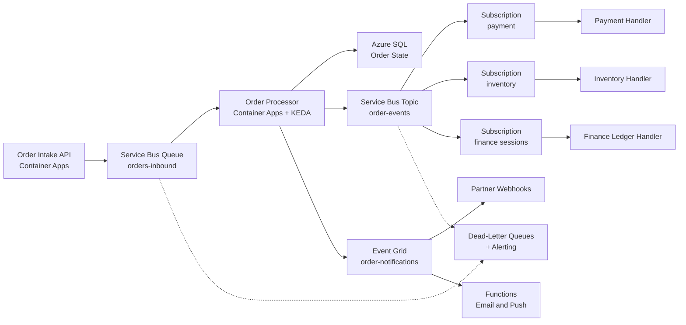

A design-review playbook for decoupling an order lifecycle — placed, paid, allocated, shipped — into an event-driven system with reliable messaging.

## Business context

A wholesale distributor processes 30,000–80,000 orders per day, with sharp Monday-morning and end-of-quarter peaks. Each order triggers a chain of downstream work: payment capture, inventory allocation, warehouse dispatch, partner notifications, and ledger updates — today implemented as a brittle chain of synchronous API calls where any slow dependency stalls order intake. Different consumers have different needs: the warehouse system is a legacy app that polls, finance needs strict per-order processing, and a growing set of integrations just wants to be told when things happen. The team (8 engineers) needs to add consumers without touching producers, and the hard business rule is that no confirmed order may ever be silently dropped.

## Requirements

| Requirement | Target |
|---|---|
| Availability (order intake) | 99.95% monthly |
| Order intake p95 latency | < 300 ms |
| End-to-end order processing | p95 < 60 s, p99 < 5 min |
| Peak absorption | 10x baseline for 2 hours without intake errors |
| Message durability | At-least-once delivery, zero silent loss |
| Ordering | Per-order event sequence preserved for finance |
| RPO / RTO | ~0 for accepted orders / 1 hour |
| Auditability | Every state transition traceable per order |

## Reference architecture

## Service choices and rationale

| Component | Chosen service | Alternatives considered | Why |
|---|---|---|---|
| Intake buffer | Service Bus queue (Premium) | Event Hubs, Storage Queues | Load-leveling with peek-lock, duplicate detection on order ID, dead-lettering; Premium for predictable throughput and geo-DR |
| Internal fan-out | Service Bus topic + subscriptions | Event Grid, one queue per consumer | Consumers get independent cursors, filters, and DLQs; sessions on the finance subscription give per-order FIFO |
| External notifications | Event Grid (custom topic) | Service Bus, direct webhooks | Push-based pub/sub with per-endpoint retry and dead-lettering to storage; right tool for fire-and-forget notifications to many endpoints |
| Compute | Azure Container Apps + KEDA | Functions, AKS | Scale-to-near-zero consumers driven by queue depth via KEDA, without cluster ops; longer processing windows than Functions consumption defaults |
| Order state | Azure SQL Database | Cosmos DB | The order state machine is relational and transactional; optimistic concurrency on state transitions |
| Workflow visibility | Application Insights + correlation IDs | Durable Functions orchestration | Choreography with correlation tracing chosen over central orchestration — see decision 4 |

## Key design decisions

1. **Service Bus for the order path, Event Grid for notifications — not one or the other.** This is the classic confusion. Service Bus is a message broker: pull-based, transactional, load-leveling, ordered sessions — for work that must happen. Event Grid is an event router: push-based, massive fan-out, per-subscriber retry then dead-letter — for facts others may react to. Orders ride Service Bus because a consumer outage must translate into backlog, not loss. Notifications ride Event Grid because forcing partner webhooks through the broker would couple intake to the slowest partner.
2. **Duplicate detection plus idempotent consumers, not exactly-once dreams.** At-least-once is the honest delivery contract. Service Bus duplicate detection (keyed on order ID, 10-minute window) removes producer-side retries; every consumer additionally upserts against the order state with a processed-event check. Trade-off: idempotency logic in every handler is a tax on all consumers, but it is the only defense that survives redelivery after lock expiry.
3. **Sessions only where ordering is required.** FIFO costs parallelism: a sessioned subscription processes one order's events serially. Finance gets sessions (ledger entries must be ordered per order); inventory and payment do not, because their handlers are commutative-by-design. Enabling sessions everywhere would cap throughput at the number of active session IDs and complicate scaling for no benefit.
4. **Choreography over orchestration — with one guardrail.** A central orchestrator (Durable Functions or Logic Apps) gives visibility and explicit compensation, but becomes a coupling point every team must change. Choreography via topics keeps producers ignorant of consumers. The guardrail: a passive order-watchdog function subscribes to all events, tracks expected transitions per order, and alerts when an order stalls past SLA — restoring the visibility orchestration would have given. Trade-off: compensation logic (e.g., payment captured but allocation failed) is distributed across handlers and harder to reason about end to end.
5. **Dead-letter queues are a product surface, not a dumpster.** Every subscription's DLQ has an alert, a dashboard, and a documented replay runbook (a small replay function moves messages back after fixes). Silent DLQ growth is the most common way event-driven systems lose data while claiming durability. Trade-off: someone is on the hook to drain them — this is an operational commitment, priced into on-call.

## Scaling and failure behavior

**Scale out.** Intake API scales on HTTP concurrency; every consumer scales independently via KEDA on its own subscription's backlog, from near-zero to its configured max. The peak pattern is by design: a 10x Monday spike fills `orders-inbound`, KEDA fans out processors, and downstream subscriptions drain at their own pace. Service Bus Premium messaging units are the throughput ceiling to watch; scale MUs before big promotions.

**What fails and how it degrades:**

- **A consumer is down** (e.g., inventory handler bug) — its subscription accumulates backlog; every other consumer is unaffected. On recovery, KEDA scales the handler out to drain. Intake never noticed. This isolation is the architecture's core payoff.
- **Poison message** — after max delivery attempts it dead-letters; the alert fires, on-call inspects, fixes, replays. One bad order cannot wedge the pipeline.
- **SQL slowdown** — processors slow, backlog grows, intake still returns 202. End-to-end p99 degrades gracefully from 60 s toward minutes; the watchdog quantifies the drift.
- **Partner webhook endpoint down** — Event Grid retries with backoff for up to 24 hours, then dead-letters to a storage container; the order pipeline is untouched.
- **Service Bus namespace outage** — the single most critical dependency. Premium geo-disaster recovery pairs the namespace with a secondary region: metadata fails over, but in-flight messages do not replicate — the RPO exposure is messages enqueued-but-unprocessed at failure time. Mitigate by keeping the intake API able to write a durable intake record to SQL first (outbox) so orders can be re-emitted.
- **Duplicate deliveries after lock expiry** — handled invisibly by idempotent handlers; visible only as a metric.

**Backpressure.** If inbound backlog exceeds an absorb-within-SLA threshold, intake flips to a degraded mode: still accepting orders (never refuse revenue) but flagging extended confirmation times to callers.


Rough monthly cost drivers: Service Bus Premium 1 MU ~ $680 (the fixed anchor; Standard ~ $10 base is fine below ~1k msg/s but lacks geo-DR and predictable latency); Container Apps consumption for API plus consumers ~ $200–500 scaling with volume; Azure SQL GP 4 vCore ~ $750; Event Grid ~ $0.60 per million operations — trivial; Application Insights ingestion $100–300. Roughly $1.8k–2.5k/month. The decision that moves cost most is Service Bus Premium vs Standard — buy Premium for the geo-DR and isolation, not for throughput you may not need yet.


## Run it yourself

- [Lab 4 — Event-Driven Messaging](../../labs/lab-04-event-driven) — build the queue, topic/subscription fan-out, and dead-letter handling from this design.
