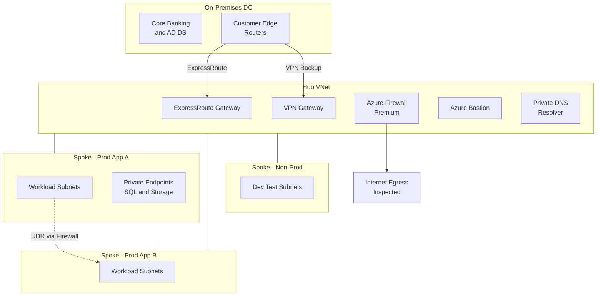

A design-review playbook for connecting an on-premises estate to Azure with a hub-spoke topology: shared services, centralized egress, and governed workload landing zones.

## Business context

A financial-services firm is moving workloads to Azure while keeping its core banking system on-premises for at least five years. Twelve application teams need isolated network environments that can reach on-prem services (mainframe APIs, Active Directory, file shares) and each other in controlled ways. Security mandates centralized inspection of north-south and east-west traffic, no public IPs on workload VMs, and full private connectivity to PaaS services. The network team is 4 engineers who own connectivity as a product for the application teams; audit requires provable segmentation between environments. Current on-prem egress is 2 Gbps sustained to Azure and growing.

## Requirements

| Requirement | Target |
|---|---|
| On-prem to Azure connectivity | Private, redundant, 2 Gbps sustained with headroom |
| Connectivity availability | 99.95% for the hybrid path |
| Latency on-prem to Azure workloads | < 10 ms round trip |
| Segmentation | Spoke-to-spoke deny by default, allow by policy |
| Egress control | All internet egress inspected and logged |
| PaaS access | Private endpoints only, no public data plane |
| DNS | Single hybrid namespace resolving both directions |
| RTO (connectivity path) | < 15 min via automatic failover to VPN |
| Onboarding a new spoke | < 1 day, via IaC |

## Reference architecture

## Service choices and rationale

| Component | Chosen service | Alternatives considered | Why |
|---|---|---|---|
| Primary hybrid link | ExpressRoute (1 Gbps x2, zone-redundant gateway) | Site-to-site VPN only, ExpressRoute Direct | Predictable latency and private path for core-banking traffic; dual circuits at different peering locations for the SLA |
| Backup link | Site-to-site VPN over internet | Second ER provider, nothing | Cheap insurance; automatic failover via route preference when ER drops |
| Topology | Hub-spoke with VNet peering | Azure Virtual WAN, flat single VNet | 12 spokes and one region is comfortably below the complexity where Virtual WAN's managed routing pays; classic hub-spoke keeps full control and lower cost |
| Central inspection | Azure Firewall Premium | Third-party NVA cluster, NSGs only | TLS inspection and IDPS required by security; managed scaling beats operating an NVA HA pair; NSGs alone cannot log or inspect flows centrally |
| Spoke segmentation | UDRs forcing inter-spoke traffic via firewall + NSGs | Peering meshes per allowed pair | Deny-by-default with auditable allow rules in one policy plane |
| PaaS connectivity | Private endpoints + Private DNS zones | Service endpoints | Private endpoints give a routable private IP reachable from on-prem over ER; service endpoints do not extend to on-prem |
| Hybrid DNS | Azure DNS Private Resolver | DNS forwarder VMs, on-prem-only DNS | Managed inbound/outbound endpoints replace the classic pair of forwarder VMs nobody wants to patch |
| Remote access | Azure Bastion (hub) | Public IPs + NSG, jump VMs | No public IPs on any workload; Bastion Standard shared from the hub |

## Key design decisions

1. **Classic hub-spoke over Azure Virtual WAN.** Virtual WAN shines with many regions, many branches, and SD-WAN integration — its managed hub routing removes UDR toil. At one region and twelve spokes, vWAN adds cost (hub + per-connection charges) and abstracts routing the team wants to control explicitly for audit. The trade-off is accepted toil: every new spoke needs peering, UDRs, and firewall rules — mitigated by making spoke onboarding a Bicep module. Revisit the decision at multi-region or 30+ spokes.
2. **ExpressRoute with VPN standby, not dual ExpressRoute.** Two ER circuits from different providers give the strongest SLA but roughly double the recurring circuit cost. A VPN backup rides the internet: worse latency and throughput during failover, but the core-banking integration tolerates a degraded window and the audit requirement is continuity, not equivalence. Failover is automatic — ER routes are preferred while healthy. Trade-off: applications must tolerate the latency step-up during VPN operation, and this must be tested deliberately, not discovered.
3. **Forced tunneling of inter-spoke and egress traffic through Azure Firewall.** Spokes cannot talk directly (no spoke-to-spoke peering); UDRs send east-west and internet-bound flows through the hub firewall. This buys a single enforcement and logging point — the segmentation audit answer — at the cost of a latency hop, a throughput ceiling at the firewall, and per-GB processing charges that become the topology's dominant variable cost. Bulk data paths (e.g., storage replication) get explicit exceptions via private endpoints rather than hairpinning terabytes through inspection.
4. **Private endpoints everywhere, with centralized Private DNS zones in the hub subscription.** The failure mode this prevents: each team creating its own privatelink DNS zones, splitting resolution and causing intermittent public-IP fallbacks. All privatelink zones live centrally, linked to hub and spokes, with the DNS Private Resolver bridging on-prem conditional forwarders. Trade-off: private endpoint sprawl has real per-endpoint cost and an operational registry to maintain — but it is the only pattern that makes PaaS reachable from on-prem privately.
5. **IP address space planned for a decade, allocated by policy.** A /16 per environment carved into /22 spokes, reserved ranges for gateway/firewall/Bastion subnets, and zero overlap with on-prem RFC1918 space. Re-IP-ing a live hub-spoke estate is among the most painful network migrations; over-allocating address space up front costs nothing. Azure IPAM tooling (or a simple registry) is mandatory from spoke one.

## Scaling and failure behavior

**Scale out.** New workloads onboard as new spokes from the Bicep module: VNet, peering, UDRs, baseline NSGs, DNS links, and a firewall rule-collection group per spoke. Azure Firewall Premium autoscales with throughput. ExpressRoute upgrades in place (1 → 2 → 5 Gbps on the same circuit); the zone-redundant gateway SKU (ErGw2AZ/3AZ) sets the gateway ceiling. Peering data rates are effectively line-rate — the firewall and the gateways are the choke points to capacity-plan.

**What fails and how it degrades:**

- **One ExpressRoute circuit down** — the second circuit carries full load; users see nothing. This is why both circuits terminate in different peering locations.
- **Both ER circuits down** — routes converge to the VPN gateway within minutes; connectivity persists at reduced throughput (~1.25 Gbps aggregate) and higher latency. Core-banking calls slow; bulk transfers are deferred by runbook.
- **Azure Firewall degraded** — the hub's most critical single point. It is a managed, zone-redundant, autoscaling service, but a misconfigured policy push is the realistic failure: all east-west and egress traffic breaks at once. Mitigation is process — policy changes via IaC with staged rings (non-prod hub policy first) and instant rollback.
- **Gateway subnet or hub misconfiguration** — the blast radius argument for treating the hub as frozen infrastructure: locked resource group, change control, no experimentation.
- **DNS resolver failure** — resolution falls back across redundant resolver endpoints; the classic symptom of DNS problems here is private endpoints resolving to public IPs, so alert on unexpected public resolution of privatelink names.
- **A spoke is compromised** — the payoff scenario: NSGs plus deny-by-default firewall policy contain lateral movement; flow logs and IDPS provide the forensic trail; the spoke can be de-peered in one operation.


Rough monthly cost drivers: Azure Firewall Premium ~ $1,280 base plus ~ $16/TB processed — at multi-TB east-west volumes, data processing becomes the top line, which is why bulk flows bypass inspection deliberately. ExpressRoute: two 1 Gbps circuits ~ $900 (metered) plus provider charges, zone-redundant gateway ~ $560. VPN gateway ~ $140. Bastion Standard ~ $210. Private endpoints ~ $7.30 each plus data — 100 endpoints is ~ $730 before traffic. Private DNS Resolver ~ $160/endpoint pair. Expect $4k–6k/month for the hub platform before workload traffic. Chargeback per spoke keeps this honest with application teams.


## Run it yourself

- [Lab 7 — Hub-Spoke Network](../../labs/lab-07-hub-spoke) — build the hub, spokes, peering, firewall routing, and private DNS from this design.
