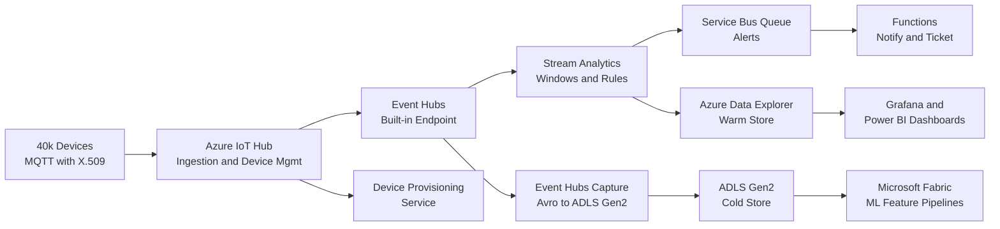

A design-review playbook for ingesting, processing, and analyzing high-volume device telemetry: hot-path alerting, warm-path dashboards, cold-path analytics.

## Business context

An industrial equipment vendor has 40,000 connected machines in the field, each emitting sensor telemetry (temperature, vibration, throughput) every 5 seconds — roughly 8,000 events/second sustained, bursting higher when firmware pushes trigger reconnect storms. The business sells uptime monitoring to customers: threshold breaches must alert within seconds, operations dashboards need minute-fresh aggregates, and data science needs months of raw history for predictive-maintenance models. Devices sit behind factory networks with flaky connectivity, so the pipeline must tolerate late, duplicated, and out-of-order data. The team is 10 engineers split between device firmware and cloud.

## Requirements

| Requirement | Target |
|---|---|
| Ingestion throughput | 8,000 events/s sustained, 25,000 events/s burst |
| Hot-path alert latency | < 10 s from device event to notification |
| Dashboard freshness | < 1 min |
| Raw retention | 13 months, queryable |
| Ingestion availability | 99.9% monthly |
| Data loss tolerance | None after broker acknowledgment; device-side buffering before |
| Late/out-of-order data | Handle up to 10 min lateness |
| Device security | Per-device identity, revocable, X.509 |

## Reference architecture

## Service choices and rationale

| Component | Chosen service | Alternatives considered | Why |
|---|---|---|---|
| Device gateway | Azure IoT Hub (Standard) | Event Hubs direct, Event Grid MQTT broker | Bidirectional messaging, per-device identity and revocation, device twins, cloud-to-device commands; Event Grid MQTT broker is the leaner choice if you only need one-way telemetry |
| Provisioning | Device Provisioning Service | Manual registration | Zero-touch enrollment at 40k-device scale with X.509 attestation |
| Stream buffer | Event Hubs (IoT Hub built-in endpoint) | Kafka on HDInsight | Partitioned, replayable log with consumer groups; no cluster ops |
| Stream processing | Azure Stream Analytics | Functions, Fabric eventstreams, Flink on HDInsight | SQL-language windowing, built-in late-arrival policies, no-code path from Event Hubs to ADX; Functions would hand-roll windowing state |
| Warm store | Azure Data Explorer | Cosmos DB, TimescaleDB | Purpose-built for time-series at this volume: columnar, ingestion-time indexing, KQL aggregations over billions of rows in seconds |
| Cold store | ADLS Gen2 via Event Hubs Capture | Direct ASA output to blob | Capture is broker-native, cannot lose data due to job failure, lands raw Avro untouched by processing logic |
| Analytics / ML | Microsoft Fabric | Databricks, Synapse Spark | Lakehouse over the same ADLS data with managed Spark and Power BI integration |
| Alert delivery | Service Bus + Functions | Direct ASA to webhook | Durable handoff — alerting must not be lost if the notifier is briefly down |

## Key design decisions

1. **IoT Hub over raw Event Hubs at the edge.** Event Hubs alone is cheaper per message, but telemetry-only ingestion forfeits per-device identity, credential revocation, twins for config, and cloud-to-device commands — all of which this business needs (firmware pushes, remote thresholds). Trade-off: IoT Hub units are a meaningful fixed cost and a throughput ceiling to manage. If the roadmap were one-way telemetry only, Event Grid's MQTT broker feeding Event Hubs would win on cost.
2. **Three explicit paths — hot, warm, cold — instead of one pipeline serving all.** One store cannot be simultaneously cheap for 13 months of raw data, fast for sub-second aggregation, and low-latency for alerting. The lambda-style split costs duplicate storage and three codepaths to operate, but each path degrades independently and is sized for its own SLO. The unifying rule: cold is the source of truth; hot and warm are rebuildable projections.
3. **Event Hubs Capture for the cold path, not a processing job.** Capture writes every raw event to ADLS from the broker itself. If Stream Analytics has a bug or outage, the cold record is untouched and the warm store can be backfilled from the lake. Trade-off: Avro files need a compaction/conversion step (Fabric job to Delta) before they are analytics-friendly.
4. **Partition by device ID, and size partitions for the burst, not the average.** Device ID partitioning preserves per-device event order through the pipeline and enables parallel consumers. Reconnect storms after firmware pushes are the real sizing event — 3x sustained rate. Under-partitioning is nearly unfixable later without a repartitioning migration, so overprovision partition count up front. Trade-off: hot devices can skew partitions; monitor per-partition lag.
5. **Handle lateness in the stream layer with watermarks, not in consumers.** ASA's late-arrival and out-of-order policies (10-minute tolerance, adjust-or-drop) centralize the messy reality of factory networks. Windows emit results once, adjusted for tolerated lateness. Trade-off: aggregates are delayed by the lateness window; the hot path uses shorter tolerance (30 s) than the warm path, accepting that very late events appear only in cold-path recomputations.

## Scaling and failure behavior

**Scale out.** IoT Hub scales by units (S2/S3) — monitor quota consumption and autoscale units via a scheduled function before firmware-push windows. Event Hubs scales by partition count (fixed at creation) and throughput capacity (auto-inflate). ASA scales by streaming units with a partition-aligned query. ADX scales its cluster on ingestion utilization. Devices buffer locally (store-and-forward) so brief cloud-side throttling surfaces as lateness, not loss.

**What fails and how it degrades:**

- **Reconnect storm** — 40k devices reconnecting after an outage hammers IoT Hub. Devices implement jittered exponential backoff (firmware requirement, not optional); IoT Hub throttles the excess; buffered telemetry drains late but complete.
- **Stream Analytics failure** — hot alerts and warm dashboards stall; the alert-latency SLO is breached and paged immediately. Cold capture continues untouched. On restart, ASA resumes from checkpointed offsets; the Event Hubs retention window (set to 3 days) is the repair budget.
- **ADX unavailable** — dashboards go stale; ASA output to ADX retries. Alerts (separate output) keep flowing. Backfill from the lake if the outage exceeds Event Hubs retention.
- **Notification function down** — alerts queue durably in Service Bus and deliver late; nothing lost. The queue-depth alarm catches it early.
- **Regional outage** — this design is single-region with DR-by-redeploy: DPS re-homes devices to a standby IoT Hub in the paired region (devices must hold both endpoints), and the lake is RA-GRS. Telemetry gap during failover is bounded by device-side buffers — typically hours of local storage.
- **Duplicate and out-of-order events** — expected steady-state noise: dedupe keys in ASA, idempotent ADX ingestion via ingest-by tags, watermark policies as above.


Rough monthly cost drivers at 8k events/s: IoT Hub S3 units ~ $2,500 (often the single largest line; the Event Grid MQTT alternative can cut this sharply for one-way telemetry); Azure Data Explorer 2-node cluster ~ $1,500–2,500 with hot-cache retention as the main lever; Stream Analytics 3–6 SUs ~ $300–700; ADLS Gen2 storage grows ~ $50–150/month cumulative at this rate with lifecycle tiering to cool/archive; Fabric capacity F2–F8 ~ $260–1,050 depending on ML workload cadence. Expect $5k–7k/month. Retention windows — ADX hot cache days and lake tiering — are where cost review should start.


## Run it yourself

- [Lab 4 — Event-Driven Messaging](../../labs/lab-04-event-driven) — the broker patterns behind the alerting path.
- [Lab 6 — Data Analytics Pipeline](../../labs/lab-06-data-pipeline) — the warm/cold analytical stores and lake pipeline.
