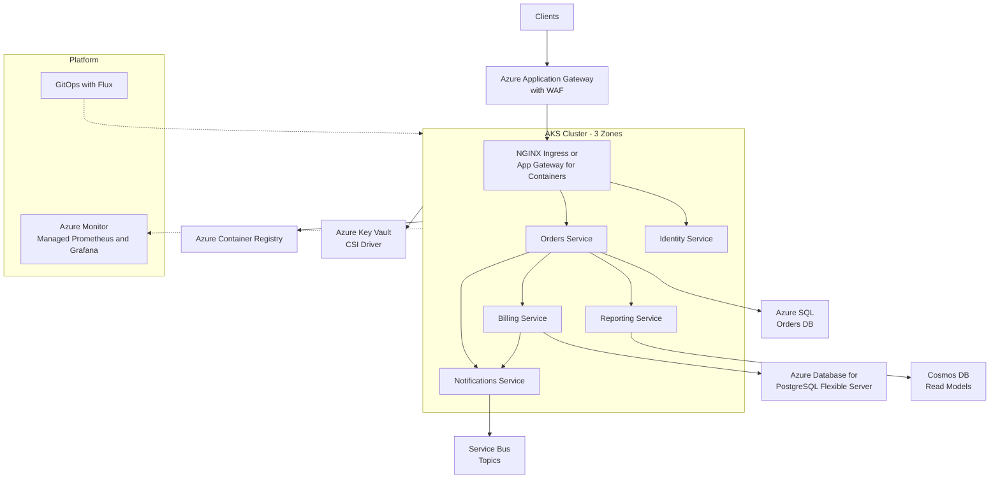

A design-review playbook for a domain-decomposed product running as microservices on Azure Kubernetes Service, owned by multiple autonomous teams.

## Business context

A B2B SaaS company has outgrown its monolith: five product teams (around 40 engineers) ship independently, deploys queue behind each other, and one team's memory leak takes down everyone. The product handles roughly 2,000 sustained RPS with strong intra-request fan-out between domains — orders, billing, identity, notifications, reporting. Contracts commit to a 99.9% SLA with enterprise customers who audit security posture. The company has a small platform team (3 engineers) willing to own a Kubernetes control plane in exchange for team autonomy, standardized deploys, and workload isolation.

## Requirements

| Requirement | Target |
|---|---|
| Availability | 99.9% monthly, per-service error budgets |
| p95 end-to-end API latency | < 500 ms across up to 4 service hops |
| Deploy frequency | Each team ships independently, daily |
| Deployment safety | Canary with automatic rollback |
| Blast radius | One service crash cannot take down others |
| RPO / RTO | 15 min / 2 hours |
| Security | mTLS in-cluster, no public pod endpoints, image scanning |
| Tenancy | Namespace-per-team with quotas |

## Reference architecture

## Service choices and rationale

| Component | Chosen service | Alternatives considered | Why |
|---|---|---|---|
| Orchestrator | AKS (Standard tier, 3 AZs) | Azure Container Apps, App Service | Container Apps was the serious contender; AKS wins on team-level isolation, custom operators, DaemonSets, and ecosystem tooling the platform team already knows |
| Edge / WAF | Application Gateway WAF v2 | Front Door, NGINX only | Regional L7 with WAF; Front Door added only when the product goes multi-region |
| In-cluster traffic | Managed ingress + Istio add-on (mTLS, retries) | Linkerd self-managed, no mesh | Managed Istio add-on gives mTLS, traffic splitting for canary, and retries without the platform team owning mesh upgrades |
| Container registry | Azure Container Registry (Premium) | Docker Hub, GitHub Packages | Geo-replication, Defender image scanning, private endpoint into the cluster VNet |
| Service data | Azure SQL, PostgreSQL Flexible Server, Cosmos DB per service | One shared database | Database-per-service is the point of the decomposition; each team picks the engine matching its model |
| Async messaging | Service Bus (topics) | Event Hubs, Kafka on AKS | Command-style integration events with per-subscriber dead-lettering; Kafka would add an ops burden with no current need for replay |
| Deploys | GitOps with Flux + Helm | Argo CD, push-based pipelines | Pull-based reconciliation, drift detection, per-namespace repo ownership |
| Observability | Managed Prometheus, Managed Grafana, Container Insights | Self-hosted LGTM stack, Datadog | SLO dashboards and alerting without running the monitoring stack; per-team Grafana folders |

## Key design decisions

1. **AKS over Azure Container Apps.** ACA would remove node management, and for 5–10 services with modest customization it is usually the better default. The decision flipped on three concrete needs: namespace-level multi-tenancy with ResourceQuotas per team, a service mesh with traffic-split canaries, and custom controllers for internal platform automation. The trade-off is real: the platform team now owns node pools, upgrade cadence, and CVE response for the cluster. Revisit if the platform team shrinks.
2. **Database-per-service, no shared schemas.** Shared databases recreate the monolith's coupling at the data layer. Each service owns its store; cross-service reads happen via APIs or projected read models (Reporting consumes events into Cosmos DB). Trade-off: no cross-service ACID transactions — workflows like order-plus-invoice use the saga pattern with compensating actions, which is more code and more failure states to test.
3. **Synchronous calls capped at depth two, then events.** Every synchronous hop multiplies error rates and latency (four 99.9% hops compound to ~99.6%). Orders may call Billing synchronously; everything beyond that is published to Service Bus topics. Trade-off: read-your-writes consistency is lost for downstream projections, so the UX and API contracts must express pending states.
4. **Canary by traffic split, not blue-green.** Istio traffic splitting shifts 5% → 25% → 100% with automated rollback on SLO burn. Blue-green is simpler but doubles capacity during deploys across 5+ services and gives an all-or-nothing cutover. Trade-off: canaries require good per-version metrics and take longer to complete.
5. **System node pool separated from user node pools, with spot pools for batch.** System components (ingress, mesh, monitoring agents) get a dedicated tainted pool so a team's runaway workload cannot evict them. Reporting's batch jobs run on spot node pools at ~60–80% discount, accepting eviction. Trade-off: more pools means more capacity to reason about and a minimum node floor per pool.

## Scaling and failure behavior

**Scale out.** Three layers of autoscaling: HPA scales pods on CPU/RPS/custom metrics per service; KEDA scales queue consumers on Service Bus depth; the cluster autoscaler (or node autoprovisioning) adds nodes when pods go unschedulable. Zone-spread topology constraints keep each service's replicas across all three AZs. The scaling anchor is the databases — HPA maxReplicas are set per service against tested database ceilings, so overload becomes queueing, not connection-pool exhaustion.

**What fails and how it degrades:**

- **Single pod or node failure** — routine; replicas across zones absorb it, PodDisruptionBudgets keep minimum replicas through upgrades.
- **One service down** (e.g., Notifications) — callers are protected by mesh-level timeouts, retries with budgets, and circuit breaking. Orders still complete; notification events accumulate in Service Bus subscriptions and drain on recovery. This is the blast-radius payoff.
- **Billing down, Orders depends on it synchronously** — the one depth-two sync path. Circuit breaker opens; Orders degrades to accepting orders with deferred invoicing where the business allows, otherwise fails fast with a clear error rather than hanging threads.
- **Zone outage** — one third of capacity gone; HPA and cluster autoscaler rebuild in the surviving zones within minutes. Zone-redundant databases (SQL BC, PostgreSQL zone-redundant HA) fail over automatically.
- **Cluster-level failure** (bad upgrade, control-plane issue) — the real RTO scenario. Recovery is GitOps-driven: a standby cluster definition exists in IaC; Flux rehydrates all workloads from Git. Practicing this rebuild quarterly is what makes the 2-hour RTO honest.
- **Bad deploy** — canary analysis catches elevated error rate at 5% traffic and rolls back automatically; worst case, one twentieth of one service's traffic saw errors.


Rough monthly cost drivers: node pools dominate — e.g., 9x D4ds_v5 across three pools ~ $2,500, plus spot pool for batch at steep discount. AKS Standard control plane ~ $73. Databases: Azure SQL BC 4 vCore ~ $1,800, PostgreSQL Flexible zone-redundant ~ $600, Cosmos DB autoscale ~ $300. ACR Premium ~ $50 per replica region. Managed Prometheus/Grafana and log ingestion commonly reach $500–1,500 — set log sampling and retention policies on day one. Expect $6k–8k/month; the levers are node right-sizing, reservations or savings plans on the steady-state pools, and log volume.


## Run it yourself

- [Lab 5 — Microservices on AKS](../../labs/lab-05-aks-microservices) — deploy a multi-service system on AKS with ingress, autoscaling, and service-to-service calls.
