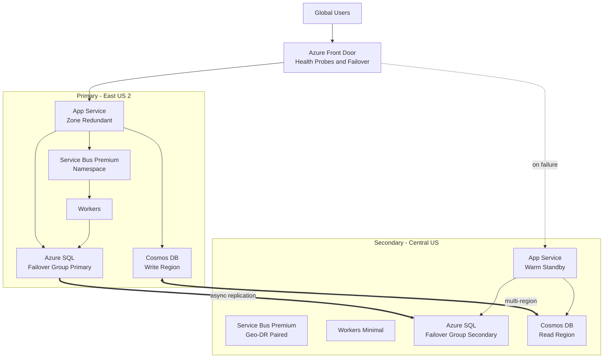

A design-review playbook for taking a business-critical web application from single-region to multi-region: failover design, data replication, and the consistency trade-offs nobody can dodge.

## Business context

A payments-adjacent SaaS platform signs enterprise contracts committing to 99.99% availability with financial penalties, after a four-hour regional outage cost it two customers. The workload is a web API plus background processing over an order-of-magnitude 500 RPS steady load — not huge, but every minute of downtime is contract-visible. Data is transactional customer records where losing acknowledged writes is unacceptable to auditors, plus a high-read configuration/profile dataset. The team is 12 engineers with mature IaC and CI/CD; the exec question on the table is active-active versus active-passive, and what the honest RPO number is.

## Requirements

| Requirement | Target |
|---|---|
| Availability | 99.99% monthly, contractually penalized |
| RTO (region loss) | < 15 min, no human decision on detection |
| RPO (transactional data) | < 5 s, measured not assumed |
| RPO (config/profile data) | ~0 |
| p95 latency | < 250 ms for users in NA and EU |
| Failover testing | Quarterly live drill, in production |
| Failback | Controlled, during business hours, zero data loss |
| Cost ceiling | Secondary region < 60% of primary run cost |

## Reference architecture

## Service choices and rationale

| Component | Chosen service | Alternatives considered | Why |
|---|---|---|---|
| Global load balancing | Azure Front Door (Premium) | Traffic Manager, Cross-region Load Balancer | Anycast with health probes fails over in seconds at the edge; Traffic Manager is DNS-based and hostage to client TTL caching |
| Compute | App Service, zone-redundant per region | AKS multi-region, Container Apps | Zone redundancy handles the common failures inside a region; the multi-region layer handles the rare ones; simplest platform that satisfies both |
| Transactional data | Azure SQL with auto-failover groups | Cosmos DB, PostgreSQL with read replicas | Relational model fits; failover groups give a stable listener endpoint so connection strings never change on failover |
| Config/profile data | Cosmos DB, multi-region, session consistency | SQL geo-replication, Redis geo | Native multi-region replication with ~0 RPO for this dataset and local reads in both regions |
| Messaging | Service Bus Premium with Geo-DR alias | Duplicated namespaces + app logic | Alias-based failover keeps producers/consumers pointed at one name; metadata fails over, messages do not — see decision 4 |
| Secrets/config | Key Vault + App Configuration, replicated per region | Single central instances | A failover that depends on the failed region's Key Vault is not a failover |
| DR orchestration | Azure Automation runbook + health alerts | Manual runbook only | Detection is automatic; the runbook sequences SQL failover-group activation and worker scale-up |

## Key design decisions

1. **Active-passive with warm standby, not active-active.** Active-active halves wasted capacity and proves the second region works continuously — but with SQL as the system of record, it requires either multi-master writes (conflict resolution the auditors will hate) or cross-region write latency on every transaction (~30 ms+ region pair round trip on the hot path). Active-passive keeps writes local and fast, at the cost of standby capacity that must be continuously verified. The compromise adopted: the secondary serves read-only traffic (reports, config reads via Cosmos DB and SQL readable secondary) so it is never cold and never unproven.
2. **The honest RPO conversation: async SQL replication means acknowledged-write loss is possible.** Failover groups replicate asynchronously; forced failover during a real disaster can lose the replication-lag window — seconds normally, more under write bursts. This design measures replication lag continuously and alerts when it exceeds the 5 s RPO budget. For the subset of operations where zero loss is mandatory (payment instructions), the app writes an outbox record that is also published to the Geo-DR-protected messaging layer, making post-failover reconciliation possible. The trade-off: full sync-replication alternatives either don't exist cross-region for Azure SQL or would put cross-region latency on every commit.
3. **Fail over automatically on detection, fail back manually.** The 15-minute RTO with no human decision means health-probe-driven Front Door rerouting plus an automation runbook triggering the SQL failover group when composite health (region status + app health + SQL connectivity) crosses threshold, with a dead-man's-switch delay to avoid flapping on transient blips. Failback, by contrast, is a business-hours, human-approved operation: re-establish replication, drain to zero lag, planned switchover with no data loss. Trade-off: automated failover will occasionally fire on false positives — the quarterly drills price that in and keep the runbook trustworthy.
4. **Treat in-flight messages as the acknowledged RPO gap they are.** Service Bus Geo-DR fails over the namespace name, not the messages; queued-but-unprocessed work in the failed region is inaccessible until that region returns. The design accepts this and compensates: every enqueued command has an outbox row in SQL (replicated), and a post-failover reconciler re-emits commands whose completion was never recorded. Idempotent consumers make the re-emission safe. The alternative — synchronously double-writing every message to both regions — was rejected as complexity that mostly reimplements the outbox.
5. **Everything regional is stamped by IaC; nothing is hand-unique.** Both regions deploy from the same Bicep stamp with parameter differences only (capacity, role). Configuration drift between regions is the silent killer of failovers — the standby that "worked at the last drill" but has since drifted. CI applies changes to secondary first, then primary, and drills alternate direction quarterly so both paths stay exercised.

## Scaling and failure behavior

**Scale out.** Within a region, zone-redundant App Service autoscales on load; SQL Business Critical handles read scale-out via the readable secondary replica. Cross-region, Front Door can weight a percentage of read traffic to the secondary to use paid-for standby capacity. On failover, the runbook's first act is scaling the secondary's App Service plan and workers from 40% to 100% capacity — pre-provisioned quota in the secondary region is verified monthly, because quota unavailability during a regional event (when everyone is failing over to the same paired region) is a real and underappreciated risk.

**What fails and how it degrades:**

- **Zone failure in primary** — absorbed by zone redundancy; no cross-region action. This should be the vast majority of infrastructure events.
- **App tier unhealthy, region otherwise fine** — Front Door probes fail; edge shifts traffic to secondary in seconds. SQL failover group may not need to move if the secondary app can reach the primary SQL listener cross-region with acceptable latency for a short window — the runbook decides based on SQL health.
- **Full regional outage** — Front Door reroutes (seconds); runbook fires SQL forced failover (single-digit minutes) and scales secondary compute. Total: inside the 15-minute RTO. Data loss: replication lag at the moment of failure — the measured RPO — plus in-flight messages, reconciled from the outbox.
- **Cosmos DB region loss** — service-managed failover promotes the surviving region; session consistency preserved; effectively invisible to the app.
- **Split-brain risk** — the failure everyone forgets: primary is alive but unreachable from the edge, secondary is promoted, and the old primary keeps processing background work. Mitigation: workers check a replicated leadership lease (App Configuration flag flipped by the runbook) before processing; drills specifically rehearse the isolated-but-alive scenario.
- **Failover works, failback ruins it** — failback without full replication re-sync repeats the outage with data divergence. Hence: manual, checklisted, business-hours only.


Rough monthly cost drivers: multi-region roughly multiplies the single-region bill by 1.5–1.7x with warm standby. Primary: zone-redundant App Service P2v3 x3 ~ $900, SQL Business Critical 8 vCore ~ $3,600, Service Bus Premium ~ $680, Cosmos DB multi-region ~ 2x single-region RU cost ~ $500. Secondary at ~40–60% compute ~ $1,500 plus SQL secondary (licensed via failover group) and its own Service Bus Premium. Front Door Premium ~ $330 plus egress; cross-region replication egress is a persistent line item. Expect $9k–12k/month versus ~ $6k single-region. The board-level framing: the delta is roughly $40–70k/year against contractual penalty exposure and churn risk from the next four-hour outage.


## Run it yourself

- [Lab 8 — Multi-Region HA](../../labs/lab-08-multi-region-ha) — deploy the two-region stamp with Front Door failover and a SQL failover group, then break the primary on purpose.
