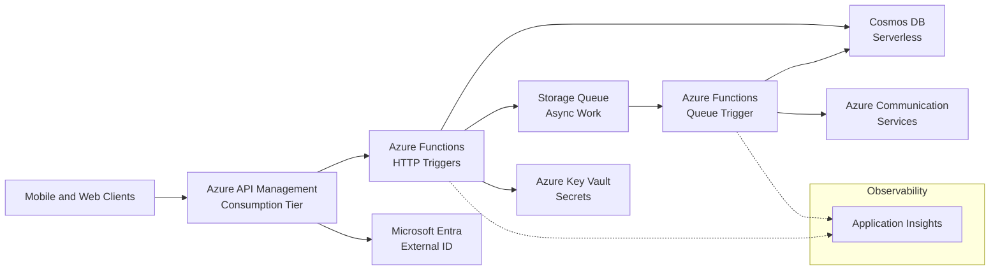

A design-review playbook for a consumption-based HTTP API backend: mobile/web clients, bursty traffic, small team, pay-per-use economics.

## Business context

A startup ships a mobile app whose backend is a REST API with heavily bursty traffic: near-zero at night, sharp spikes when push notifications go out, and unpredictable viral moments. The team is four engineers who want to write business logic, not manage servers or capacity plans. Data is user profiles and activity records — low relational complexity, high read/write concurrency. The business constraint is cost at low scale: the platform must cost close to nothing when idle but survive a 100x spike without a redesign. A modest SLA is acceptable; losing writes is not.

## Requirements

| Requirement | Target |
|---|---|
| Availability | 99.9% monthly |
| p95 API latency (warm) | < 200 ms |
| p99 API latency (including cold start) | < 1.5 s |
| Burst handling | 0 to 1,000 RPS in under 1 minute |
| Idle cost | < $50/month excluding data |
| RPO | < 5 minutes |
| RTO | < 4 hours |
| Auth | OAuth 2.0 / OIDC, no custom credential storage |

## Reference architecture

## Service choices and rationale

| Component | Chosen service | Alternatives considered | Why |
|---|---|---|---|
| API gateway | API Management (Consumption) | Front Door, Functions proxies, no gateway | Per-call pricing, key/JWT validation, rate limiting, and versioning without a fixed monthly fee |
| Compute | Azure Functions (Flex Consumption) | Container Apps, App Service, AKS | True scale-to-zero, per-execution billing, native bindings to queues and Cosmos DB; Flex Consumption reduces cold starts with always-ready instances |
| Identity | Microsoft Entra External ID | Auth0, custom JWT service | Managed consumer identity, MFA, and token issuance; removes credential storage from scope entirely |
| Primary data | Cosmos DB (serverless) | Azure SQL serverless, Table Storage | Per-request billing matches the traffic shape; automatic indexing; SQL serverless auto-pause adds resume latency to the hot path |
| Async buffer | Storage Queues | Service Bus | Simplest queue that works; no need for sessions, topics, or duplicate detection at this stage — and it is nearly free |
| Secrets | Azure Key Vault | App settings only | Central rotation and RBAC; Functions reads via managed identity, no secrets in config |
| Observability | Application Insights | Third-party APM | Distributed traces across gateway, function, and queue hops out of the box |

## Key design decisions

1. **Flex Consumption over classic Consumption plan.** Classic Consumption has the lowest idle cost but the worst cold starts (seconds for .NET/Java). Flex Consumption lets you pay a small premium for always-ready instances on the hot endpoints, converting the p99 cold-start problem into a bounded cost. The trade-off is that idle cost is no longer literally zero — budget the always-ready floor against the p99 target.
2. **API Management in front of Functions rather than exposing Functions directly.** Direct exposure is cheaper and simpler, but you lose centralized JWT validation, per-client rate limits, request/response transformation, and the ability to swap the backend without breaking clients. Consumption-tier APIM keeps this aligned with the pay-per-use model. Trade-off: an extra hop of ~10–30 ms and another service to configure.
3. **Cosmos DB serverless, with a planned migration trigger to provisioned autoscale.** Serverless bills per RU consumed — ideal below roughly 1M requests/month per container. Past a sustained threshold, provisioned autoscale becomes cheaper. Decide the crossover point now (monitor RU consumption) so the switch is a planned change, not an emergency. Trade-off: serverless caps per-container throughput, which is the ceiling that forces the migration.
4. **Split synchronous and asynchronous work at the API boundary.** Anything not needed for the response — notifications, enrichment, fan-out writes — goes through a Storage Queue to a separate function. This keeps p95 low and makes retries safe. Trade-off: eventual consistency for side effects and the need for idempotent queue handlers (Storage Queues deliver at-least-once).
5. **Storage Queues now, Service Bus when semantics demand it.** The upgrade triggers are concrete: need for ordered processing, duplicate detection, topics/subscriptions, or messages over 64 KB. Starting with Service Bus everywhere would be defensible but adds cost and concepts the team does not yet need.

## Scaling and failure behavior

**Scale out.** Every tier is elastic: APIM Consumption and Functions scale on demand per request; Cosmos DB serverless absorbs bursts up to its container throughput cap. The scaling unit is the function instance, and the platform adds instances in response to event rate — no autoscale rules to tune. The practical limits to know: Flex Consumption per-app instance caps, Cosmos serverless container limits, and APIM Consumption rate limits. A 100x spike mostly surfaces as a brief cold-start latency bump, not errors.

**What fails and how it degrades:**

- **Cold starts under sudden spike** — p99 latency degrades for the first seconds of a burst. Always-ready instances on the top three endpoints bound this; the mobile client retries idempotent GETs.
- **Cosmos DB throttling** (429s) — serverless container hits its RU ceiling. The Functions Cosmos SDK retries with backoff; sustained 429s trip the planned migration to provisioned autoscale. Writes that must not be lost are enqueued instead of failed.
- **Queue processing lag** — a spike creates backlog; notifications arrive late but nothing is lost. Poison messages move to the poison queue after five dequeues and alert via Application Insights.
- **APIM or regional outage** — this is a single-region design by choice at this SLA. RTO is redeploy-to-paired-region from IaC (Bicep) plus Cosmos DB continuous backup restore; RPO is bounded by Cosmos continuous backup (point-in-time). Multi-region writes are a deliberate non-goal until the SLA justifies the cost.
- **Key Vault unavailable** — Functions caches secrets at startup; existing instances keep running, new cold starts fail. Mitigate with secret caching and Key Vault availability zones.

**Backpressure.** APIM policies enforce per-client rate limits and a global spike-arrest, so a misbehaving client degrades into 429s at the gateway instead of RU exhaustion at the database.


Rough monthly cost drivers: near-zero at idle — APIM Consumption ~ $3.50 per million calls, Functions Flex Consumption per-GB-second plus a small always-ready floor (~ $15–40), Cosmos DB serverless per million RUs (~ $0.25) plus storage, Storage Queues effectively pennies, Application Insights ingestion (often the surprise line item — cap sampling early). A typical month at 5M API calls lands around $50–150 total. The cost curve is linear with traffic, which is exactly the point.


## Run it yourself

- [Lab 3 — Serverless API](../../labs/lab-03-serverless-api) — build this API with Functions, APIM, and Cosmos DB end to end.
